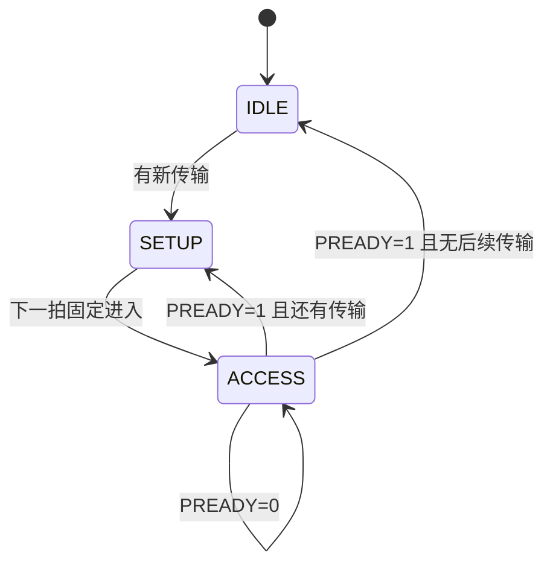

# AMBA APB 学习笔记：从寄存器读写到协议验证

> 适合读者：已经接触过 Verilog/SystemVerilog，准备学习片上总线和 UVM，但还没有总线协议基础。
>
> 学习目标：看懂 APB 波形；能写简单 APB Requester/Completer；能设计 interface、monitor、scoreboard 和协议断言；知道常见错误发生在哪里。

---

## 0. 文档定位与版本说明

本文主要依据 Arm《AMBA APB Protocol Specification》ARM IHI 0024E。该文档定义的是 APB5，并向下覆盖 APB2、APB3、APB4 的核心行为。

官方新版术语使用：

| 本文主要术语 | 旧资料常见术语 | 含义 |
|---|---|---|
| Requester | Master | 发起 APB 访问的一方，常见实现是 AXI-to-APB bridge |
| Completer | Slave | 被访问的外设，例如 UART、GPIO、Timer |

版本演进可以先记成：

| 版本 | 主要增加内容 |
|---|---|
| APB2 | 基本的两阶段传输 |
| APB3 | `PREADY` 等待状态、`PSLVERR` 错误响应 |
| APB4 | `PSTRB` 字节写使能、`PPROT` 保护属性 |
| APB5 | 唤醒、用户信号、接口奇偶校验；Issue E 还加入可选 RME 支持 |

初学阶段的优先级：

1. 先掌握 `PSEL`、`PENABLE`、`PREADY` 组成的传输流程。
2. 再掌握读写数据、等待状态和错误响应。
3. 最后了解 APB4/APB5 的可选信号。

---

## 1. APB 是什么

APB 全称 Advanced Peripheral Bus，定位是低成本、低功耗、低复杂度的外设寄存器访问接口。

常见系统结构：

```text
CPU / DMA
    |
  AXI Interconnect
    |
AXI-to-APB Bridge        <- APB Requester
    |
    +--------+---------+---------+
    |        |         |         |
  GPIO     UART      TIMER      SPI     <- APB Completer
```

APB 的特点：

- 同步协议，所有传输在 `PCLK` 上升沿采样。
- 不支持流水线。
- 一次传输至少需要两个时钟周期。
- 地址和数据不分成独立握手通道。
- 适合控制寄存器，不适合高带宽连续数据搬运。
- 通常不是 CPU 直接产生 APB 时序，而是桥接器将 AXI/AHB 请求转换为 APB。

### 1.1 为什么最少两个周期

APB 把一次传输拆成：

```text
SETUP  : 选中外设，给出地址、方向、写数据和属性
ACCESS : 拉高 PENABLE，等待外设完成
```

这两个阶段不能合并，所以即使外设零等待，一次访问也至少占两个周期。

### 1.2 APB 与存储器总线的直觉区别

APB 更像“访问一个寄存器”：

```text
选择设备 -> 告诉它访问哪个地址 -> 等它完成 -> 取回数据/错误
```

它不是用来追求每拍一个数据，也没有 burst、ID、乱序完成等机制。

---

## 2. 信号总览

### 2.1 基础信号

| 信号 | 方向 | 作用 |
|---|---|---|
| `PCLK` | Clock -> all | APB 时钟，上升沿采样 |
| `PRESETn` | System -> all | 低有效复位 |
| `PADDR` | Requester -> Completer | 字节地址，规范允许最高 32 位 |
| `PSELx` | Requester -> Completer | 选中某个 Completer；通常每个外设一根选择线 |
| `PENABLE` | Requester -> Completer | 表示进入 ACCESS 阶段 |
| `PWRITE` | Requester -> Completer | `1` 写，`0` 读 |
| `PWDATA` | Requester -> Completer | 写数据，宽度为 8、16 或 32 位 |
| `PRDATA` | Completer -> Requester | 读数据，与 `PWDATA` 等宽 |

### 2.2 APB3 常用扩展

| 信号 | 方向 | 作用 |
|---|---|---|
| `PREADY` | Completer -> Requester | `0` 延长 ACCESS，`1` 允许传输完成 |
| `PSLVERR` | Completer -> Requester | 最后一个 ACCESS 周期报告错误 |

### 2.3 APB4 常用扩展

| 信号 | 方向 | 作用 |
|---|---|---|
| `PSTRB` | Requester -> Completer | 每个数据字节一位写使能 |
| `PPROT[2:0]` | Requester -> Completer | 特权、安全、数据/指令属性 |

### 2.4 APB5 可选扩展

| 信号 | 作用 |
|---|---|
| `PWAKEUP` | 请求接口相关逻辑上电或开时钟 |
| `PAUSER/PWUSER/PRUSER/PBUSER` | 用户自定义请求、数据和响应属性 |
| `PNSE` | RME 物理地址空间扩展 |
| parity/check 信号 | 保护地址、控制、数据和响应信号 |

初学者实现 APB 外设时，先完成基础信号、`PREADY`、`PSLVERR`、`PSTRB` 即可。

---

## 3. 三个工作状态

APB 可以用三状态状态机理解：



| 状态 | `PSEL` | `PENABLE` | 含义 |
|---|---:|---:|---|
| IDLE | 0 | 0 | 没有传输 |
| SETUP | 1 | 0 | 给出本次传输信息 |
| ACCESS | 1 | 1 | Completer 执行并给出完成状态 |

### 3.1 最重要的完成条件

```systemverilog
// 只有“选中 + ACCESS 阶段 + Completer 就绪”同时成立，
// 当前 APB 传输才会在这个 PCLK 上升沿完成。
apb_complete = PSEL && PENABLE && PREADY;
```

只有在时钟上升沿同时采到这三个信号为 `1`，传输才完成。

不要只用 `PREADY` 判断完成，因为规范允许 `PENABLE=0` 时 `PREADY` 取任意值，零等待外设甚至可以把它常接 `1`。

### 3.2 `PENABLE` 不是“外设使能”

`PENABLE` 是整个 APB 接口共享的阶段信号，不是某个外设独有的片选。

某个 Completer 判断自己是否处于有效访问阶段，应使用：

```systemverilog
// PENABLE 是整条 APB 总线共享的阶段信号，
// 必须再与本外设自己的 PSEL 组合，才能判断本外设正在被访问。
PSEL_this && PENABLE
```

---

## 4. 基本写传输

### 4.1 零等待写

```text
上升沿       T1              T2              T3
阶段       SETUP           ACCESS          完成后
PSEL         1               1               0/1
PENABLE      0               1               0
PWRITE       1               1               下一传输
PADDR       addr            addr             下一地址
PWDATA      data            data             下一数据
PREADY       X               1               X
                         T3 上升沿完成
```

流程：

1. Requester 在 SETUP 阶段拉高 `PSEL`。
2. 同时给出稳定的 `PADDR`、`PWRITE=1`、`PWDATA`、`PSTRB` 和属性。
3. 下一周期拉高 `PENABLE`，进入 ACCESS。
4. 若 `PREADY=1`，在该 ACCESS 周期末的上升沿完成写传输。
5. 完成后 `PENABLE` 必须拉低。

### 4.2 带等待状态的写

```text
阶段       SETUP     ACCESS     ACCESS     ACCESS      完成后
PSEL         1          1          1          1           0/1
PENABLE      0          1          1          1           0
PREADY       X          0          0          1           X
PADDR       A1         A1         A1         A1         next
PWDATA      D1         D1         D1         D1         next
```

只要处于 ACCESS 且 `PREADY=0`，Requester 必须保持本次传输信息不变：

- `PADDR`
- `PWRITE`
- `PSELx`
- `PENABLE`
- `PWDATA`
- `PSTRB`
- `PPROT`
- 对应用户信号

这条规则是 APB monitor 和 SVA 的重点。

---

## 5. 基本读传输

### 5.1 零等待读

Requester 在 SETUP 阶段给出：

```text
PSEL=1, PENABLE=0, PWRITE=0, PADDR=目标地址
```

下一周期进入 ACCESS：

```text
PSEL=1, PENABLE=1
```

Completer 必须在完成沿之前提供有效 `PRDATA`。Requester 在：

```systemverilog
// 读数据 PRDATA 与错误 PSLVERR 都应在这个完成事件上采样。
PSEL && PENABLE && PREADY
```

为真的上升沿采样 `PRDATA` 和 `PSLVERR`。

### 5.2 带等待读

`PREADY=0` 可以延长 ACCESS 任意多个周期。等待期间 Requester 保持地址、方向、选择和属性稳定。

`PRDATA` 是否必须在整个等待阶段稳定？对 Requester 来说，真正需要采样的是最终完成沿的数据。工程上常让 Completer 在等待期间也保持稳定，便于时序和调试，但 monitor 不应在完成前提交 transaction。

### 5.3 读传输时的 `PSTRB`

规范明确要求：读传输中所有 `PSTRB` 位必须为 `0`。

```systemverilog
// PSTRB 只描述写数据的有效字节；读访问必须全部清零。
if (!PWRITE)
    PSTRB = '0;
```

---

## 6. 连续传输

### 6.1 连续访问同一个 Completer

如果下一笔仍访问同一个外设，`PSEL` 可以保持为 `1`，但 `PENABLE` 必须在两笔传输之间回到 `0`：

```text
ACCESS(old) -> SETUP(new) -> ACCESS(new)
PSEL       1       1             1
PENABLE    1       0             1
```

不能连续两个完成周期都保持 `PENABLE=1`，否则没有新传输的 SETUP 阶段。

### 6.2 切换到另一个 Completer

通常每个外设有独立的 `PSELx`。完成旧访问后，下一个 SETUP 周期切换选择线：

```text
old_PSEL = 0
new_PSEL = 1
PENABLE  = 0
```

### 6.3 吞吐率直觉

零等待、连续传输情况下，一笔 APB 访问仍至少占两拍：

```text
SETUP0 ACCESS0 SETUP1 ACCESS1 SETUP2 ACCESS2
```

因此 APB 不适合追求每拍传一个数据。

---

## 7. 写字节使能 `PSTRB`

`PSTRB` 每一位对应 `PWDATA` 的一个字节：

```text
PSTRB[0] -> PWDATA[7:0]
PSTRB[1] -> PWDATA[15:8]
PSTRB[2] -> PWDATA[23:16]
PSTRB[3] -> PWDATA[31:24]
```

32 位数据总线下：

| `PSTRB` | 含义 |
|---|---|
| `4'b0001` | 只写最低字节 |
| `4'b0011` | 写低 16 位 |
| `4'b1100` | 写高 16 位 |
| `4'b1111` | 写完整 32 位 |
| `4'b0000` | 没有字节被更新 |

寄存器按字节更新示例：

```systemverilog
// DATA_WIDTH/8 就是 byte lane 的数量，例如 32-bit 数据有 4 个 lane。
for (int i = 0; i < DATA_WIDTH/8; i++) begin
    // 每个 PSTRB 位只控制与它对应的 8-bit 字节。
    if (PSTRB[i])
        reg_data[i*8 +: 8] <= PWDATA[i*8 +: 8];
end
```

### 7.1 常见错误

- 把 `PSTRB` 当成位写使能；它是字节写使能。
- 写寄存器时无条件覆盖全部字节。
- 读传输时仍驱动非零 `PSTRB`。
- 接口声明的数据宽度不是 8 的整数倍。

---

## 8. 错误响应 `PSLVERR`

`PSLVERR` 只在传输最后一个周期有效：

```systemverilog
// PSLVERR 只在传输完成周期有协议意义。
PSEL && PENABLE && PREADY
```

典型错误来源：

- 地址不存在。
- 写只读寄存器。
- 读只写寄存器。
- 不支持的 `PSTRB` 组合。
- 权限检查失败。

### 8.1 错误并不保证“没有副作用”

规范允许一次报错的访问已经改变了外设状态。

因此：

- 写错误不保证寄存器没被更新。
- 读错误时 `PRDATA` 可能无效。
- Requester 不能靠 `PSLVERR` 推断操作一定被回滚。

### 8.2 桥接后的响应

AXI-to-APB bridge 通常把：

```text
APB read  PSLVERR -> AXI RRESP
APB write PSLVERR -> AXI BRESP
```

---

## 9. 保护属性 `PPROT`

| 位 | `0` | `1` |
|---|---|---|
| `PPROT[0]` | Normal | Privileged |
| `PPROT[1]` | Secure | Non-secure |
| `PPROT[2]` | Data | Instruction |

`PPROT[2]` 更像提示，不一定能准确代表所有系统行为。

一个外设可以根据 `PPROT` 实现权限检查，例如只有 privileged access 才能写看门狗控制寄存器。

---

## 10. 地址与寄存器映射

### 10.1 `PADDR` 是字节地址

32 位寄存器常见映射：

| 地址 | 寄存器 |
|---|---|
| `0x00` | CTRL |
| `0x04` | STATUS |
| `0x08` | DATA |
| `0x0C` | IRQ_EN |

可以使用：

```systemverilog
// 32-bit 寄存器按 4-byte 对齐，因此忽略最低 2 位进行 word 译码。
case (PADDR[5:2])
    4'h0: ... // 0x00
    4'h1: ... // 0x04
    4'h2: ... // 0x08
    4'h3: ... // 0x0C
endcase
```

### 10.2 非对齐地址

规范允许 `PADDR` 出现相对数据宽度非对齐的值，但结果是 UNPREDICTABLE。Completer 可能使用原地址、对齐后的地址或报错。

工程上应明确约束：

```systemverilog
constraint aligned_c {
    // 32-bit 访问按 4-byte 对齐；地址最低两位必须为 0。
    addr[1:0] == 2'b00;
}
```

除非测试目标就是验证非法或非对齐访问。

---

## 11. 一个简单的 APB interface

```systemverilog
interface apb_if #(
    // 地址、数据宽度参数化，便于同一 interface 复用于不同项目。
    parameter int ADDR_WIDTH = 32,
    parameter int DATA_WIDTH = 32
) (
    input logic PCLK,
    input logic PRESETn
);
    // Requester -> Completer：请求和写数据方向的信号。
    logic [ADDR_WIDTH-1:0] PADDR;
    logic                  PSEL;
    logic                  PENABLE;
    logic                  PWRITE;
    logic [DATA_WIDTH-1:0] PWDATA;
    logic [DATA_WIDTH/8-1:0] PSTRB;
    logic [2:0]            PPROT;
    // Completer -> Requester：完成、读数据与错误响应。
    logic                  PREADY;
    logic [DATA_WIDTH-1:0] PRDATA;
    logic                  PSLVERR;

    clocking requester_cb @(posedge PCLK);
        // input #1step 在时钟沿前的采样区读取 DUT 输出，避免 testbench/DUT race；
        // output #0 表示驱动值在本 clocking event 输出。
        default input #1step output #0;
        output PADDR, PSEL, PENABLE, PWRITE, PWDATA, PSTRB, PPROT;
        input  PREADY, PRDATA, PSLVERR;
    endclocking

    clocking monitor_cb @(posedge PCLK);
        // Monitor 只采样，不驱动协议信号。
        default input #1step;
        input PADDR, PSEL, PENABLE, PWRITE, PWDATA, PSTRB, PPROT;
        input PREADY, PRDATA, PSLVERR;
    endclocking

    // modport 限制不同验证组件能看到的 clocking block 和复位信号。
    modport requester (clocking requester_cb, input PRESETn);
    modport monitor   (clocking monitor_cb, input PRESETn);
endinterface
```

这里使用 clocking block 的目的，是避免 driver 和 DUT 在同一个时钟沿发生采样竞争。

---

## 12. Requester 驱动任务

### 12.1 写任务

```systemverilog
task automatic apb_write(
    virtual apb_if.requester vif,
    logic [31:0] addr,
    logic [31:0] data,
    logic [3:0]  strb,
    output logic err
);
    // SETUP：PSEL 拉高、PENABLE 保持低，同时给出本次写请求的全部信息。
    vif.requester_cb.PSEL    <= 1'b1;
    vif.requester_cb.PENABLE <= 1'b0;
    vif.requester_cb.PWRITE  <= 1'b1;
    vif.requester_cb.PADDR   <= addr;
    vif.requester_cb.PWDATA  <= data;
    vif.requester_cb.PSTRB   <= strb;
    // 这里使用普通、安全、数据访问；实际 sequence 可以把 PPROT 参数化。
    vif.requester_cb.PPROT   <= 3'b000;
    // SETUP 必须完整保持一个周期，再进入 ACCESS。
    @(vif.requester_cb);

    // ACCESS：只改变 PENABLE；地址、方向、数据和属性继续保持。
    vif.requester_cb.PENABLE <= 1'b1;
    // PREADY 可能连续为 0，因此至少等待一个 ACCESS 采样点并循环等待。
    do @(vif.requester_cb);
    while (!vif.requester_cb.PREADY);

    // 循环退出时正处于完成沿，此时 PSLVERR 才有协议意义。
    err = vif.requester_cb.PSLVERR;

    // 返回 IDLE。若要连续访问，可直接进入下一笔 SETUP。
    vif.requester_cb.PSEL    <= 1'b0;
    vif.requester_cb.PENABLE <= 1'b0;
endtask
```

### 12.2 读任务

```systemverilog
task automatic apb_read(
    virtual apb_if.requester vif,
    logic [31:0] addr,
    output logic [31:0] data,
    output logic err
);
    // SETUP：读访问使用 PWRITE=0，地址在整个传输期间保持。
    vif.requester_cb.PSEL    <= 1'b1;
    vif.requester_cb.PENABLE <= 1'b0;
    vif.requester_cb.PWRITE  <= 1'b0;
    vif.requester_cb.PADDR   <= addr;
    // APB 规范要求读传输时 PSTRB 全为 0。
    vif.requester_cb.PSTRB   <= '0;
    vif.requester_cb.PPROT   <= 3'b000;
    @(vif.requester_cb);

    // 下一拍进入 ACCESS，并允许 Completer 用 PREADY 插入任意等待周期。
    vif.requester_cb.PENABLE <= 1'b1;
    do @(vif.requester_cb);
    while (!vif.requester_cb.PREADY);

    // 只在 PSEL && PENABLE && PREADY 的完成沿采样返回信息。
    data = vif.requester_cb.PRDATA;
    err  = vif.requester_cb.PSLVERR;

    vif.requester_cb.PSEL    <= 1'b0;
    vif.requester_cb.PENABLE <= 1'b0;
endtask
```

注意：driver 必须等待真正的完成条件，不能假设外设永远零等待。

---

## 13. 简单 Completer 设计

### 13.1 零等待寄存器外设

```systemverilog
// 零等待外设可以把 PREADY 常接 1；传输仍然需要 SETUP 和 ACCESS 两拍。
assign PREADY = 1'b1;

always_comb begin
    // 组合逻辑先给默认值，避免推断锁存器。
    PRDATA  = '0;
    PSLVERR = 1'b0;

    // SETUP 和 ACCESS 都可以进行地址译码，但 Requester 只在完成沿采样 PRDATA。
    if (PSEL && !PWRITE) begin
        unique case (PADDR[5:2])
            4'h0: PRDATA = ctrl_reg;
            4'h1: PRDATA = status_reg;
            4'h2: PRDATA = data_reg;
            default: begin
                PRDATA  = '0;
                // 只让非法地址错误出现在 ACCESS；PREADY 常高，所以该周期即完成周期。
                PSLVERR = PENABLE;
            end
        endcase
    end
end

always_ff @(posedge PCLK or negedge PRESETn) begin
    if (!PRESETn) begin
        // 异步低有效复位寄存器状态。
        ctrl_reg <= '0;
        data_reg <= '0;
    end
    // 写副作用只在真正完成且无错误的上升沿发生一次。
    else if (PSEL && PENABLE && PREADY && PWRITE && !PSLVERR) begin
        unique case (PADDR[5:2])
            // 按 PSTRB 分别更新每个字节，未使能字节保留旧值。
            4'h0: for (int i = 0; i < 4; i++)
                if (PSTRB[i]) ctrl_reg[i*8 +: 8] <= PWDATA[i*8 +: 8];
            4'h2: for (int i = 0; i < 4; i++)
                if (PSTRB[i]) data_reg[i*8 +: 8] <= PWDATA[i*8 +: 8];
            default: ;
        endcase
    end
end
```

寄存器副作用应绑定到完成沿，避免等待期间重复执行写操作。

### 13.2 为什么不能只判断 `PSEL && PENABLE`

如果 `PREADY` 连续三拍为 `0`，ACCESS 会持续三拍。若写逻辑每拍都执行：

```systemverilog
// 错误示例：若 PREADY 连续为 0，ACCESS 会保持多拍，FIFO 可能被重复写入。
if (PSEL && PENABLE && PWRITE)
    fifo_push(PWDATA); // 错误：可能 push 多次
```

正确做法：

```systemverilog
// 正确示例：加入 PREADY，只在传输完成事件上产生一次副作用。
if (PSEL && PENABLE && PREADY && PWRITE)
    fifo_push(PWDATA);
```

---

## 14. 协议断言 SVA

### 14.1 SETUP 后必须进入 ACCESS

```systemverilog
property p_setup_to_access;
    @(posedge PCLK) disable iff (!PRESETn)
    // |=> 表示下一拍检查：有效 SETUP 的下一拍必须进入 ACCESS。
    PSEL && !PENABLE |=> PSEL && PENABLE;
endproperty
a_setup_to_access: assert property (p_setup_to_access);
```

### 14.2 等待期间控制信号稳定

```systemverilog
property p_stable_during_wait;
    @(posedge PCLK) disable iff (!PRESETn)
    // 当前拍正在等待时，下一拍仍须保持选择、ACCESS 状态和请求 payload。
    PSEL && PENABLE && !PREADY
    |=> PSEL && PENABLE &&
        $stable({PADDR, PWRITE, PWDATA, PSTRB, PPROT});
endproperty
a_stable_during_wait: assert property (p_stable_during_wait);
```

### 14.3 `PENABLE` 不能在没有选择时有效

```systemverilog
property p_enable_requires_select;
    @(posedge PCLK) disable iff (!PRESETn)
    // 单 Completer 接口中，PENABLE 有效时必须同时选中该接口。
    PENABLE |-> PSEL;
endproperty
a_enable_requires_select: assert property (p_enable_requires_select);
```

### 14.4 读访问不允许非零 `PSTRB`

```systemverilog
property p_read_strb_zero;
    @(posedge PCLK) disable iff (!PRESETn)
    // |-> 是同拍蕴含：检测到读请求时，PSTRB 必须已经为 0。
    PSEL && !PWRITE |-> PSTRB == '0;
endproperty
a_read_strb_zero: assert property (p_read_strb_zero);
```

### 14.5 错误只在完成周期使用

如果设计约定非完成周期必须拉低：

```systemverilog
property p_slverr_only_on_complete;
    @(posedge PCLK) disable iff (!PRESETn)
    // 这是常见项目约束，比规范“非完成周期建议拉低”更严格。
    PSLVERR |-> PSEL && PENABLE && PREADY;
endproperty
```

这比规范更严格，因为规范只是推荐其他周期拉低。只有在项目接口约定明确时才把它作为 error assertion。

---

## 15. UVM transaction 建模

```systemverilog
class apb_item extends uvm_sequence_item;
    // rand 字段由 sequence 随机产生，描述 Requester 发出的请求。
    rand bit [31:0] addr;
    rand bit        write;
    rand bit [31:0] wdata;
    rand bit [3:0]  strb;
    rand bit [2:0]  prot;

         // 非 rand 字段由 driver/monitor 在完成沿回填，描述执行结果。
         bit [31:0] rdata;
         bit        slverr;
         int unsigned wait_cycles;

    // 默认只生成 32-bit 对齐访问；非法地址测试可以临时关闭该约束。
    constraint aligned_c { addr[1:0] == 2'b00; }
    // 读操作不允许携带写字节使能。
    constraint read_strb_c { !write -> strb == 4'b0000; }

    // 字段自动化宏支持 print/copy/compare/record 等常见 UVM 操作。
    `uvm_object_utils_begin(apb_item)
        `uvm_field_int(addr,        UVM_ALL_ON)
        `uvm_field_int(write,       UVM_ALL_ON)
        `uvm_field_int(wdata,       UVM_ALL_ON)
        `uvm_field_int(strb,        UVM_ALL_ON)
        `uvm_field_int(prot,        UVM_ALL_ON)
        `uvm_field_int(rdata,       UVM_ALL_ON)
        `uvm_field_int(slverr,      UVM_ALL_ON)
        `uvm_field_int(wait_cycles, UVM_ALL_ON)
    `uvm_object_utils_end

    function new(string name = "apb_item");
        super.new(name);
    endfunction
endclass
```

transaction 表示“一次完成的 APB 访问”，不是 SETUP 和 ACCESS 两个独立 item。

---

## 16. Monitor 的正确采样方法

Monitor 可以在 SETUP 捕获请求字段，在完成沿补充返回字段：

```systemverilog
task apb_monitor::run_phase(uvm_phase phase);
    forever begin
        // 每个 PCLK 通过只读 monitor clocking block 采样一次。
        @(vif.monitor_cb);

        // SETUP 是一笔新 transaction 的起点；连续访问时 PSEL 可能不会拉低。
        if (vif.monitor_cb.PSEL && !vif.monitor_cb.PENABLE) begin
            apb_item tr = apb_item::type_id::create("tr");
            tr.addr  = vif.monitor_cb.PADDR;
            tr.write = vif.monitor_cb.PWRITE;
            tr.wdata = vif.monitor_cb.PWDATA;
            tr.strb  = vif.monitor_cb.PSTRB;
            tr.prot  = vif.monitor_cb.PPROT;
            tr.wait_cycles = 0;

            // 一直等到 ACCESS 完成。等待周期只统计 PENABLE=1 且 PREADY=0 的拍数。
            do begin
                @(vif.monitor_cb);
                if (vif.monitor_cb.PENABLE && !vif.monitor_cb.PREADY)
                    tr.wait_cycles++;
            end while (!(vif.monitor_cb.PSEL &&
                         vif.monitor_cb.PENABLE &&
                         vif.monitor_cb.PREADY));

            // 退出循环的当前采样点就是完成沿，此时补齐返回字段。
            tr.rdata  = vif.monitor_cb.PRDATA;
            tr.slverr = vif.monitor_cb.PSLVERR;
            // 只发布一次完整 transaction，不能在每个等待周期重复发布。
            ap.write(tr);
        end
    end
endtask
```

### 16.1 Monitor 易错点

- 看到 `PSEL` 就立即发送 transaction，导致响应字段还没出现。
- 每个等待周期都发送一次 transaction。
- 在 `PREADY` 高但 `PENABLE` 低时误判完成。
- 连续传输中等待 `PSEL` 拉低，结果漏掉下一笔。
- 没有通过 clocking block 采样，产生 race。

---

## 17. Scoreboard 与寄存器预测

对于寄存器外设，reference model 通常保存一个镜像：

```text
APB write 完成且无错误 -> 按 PSTRB 更新镜像
APB read  完成且无错误 -> 预测期望值并比较 PRDATA
收到错误               -> 按项目约定决定是否更新镜像
```

按 `PSTRB` 合并数据：

```systemverilog
function automatic bit [31:0] merge_by_strb(
    bit [31:0] old_data,
    bit [31:0] new_data,
    bit [3:0]  strb
);
    // 先复制旧值，确保 strobe=0 的字节自然保持。
    bit [31:0] result = old_data;
    // foreach 自动遍历 strb 的所有 byte lane。
    foreach (strb[i])
        if (strb[i]) result[i*8 +: 8] = new_data[i*8 +: 8];
    return result;
endfunction
```

若使用 UVM RAL，应考虑寄存器的 RO、WO、W1C、RC 等访问策略，而不是简单地认为读写都无副作用。

---

## 18. 功能覆盖建议

### 18.1 基本 coverpoint

```systemverilog
covergroup apb_cg with function sample(apb_item tr);
    // 方向、错误和等待长度是 APB 最基本的行为维度。
    cp_dir: coverpoint tr.write;
    cp_err: coverpoint tr.slverr;
    cp_wait: coverpoint tr.wait_cycles {
        // 将等待深度分成零等待、短等待和长等待，便于观察反压覆盖。
        bins zero  = {0};
        bins short = {[1:3]};
        bins long  = {[4:15]};
    }
    cp_strb: coverpoint tr.strb iff (tr.write) {
        // iff 保证只有写 transaction 才采样 PSTRB。
        bins none = {4'b0000};
        bins byte[] = {4'b0001, 4'b0010, 4'b0100, 4'b1000};
        bins half[] = {4'b0011, 4'b1100};
        bins full = {4'b1111};
        bins sparse = default;
    }
    // 交叉覆盖确认读/写两种方向都见过成功、失败和不同等待长度。
    dir_x_err  : cross cp_dir, cp_err;
    dir_x_wait : cross cp_dir, cp_wait;
endgroup
```

### 18.2 建议测试场景

| 场景 | 检查点 |
|---|---|
| 零等待读写 | 两阶段时序、数据正确 |
| 随机等待 | 等待期间信号稳定、只完成一次 |
| 连续同外设访问 | `PSEL` 可连续，`PENABLE` 必须回低 |
| 不同外设切换 | `PSELx` 独热、地址译码正确 |
| 各种 `PSTRB` | 字节更新正确 |
| 非法地址 | `PSLVERR` 和副作用符合约定 |
| 权限失败 | `PPROT` 检查正确 |
| 复位打断 | 状态机回到 IDLE，无伪传输 |

---

## 19. 常见错误总表

| 错误理解/实现 | 正确理解 |
|---|---|
| `PREADY=1` 就表示完成 | 必须同时有 `PSEL && PENABLE && PREADY` |
| `PENABLE` 可以一直为 1 | 每笔传输都必须先有 `PENABLE=0` 的 SETUP |
| 等待时可以先改地址 | `PREADY=0` 的 ACCESS 期间请求信息必须稳定 |
| 写逻辑见到 ACCESS 就执行 | 副作用应在完成沿执行，避免等待期间重复 |
| `PSTRB` 是位掩码 | 每位控制一个字节 |
| 读时 `PSTRB` 无所谓 | 读传输必须全 0 |
| `PSLVERR` 表示操作已回滚 | 规范不保证没有副作用 |
| 连续传输必须拉低 `PSEL` | 同一外设可保持 `PSEL=1`，但要插入 SETUP |
| Monitor 等 `PSEL` 下降才结束 | 连续传输可能不下降，应看完成条件 |
| APB 适合搬运大块数据 | APB 不流水，适合控制寄存器 |

---

## 20. 调试波形的固定顺序

看到 APB 失败时，按以下顺序检查：

1. `PRESETn` 是否正确释放。
2. 是否出现 `PSEL=1, PENABLE=0` 的 SETUP。
3. 下一拍是否进入 `PSEL=1, PENABLE=1` 的 ACCESS。
4. `PREADY=0` 时请求字段是否稳定。
5. 完成沿 `PRDATA/PSLVERR` 是否有效。
6. 完成后 `PENABLE` 是否拉低。
7. 写副作用是否只发生一次。
8. `PSTRB` 和地址低位是否匹配预期。

---

## 21. 练习题

### 练习 1

某周期 `PSEL=0, PENABLE=0, PREADY=1`，传输是否完成？

答案：否。`PREADY` 在非 ACCESS 阶段没有完成含义。

### 练习 2

`PSEL=1, PENABLE=1, PREADY=0` 连续保持 5 拍，外设写 FIFO 应 push 几次？

答案：0 次。直到完成沿才 push 一次。

### 练习 3

32 位 APB 中，向 `0x1000` 写 `32'hAABB_CCDD`，`PSTRB=4'b0101`，哪些字节更新？

答案：`[7:0]` 写入 `DD`，`[23:16]` 写入 `BB`，其他字节保持。

### 练习 4

为什么连续访问同一个外设时 `PSEL` 能保持高，而 `PENABLE` 不能保持高？

答案：`PSEL` 只表示外设仍被选择；`PENABLE=0` 是新传输必需的 SETUP 阶段标志。

---

## 本章总结

### 学习重点排序

| 优先级 | 必须掌握 |
|---|---|
| 高 | `SETUP -> ACCESS` 两阶段流程 |
| 高 | 完成条件 `PSEL && PENABLE && PREADY` |
| 高 | 等待期间请求字段稳定 |
| 高 | 连续传输中 `PENABLE` 必须回低 |
| 中 | `PSTRB` 字节更新和 `PSLVERR` |
| 中 | interface、monitor、SVA 的采样点 |
| 低/进阶 | `PPROT`、RME、用户信号、奇偶校验 |

### 最重要的 10 条规则

1. APB 是同步、非流水协议，每笔至少两拍。
2. SETUP 时 `PSEL=1, PENABLE=0`。
3. ACCESS 时 `PSEL=1, PENABLE=1`。
4. 只有 `PSEL && PENABLE && PREADY` 才完成。
5. `PREADY=0` 时 Requester 必须保持传输信息稳定。
6. 每笔新传输前 `PENABLE` 都必须回到 `0`。
7. 读数据和错误响应在完成沿采样。
8. `PSTRB` 每一位控制一个写数据字节，读时必须为 0。
9. 外设副作用应只绑定到完成事件。
10. `PSLVERR` 不保证操作没有产生副作用。

---

## 参考资料

- Arm, *AMBA APB Protocol Specification*, ARM IHI 0024E, 2023。
- Arm, *Introduction to AMBA AXI4*, 102202 Issue 01, 2020（用于理解 AXI-to-APB 的系统定位）。
