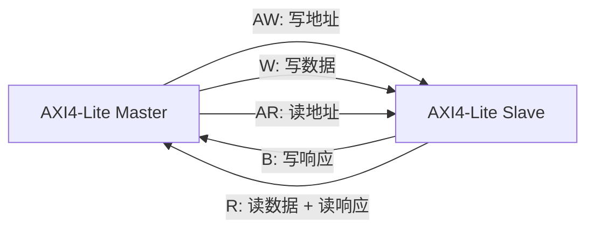

# AMBA AXI4-Lite 学习笔记：五通道握手与寄存器接口

> 适合读者：已经学过 APB，准备接触 AXI；希望先用较小的协议子集理解五通道、VALID/READY 和独立握手。
>
> 学习目标：能读懂 AXI4-Lite 波形；能写不会丢失 AW/W 的寄存器从设备；能设计 monitor、scoreboard、断言和基本测试计划。

---

## 0. 文档定位与版本边界

AXI4-Lite 是 AXI4 的简化子集，主要用于控制寄存器接口。

本文的精确定义以 Arm IHI 0022H 中的 AXI4-Lite 章节为依据，并结合《Introduction to AMBA AXI4》解释五通道和握手。你提供的 IHI 0022L 是 2025 年新版规范，已移除 AXI3、AXI4 和 AXI4-Lite 接口类别，只保留 AMBA 5 接口类别，因此不能直接拿 Issue L 的 AXI5-Lite 新增信号当作 AXI4-Lite 必选信号。

术语说明：

| 本文术语 | 新版 Arm 常用术语 |
|---|---|
| Master | Manager / Requester |
| Slave | Subordinate / Completer |

工程和 IP 文档中仍大量使用 AXI4 的 Master/Slave 命名，本文保留它，便于对照信号方向。

---

## 1. AXI4-Lite 是什么

AXI4-Lite 可以理解为：

```text
保留 AXI 的五个独立通道和 VALID/READY 握手
去掉 burst、ID、乱序完成和 exclusive access
每次只传输一个 data beat
```

典型用途：

- CPU 配置 DMA 寄存器。
- 读写 GPIO、UART、Timer 等控制寄存器。
- FPGA 中处理器系统访问自定义 IP 寄存器。
- 低吞吐量状态和控制通路。

不适合：

- 大块内存搬运。
- 高吞吐量连续数据。
- 依赖 burst、多个 ID 或乱序返回的场景。

### 1.1 与 APB 的关键区别

| 对比项 | APB | AXI4-Lite |
|---|---|---|
| 通道 | 地址、数据共用一次两阶段传输 | 5 个独立通道 |
| 握手 | `PSEL/PENABLE/PREADY` | 每通道 `VALID/READY` |
| 最少周期 | 至少 2 拍 | 某个通道可 1 拍握手 |
| 读写并发 | 不支持 | 读、写通路可并发 |
| 写地址和写数据 | 同一传输中同时稳定 | 两个独立通道，可任意先后 |
| 响应 | `PSLVERR` | `BRESP/RRESP` |

AXI4-Lite 语法看似只是信号更多，真正难点是“通道彼此独立”。

---

## 2. 五个通道



| 通道 | 方向 | 内容 |
|---|---|---|
| AW | Master -> Slave | 写地址和写保护属性 |
| W | Master -> Slave | 写数据和字节使能 |
| B | Slave -> Master | 写响应 |
| AR | Master -> Slave | 读地址和读保护属性 |
| R | Slave -> Master | 读数据和读响应 |

### 2.1 为什么读没有单独响应通道

读数据必须从 Slave 返回 Master，因此 `RRESP` 可以与 `RDATA` 一起放在 R 通道。

写数据方向是 Master 到 Slave，写结果要反方向返回，所以需要单独的 B 通道。

---

## 3. 信号表

### 3.1 全局信号

| 信号 | 作用 |
|---|---|
| `ACLK` | 所有输入在上升沿采样 |
| `ARESETn` | 低有效复位 |

### 3.2 AW 写地址通道

| 信号 | 方向 | 作用 |
|---|---|---|
| `AWADDR` | M -> S | 写地址 |
| `AWPROT[2:0]` | M -> S | 特权、安全、指令/数据属性 |
| `AWVALID` | M -> S | 写地址有效 |
| `AWREADY` | S -> M | Slave 可以接收写地址 |

### 3.3 W 写数据通道

| 信号 | 方向 | 作用 |
|---|---|---|
| `WDATA` | M -> S | 写数据 |
| `WSTRB` | M -> S | 每字节写使能 |
| `WVALID` | M -> S | 写数据有效 |
| `WREADY` | S -> M | Slave 可以接收写数据 |

### 3.4 B 写响应通道

| 信号 | 方向 | 作用 |
|---|---|---|
| `BRESP[1:0]` | S -> M | 写响应状态 |
| `BVALID` | S -> M | 写响应有效 |
| `BREADY` | M -> S | Master 可以接收写响应 |

### 3.5 AR 读地址通道

| 信号 | 方向 | 作用 |
|---|---|---|
| `ARADDR` | M -> S | 读地址 |
| `ARPROT[2:0]` | M -> S | 访问属性 |
| `ARVALID` | M -> S | 读地址有效 |
| `ARREADY` | S -> M | Slave 可以接收读地址 |

### 3.6 R 读数据通道

| 信号 | 方向 | 作用 |
|---|---|---|
| `RDATA` | S -> M | 读数据 |
| `RRESP[1:0]` | S -> M | 读响应状态 |
| `RVALID` | S -> M | 读数据和响应有效 |
| `RREADY` | M -> S | Master 可以接收读返回 |

---

## 4. AXI4-Lite 去掉了什么

AXI4-Lite 的核心限制：

- 每笔事务只有 1 个 data beat。
- 数据总线宽度固定为 32 位或 64 位。
- 不支持 AXI ID。
- 不支持 burst。
- 不支持 exclusive access。
- 不支持数据交织。
- 所有事务按顺序完成。

与完整 AXI4 信号的等效关系：

| 完整 AXI4 字段 | AXI4-Lite 等效含义 |
|---|---|
| `AxLEN` | 固定为 0，即 1 beat |
| `AxSIZE` | 固定为数据总线宽度 |
| `AxBURST` | 无意义，因为只有 1 beat |
| `AxLOCK` | 固定 Normal access |
| `AxCACHE` | 固定 Non-modifiable、Non-bufferable |
| `WLAST/RLAST` | 每笔都是最后一拍，等效为 1 |
| ID signals | 不存在 |

注意：协议仍允许多个 outstanding AXI4-Lite 事务，但没有 ID，因此必须保持顺序。简单 Slave 可以通过 `READY` 限制为一次只接收一笔。

---

## 5. VALID/READY 握手

每个通道都使用相同规则：

```systemverilog
// 该表达式必须在 ACLK 上升沿采样；组合值为 1 才完成一次通道 transfer。
transfer = VALID && READY;
```

### 5.1 Source 与 Destination

| 通道 | Source：驱动 VALID | Destination：驱动 READY |
|---|---|---|
| AW | Master | Slave |
| W | Master | Slave |
| B | Slave | Master |
| AR | Master | Slave |
| R | Slave | Master |

“VALID 一定由 Master 驱动”是错误的。B、R 通道的 Source 是 Slave。

### 5.2 三种合法时序

```text
情况 A：VALID 先到，READY 后到
情况 B：READY 先到，VALID 后到
情况 C：VALID 与 READY 同拍到
```

只要在某个上升沿两者同时为 `1`，该通道完成一次传输。

### 5.3 Source 的铁律

Source 不允许等待 READY 后才拉高 VALID。

```text
错误：Master 等 AWREADY，Slave 又等 AWVALID -> 永久死锁
```

正确规则：

1. Source 有有效 payload 时自主拉高 VALID。
2. 一旦 VALID 拉高，在握手完成前必须保持 VALID。
3. 握手完成前 payload 必须稳定。

### 5.4 Destination 可以等待 VALID

Destination 可以：

- 提前拉高 READY。
- 看到 VALID 后再拉高 READY。
- 在 VALID 出现前自由改变 READY。

为了单拍接收，常建议 READY 在确实有容量时提前为高。

### 5.5 接口组合路径限制

AXI 接口输入到输出之间不能存在组合路径。实际设计通常使用寄存器、FIFO 或 skid buffer 断开组合依赖。

例如，不应简单写成：

```systemverilog
// 错误示例：AWREADY 直接由输入 WVALID 组合产生，既形成输入到输出的组合路径，
// 又错误地把本应独立的 AW、W 两个通道绑在一起。
assign AWREADY = WVALID; // 输入直接组合影响输出，且耦合两个独立通道
```

---

## 6. 写事务：三个独立握手

一次 AXI4-Lite 写事务包含：

```text
一次 AW 握手 + 一次 W 握手 + 一次 B 握手
```

关键依赖：

```text
AW 与 W：没有固定先后关系
BVALID：必须等 AW 和 W 都已被接收后才能产生
```

### 6.1 三种合法到达顺序

```text
顺序 1：AW 先，W 后
顺序 2：W 先，AW 后
顺序 3：AW 与 W 同拍
```

Slave 必须正确处理自己声明可以接收的所有合法顺序。

### 6.2 最常见的错误实现

```systemverilog
// 错误示例：这个条件要求 AW 与 W 恰好同一拍握手。
// 如果地址先被接收、数据几拍后才到，本次写事务就会丢失。
if (AWVALID && AWREADY && WVALID && WREADY)
    do_write();
```

这个实现只接受“AW 与 W 恰好同拍握手”。若 AW 先握手后撤销，W 隔几拍才来，写事务会永久丢失。

### 6.3 正确思路：分别保存

```text
AW handshake -> 保存地址，置 aw_hold_valid
W  handshake -> 保存数据/STRB，置 w_hold_valid
两者都有效   -> 执行写操作，产生 B response
```

---

## 7. 写响应

`BRESP` 编码：

| 值 | 名称 | AXI4-Lite 含义 |
|---|---|---|
| `2'b00` | OKAY | 正常完成 |
| `2'b01` | EXOKAY | AXI4-Lite 不支持 exclusive，通常不使用 |
| `2'b10` | SLVERR | Slave 能译码，但访问失败 |
| `2'b11` | DECERR | 通常由 interconnect 表示地址无法译码 |

Slave 拉高 `BVALID` 后，必须保持 `BRESP` 稳定，直到 `BVALID && BREADY` 握手。

写操作完成不等于 Master 已收到响应：

```text
内部寄存器更新 -> BVALID 拉高 -> 等待 BREADY -> B 通道完成
```

在 `BREADY=0` 时，Slave 不能覆盖尚未接收的响应。

---

## 8. 读事务

一次 AXI4-Lite 读事务包含：

```text
一次 AR 握手 + 一次 R 握手
```

顺序关系：

```text
必须先接收 AR
然后 Slave 才能对该请求产生 RVALID/RDATA/RRESP
```

### 8.1 R 通道阻塞

若 `RVALID=1, RREADY=0`：

- `RVALID` 必须保持为 1。
- `RDATA` 必须稳定。
- `RRESP` 必须稳定。
- 没有额外缓冲时，不应再接收会覆盖返回槽的新读请求。

---

## 9. 写字节使能 `WSTRB`

32 位接口中：

```text
WSTRB[0] -> WDATA[7:0]
WSTRB[1] -> WDATA[15:8]
WSTRB[2] -> WDATA[23:16]
WSTRB[3] -> WDATA[31:24]
```

按字节更新：

```systemverilog
// WSTRB 每一位对应 WDATA 的一个 8-bit byte lane。
for (int i = 0; i < DATA_WIDTH/8; i++) begin
    // 只覆盖使能字节；其余字节依靠非阻塞赋值保持原值。
    if (wstrb_q[i])
        reg_data[i*8 +: 8] <= wdata_q[i*8 +: 8];
end
```

规范允许 Slave：

- 完整支持 `WSTRB`。
- 对非存储器类寄存器忽略它，并当成全宽写。
- 检测不支持的组合并报错。

但如果 Slave 提供 memory access，就必须正确支持 `WSTRB`。

### 9.1 `WSTRB='0`

全 0 写 strobe 的事务仍可在 AXI4-Lite 接口上传递。设计不能假设 interconnect 一定会抑制它。

常见处理是正常返回 OKAY，但不更新任何字节；具体项目应明确规定。

---

## 10. `AxPROT` 访问属性

`AWPROT` 和 `ARPROT` 的含义相同：

| 位 | `0` | `1` |
|---|---|---|
| `[0]` | Unprivileged | Privileged |
| `[1]` | Secure | Non-secure |
| `[2]` | Data | Instruction |

简单外设经常忽略 `AxPROT`，安全系统可能据此拒绝访问。

---

## 11. 一个 AXI4-Lite interface

```systemverilog
interface axi_lite_if #(
    // AXI4-Lite 数据宽度按规范通常为 32 或 64 bit。
    parameter int ADDR_WIDTH = 32,
    parameter int DATA_WIDTH = 32
) (
    input logic ACLK,
    input logic ARESETn
);
    // AW：Master 发送写地址和保护属性，Slave 用 AWREADY 接收。
    logic [ADDR_WIDTH-1:0] AWADDR;
    logic [2:0]            AWPROT;
    logic                  AWVALID, AWREADY;

    // W：写数据与 byte strobe 独立于 AW 通道握手。
    logic [DATA_WIDTH-1:0] WDATA;
    logic [DATA_WIDTH/8-1:0] WSTRB;
    logic                  WVALID, WREADY;

    // B：Slave 返回整笔写事务的响应。
    logic [1:0]            BRESP;
    logic                  BVALID, BREADY;

    // AR：Master 发出单 beat 读请求。
    logic [ADDR_WIDTH-1:0] ARADDR;
    logic [2:0]            ARPROT;
    logic                  ARVALID, ARREADY;

    // R：Slave 把读数据和响应放在同一通道返回。
    logic [DATA_WIDTH-1:0] RDATA;
    logic [1:0]            RRESP;
    logic                  RVALID, RREADY;

    clocking master_cb @(posedge ACLK);
        // #1step 用于无竞争地采样 DUT 输出，#0 用于驱动 Master 输出。
        default input #1step output #0;
        output AWADDR, AWPROT, AWVALID;
        input  AWREADY;
        output WDATA, WSTRB, WVALID;
        input  WREADY;
        input  BRESP, BVALID;
        output BREADY;
        output ARADDR, ARPROT, ARVALID;
        input  ARREADY;
        input  RDATA, RRESP, RVALID;
        output RREADY;
    endclocking

    clocking monitor_cb @(posedge ACLK);
        // Monitor 只采样双方所有通道，不承担任何驱动责任。
        default input #1step;
        input AWADDR, AWPROT, AWVALID, AWREADY;
        input WDATA, WSTRB, WVALID, WREADY;
        input BRESP, BVALID, BREADY;
        input ARADDR, ARPROT, ARVALID, ARREADY;
        input RDATA, RRESP, RVALID, RREADY;
    endclocking
endinterface
```

---

## 12. Master 驱动写事务

AW 和 W 应作为独立线程驱动，不能强制同拍：

```systemverilog
task automatic axi_lite_write(
    virtual axi_lite_if vif,
    bit [31:0] addr,
    bit [31:0] data,
    bit [3:0]  strb,
    output bit [1:0] resp
);
    // AW 和 W 是独立通道，因此用两个并行线程分别完成握手。
    fork
        begin : drive_aw
            // 在 AWVALID 拉高前先准备好整个 AW payload。
            vif.master_cb.AWADDR  <= addr;
            vif.master_cb.AWPROT  <= 3'b000;
            vif.master_cb.AWVALID <= 1'b1;
            // AWREADY 为 0 时，AWVALID/AWADDR/AWPROT 必须保持不变。
            do @(vif.master_cb); while (!vif.master_cb.AWREADY);
            // 循环退出表示 AWVALID && AWREADY 已在当前采样沿完成握手。
            vif.master_cb.AWVALID <= 1'b0;
        end
        begin : drive_w
            // W 通道可以比 AW 早、晚或同拍到达。
            vif.master_cb.WDATA  <= data;
            vif.master_cb.WSTRB  <= strb;
            vif.master_cb.WVALID <= 1'b1;
            // 保持 WVALID 和 payload，直到 Slave 真正接收写数据。
            do @(vif.master_cb); while (!vif.master_cb.WREADY);
            vif.master_cb.WVALID <= 1'b0;
        end
    join

    // 两个请求通道都完成后，等待 Slave 返回一笔 B response。
    vif.master_cb.BREADY <= 1'b1;
    do @(vif.master_cb); while (!vif.master_cb.BVALID);
    // BVALID && BREADY 的采样沿才能读取并消费 BRESP。
    resp = vif.master_cb.BRESP;
    vif.master_cb.BREADY <= 1'b0;
endtask
```

为了验证 Slave 的独立通道处理能力，sequence 应随机化 AW/W 的启动延迟和 BREADY backpressure。

---

## 13. 一个健壮的单 outstanding Slave 思路

下面只展示核心控制结构。重点是 AW/W 独立保存。

```systemverilog
// 两个 valid flag 分别表示已经缓存了 AW payload 和 W payload。
logic aw_stored, w_stored;
logic [ADDR_WIDTH-1:0] awaddr_q;
logic [DATA_WIDTH-1:0] wdata_q;
logic [DATA_WIDTH/8-1:0] wstrb_q;

// 该简单实现一次只处理一笔写事务：已有缓存或响应未取走时停止接收。
assign AWREADY = !aw_stored && !BVALID;
assign WREADY  = !w_stored  && !BVALID;

always_ff @(posedge ACLK or negedge ARESETn) begin
    if (!ARESETn) begin
        // 复位期间清除所有内部“已接收”状态，并按协议拉低 BVALID。
        aw_stored <= 1'b0;
        w_stored  <= 1'b0;
        BVALID    <= 1'b0;
        BRESP     <= 2'b00;
    end
    else begin
        if (AWVALID && AWREADY) begin
            // AW fire：只保存地址，不要求 W 在同一拍出现。
            awaddr_q  <= AWADDR;
            aw_stored <= 1'b1;
        end

        if (WVALID && WREADY) begin
            // W fire：只保存数据和 strobe，不要求 AW 在同一拍出现。
            wdata_q  <= WDATA;
            wstrb_q  <= WSTRB;
            w_stored <= 1'b1;
        end

        if (!BVALID && aw_stored && w_stored) begin
            // 地址和数据都齐备后，才能执行一次写副作用并生成响应。
            // 示例用 OKAY=00、SLVERR=10；实际写逻辑还要按 wstrb_q 更新寄存器。
            BVALID    <= 1'b1;
            BRESP     <= write_is_legal(awaddr_q) ? 2'b00 : 2'b10;
            aw_stored <= 1'b0;
            w_stored  <= 1'b0;
        end

        // B fire 后当前响应已被 Master 消费，可以释放响应槽。
        if (BVALID && BREADY)
            BVALID <= 1'b0;
    end
end
```

### 13.1 同拍捕获的细节

上面用寄存后的 `aw_stored && w_stored`，所以两者同拍握手后通常下一拍执行写。功能正确，但增加一拍延迟。

若要同拍合并新旧状态，需要仔细计算：

```systemverilog
// 若希望在“最后一个缺失通道本拍刚握手”时立即判断两部分是否齐备，
// 需要把寄存状态与本拍 fire 事件合并考虑。
aw_available = aw_stored || (AWVALID && AWREADY);
w_available  = w_stored  || (WVALID  && WREADY);
```

并选择保存值或当前总线值。优化前先保证不丢事务。

### 13.2 写副作用时机

寄存器更新可以在 AW 和 W 都已接收后发生，不需要等待 `BREADY`。但产生 `BVALID` 后必须保存响应，直到 B 握手完成。

---

## 14. 简单读通路

单 outstanding 读返回槽：

```systemverilog
// 只有输出 R 槽为空时才接收新地址，防止覆盖尚未取走的响应。
assign ARREADY = !RVALID;

always_ff @(posedge ACLK or negedge ARESETn) begin
    if (!ARESETn) begin
        // 协议要求 Slave 在复位期间把 RVALID 拉低。
        RVALID <= 1'b0;
        RDATA  <= '0;
        RRESP  <= 2'b00;
    end
    else begin
        if (ARVALID && ARREADY) begin
            // AR fire：锁存/使用当前地址，并为这笔请求生成一个 R response。
            RVALID <= 1'b1;
            if (read_is_legal(ARADDR)) begin
                RDATA <= read_mux(ARADDR);
                RRESP <= 2'b00;
            end
            else begin
                // 地址能到达本 Slave 但不受支持时，用 SLVERR 举例。
                RDATA <= '0;
                RRESP <= 2'b10;
            end
        end
        // R fire：Master 已消费当前数据，释放单深度返回槽。
        else if (RVALID && RREADY) begin
            RVALID <= 1'b0;
        end
    end
end
```

因为 `ARREADY = !RVALID`，未被接收的 R 响应会阻止新 AR 覆盖返回槽。

---

## 15. SVA 协议断言

### 15.1 VALID 被阻塞时保持

可对五个通道分别检查：

```systemverilog
property p_awvalid_sticky;
    @(posedge ACLK) disable iff (!ARESETn)
    // AW 被阻塞时，下一拍 AWVALID 仍必须为 1。
    AWVALID && !AWREADY |=> AWVALID;
endproperty

property p_bvalid_sticky;
    @(posedge ACLK) disable iff (!ARESETn)
    // 同一规则也适用于反向的 B 通道，此时 Source 是 Slave。
    BVALID && !BREADY |=> BVALID;
endproperty
```

### 15.2 Payload 在阻塞期间稳定

```systemverilog
property p_aw_stable;
    @(posedge ACLK) disable iff (!ARESETn)
    // 地址通道阻塞时，VALID 与整个 AW payload 都必须保持。
    AWVALID && !AWREADY |=> AWVALID && $stable({AWADDR, AWPROT});
endproperty

property p_w_stable;
    @(posedge ACLK) disable iff (!ARESETn)
    // 写数据阻塞时不能提前切换到下一笔数据。
    WVALID && !WREADY |=> WVALID && $stable({WDATA, WSTRB});
endproperty

property p_r_stable;
    @(posedge ACLK) disable iff (!ARESETn)
    // Master 未接收时，Slave 必须保存返回数据和响应。
    RVALID && !RREADY |=> RVALID && $stable({RDATA, RRESP});
endproperty
```

### 15.3 复位时输出 VALID 为低

规范要求 Master 的 `ARVALID/AWVALID/WVALID` 和 Slave 的 `RVALID/BVALID` 在复位期间为低。

```systemverilog
property p_valid_low_in_reset;
    @(posedge ACLK)
    // 示例同时观察双方接口；实际 checker 通常按 Master/Slave 责任拆开绑定。
    !ARESETn |-> !(AWVALID || WVALID || ARVALID || BVALID || RVALID);
endproperty
```

实际绑定断言时要根据接口角色拆分，避免一个 checker 同时驱动双方责任。

### 15.4 B 响应不能凭空出现

可在 checker 中维护已接受 AW/W 计数：

```text
aw_count += AWVALID && AWREADY
w_count  += WVALID  && WREADY
b_count  += BVALID  && BREADY

任意时刻：b_count <= min(aw_count, w_count)
```

对于 single-outstanding Slave，还可以断言 `BVALID` 产生前已各接受一次 AW 和 W。

---

## 16. UVM transaction 建模

```systemverilog
// 用枚举明确区分读写，比一个未命名的 bit 更容易打印和调试。
typedef enum {AXIL_READ, AXIL_WRITE} axil_kind_e;

class axi_lite_item extends uvm_sequence_item;
    // 协议内容字段。
    rand axil_kind_e kind;
    rand bit [31:0]  addr;
    rand bit [31:0]  data;
    rand bit [3:0]   strb;
    rand bit [2:0]   prot;

    // 时序随机字段用于主动制造 AW/W 错拍与 response backpressure。
    rand int unsigned addr_delay;
    rand int unsigned data_delay;
    rand int unsigned ready_delay;

         // 由 driver 或 monitor 在响应握手后回填，不能参与请求随机化。
         bit [1:0]   resp;

    // 默认生成 32-bit 对齐地址；非法/非对齐专项测试可关闭该约束。
    constraint aligned_c { addr[1:0] == 2'b00; }
    constraint read_fields_c {
        kind == AXIL_READ -> strb == '0;
    }
    constraint reasonable_delay_c {
        // 限制随机延迟，避免普通回归因为超长空等而效率过低。
        addr_delay  inside {[0:10]};
        data_delay  inside {[0:10]};
        ready_delay inside {[0:10]};
    }

    // 注册 factory，使 sequence item 可通过 type_id::create() 创建和 override。
    `uvm_object_utils(axi_lite_item)

    function new(string name = "axi_lite_item");
        super.new(name);
    endfunction
endclass
```

一个 write item 表示完整写事务，但 driver 内部要并行完成 AW、W 和 B 三个通道动作。

---

## 17. Monitor 如何重建事务

### 17.1 写 Monitor 不能只看同拍

AW 和 W 独立，monitor 应维护两个队列：

```text
AW handshake -> aw_queue.push_back(address/prot)
W  handshake -> w_queue.push_back(data/strb)

当两个队列都非空：
    取各自最早元素，形成一个待响应 write transaction

B handshake：
    给最早待响应 write transaction 填入 BRESP 并发布
```

AXI4-Lite 没有 ID，事务必须按顺序匹配。

### 17.2 读 Monitor

```text
AR handshake -> read_request_queue.push_back(address/prot)
R  handshake -> 取最早请求，填入 RDATA/RRESP，发布事务
```

### 17.3 Monitor 关注的是握手

只有这些事件才进入队列：

```systemverilog
// fire 事件是 monitor 入队和协议计数的唯一依据；只有 VALID 不能算传输。
aw_fire = AWVALID && AWREADY;
w_fire  = WVALID  && WREADY;
b_fire  = BVALID  && BREADY;
ar_fire = ARVALID && ARREADY;
r_fire  = RVALID  && RREADY;
```

VALID 单独为高只表示 Source 正在等待，不能重复采样成多个 transfer。

---

## 18. Scoreboard 与寄存器模型

写预测流程：

```text
收到完整 write transaction
    |
检查 BRESP
    |
若成功，按 WSTRB 更新 reference register map
```

读比较流程：

```text
收到完整 read transaction
    |
根据 ARADDR 和当前模型预测期望值
    |
检查 RRESP 和 RDATA
```

如果寄存器具有 read-clear、write-one-to-clear 等副作用，预测器必须按寄存器语义更新，不能只做普通存储器模型。

---

## 19. 随机验证重点

### 19.1 通道时序组合

必须覆盖：

- AW 比 W 早。
- W 比 AW 早。
- AW/W 同拍。
- AW 被阻塞，W 不阻塞。
- W 被阻塞，AW 不阻塞。
- BREADY 长时间为 0。
- ARREADY 随机反压。
- RREADY 长时间为 0。
- 读写同时进行。

### 19.2 数据与响应

- 各种 `WSTRB`。
- 合法/非法地址。
- RO、WO、W1C、RC 寄存器。
- `SLVERR`。
- 地址边界。
- 复位期间和复位刚释放后的事务。

### 19.3 功能覆盖示意

```systemverilog
covergroup axil_write_cg;
    // relation 由 monitor 计算：0=AW先、1=同拍、2=W先。
    cp_aw_before_w : coverpoint relation {
        bins aw_first = {0};
        bins same     = {1};
        bins w_first  = {2};
    }
    cp_resp : coverpoint resp {
        // EXOKAY 不属于普通 AXI4-Lite 写响应，因此这里不设功能 bin。
        bins okay   = {2'b00};
        bins slverr = {2'b10};
        bins decerr = {2'b11};
    }
    // 观察部分写、全写和全零 strobe 是否都被激励。
    cp_strb : coverpoint strb;
    // 交叉覆盖确认三种 AW/W 到达顺序下都见过不同响应。
    cross cp_aw_before_w, cp_resp;
endgroup
```

---

## 20. 常见错误总表

| 错误 | 后果 | 正确做法 |
|---|---|---|
| 只在 AW/W 同拍时写 | 通道错开就丢事务 | 独立保存 AW 和 W |
| Source 等 READY 才拉 VALID | 双方互等导致死锁 | Source 有数据就拉 VALID |
| VALID 阻塞时改变 payload | 接收方得到不确定内容 | 保持 VALID 和 payload |
| `BVALID` 未等 AW/W 都接收 | 写响应凭空出现 | 同时追踪地址和数据 |
| `RVALID && !RREADY` 时改 RDATA | Master 采样到错误数据 | 保持 RDATA/RRESP |
| 用 VALID 单独计数 transfer | 一个阻塞传输被重复计数 | 只在 VALID && READY 计数 |
| 忽略 `WSTRB` | 部分写破坏其他字节 | 按字节合并或明确报错 |
| 把 AXI4-Lite 当 APB | 强制地址数据同拍 | 接受五通道独立性 |
| 认为 Lite 不允许 outstanding | 错过协议能力 | 无 ID 但可多笔，必须有序 |
| 未限制返回槽却继续接收请求 | 响应被覆盖 | 使用 FIFO 或拉低 READY |

---

## 21. 调试波形的固定顺序

### 写失败

1. 看 AW 是否真的握手，而不是只有 `AWVALID`。
2. 看 W 是否真的握手。
3. 两者谁先谁后，Slave 是否都保存。
4. `WSTRB` 是否与期望一致。
5. `BVALID` 是否在 AW/W 都接收后出现。
6. `BVALID && !BREADY` 时 `BRESP` 是否稳定。
7. 最终 B 是否握手。

### 读失败

1. AR 是否握手。
2. Slave 是否保存地址。
3. RVALID 是否在请求之后出现。
4. `RVALID && !RREADY` 时数据是否稳定。
5. 最终 R 是否握手。

---

## 22. 练习题

### 练习 1

AW 在第 2 拍握手，W 在第 7 拍握手，是否合法？

答案：合法。AXI4-Lite 不规定两者固定时序关系。

### 练习 2

`WVALID=1, WREADY=0` 连续 4 拍，产生几个 W transfer？

答案：0 个。只有两者同时为 1 的上升沿才产生 transfer。

### 练习 3

`BVALID=1, BREADY=0` 时 Slave 能否先拉低 `BVALID`，等以后再重发？

答案：不能。VALID 必须保持到握手完成。

### 练习 4

为什么一个只有单返回寄存器的读 Slave 应在 `RVALID=1` 时拉低 `ARREADY`？

答案：防止接受新读请求后覆盖尚未被 Master 接收的 `RDATA/RRESP`。

---

## 本章总结

### 知识链

```text
五个独立通道
    -> 每通道 VALID/READY
    -> 握手才产生 transfer
    -> 写地址和写数据独立
    -> Slave 分别缓存后产生 B
    -> AR 后产生 R
    -> backpressure 时 VALID/payload 稳定
```

### 最重要的 10 条规则

1. AXI4-Lite 有 AW、W、B、AR、R 五个独立通道。
2. 任一通道只在 `VALID && READY` 的上升沿传输。
3. Source 不能等待 READY 才拉 VALID。
4. VALID 一旦拉高，握手前必须保持。
5. 阻塞期间 payload 必须稳定。
6. AW 和 W 可以任意先后或同拍到达。
7. B 必须在 AW 和 W 都被接收后产生。
8. R 必须对应已经接收的 AR。
9. AXI4-Lite 每笔只有 1 beat、无 ID、按序完成。
10. Monitor 必须按各通道握手重建完整事务。

---

## 参考资料

- Arm, *AMBA AXI and ACE Protocol Specification*, ARM IHI 0022H, Part A 与 Part B, 2020。
- Arm, *Introduction to AMBA AXI4*, 102202 Issue 01, 2020。
- Arm, *AMBA AXI Protocol Specification*, ARM IHI 0022 Issue L, 2025（用于确认新版版本边界和通用术语）。
