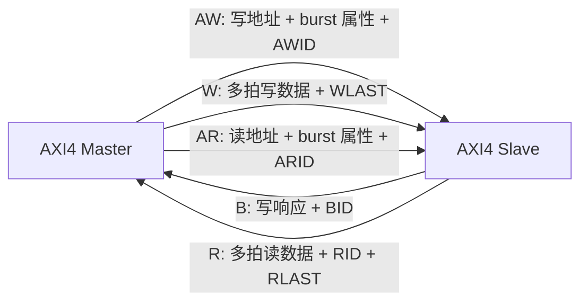
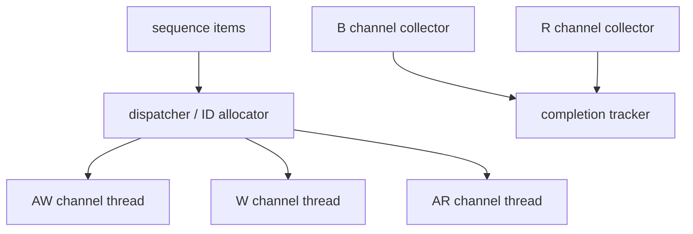

# AMBA AXI4 学习笔记：Burst、ID、Outstanding 与顺序模型

> 适合读者：已经理解 AXI4-Lite 的五通道和 VALID/READY，准备学习高性能存储映射接口。
>
> 学习目标：能解释一次 AXI4 读写 burst；能计算 beat 地址、长度和有效 byte lane；能理解 ID、outstanding、乱序返回和顺序保证；能搭建基础 UVM 验证模型。

---

## 0. 文档定位与版本说明

本文讲的是工程中最常见的 AMBA 4 AXI4，而不是把所有 AXI5、ACE 和 CHI 特性混在一起。

资料使用原则：

- 用 Arm《Introduction to AMBA AXI4》建立学习主线。
- 用 ARM IHI 0022H 中的 AXI4 章节补充精确定义。
- 参考你提供的 ARM IHI 0022 Issue L 理解 AXI 通用思想和新术语，但 Issue L 已移除 AXI3/AXI4/AXI4-Lite 接口类别，不能把其中 AXI5 专属 opcode、atomic、tag 等内容误当成 AXI4 必选功能。

术语对照：

| 传统 AXI4 资料 | 新版 Arm 术语 | 本文用法 |
|---|---|---|
| Master | Manager | 主要写 Master，首次出现时说明 |
| Slave | Subordinate | 主要写 Slave |
| Transaction | Transaction | 完整读或写事务 |
| Transfer / Beat | Transfer / Beat | 一次通道握手传输的数据单元 |

---

## 1. AXI4 解决什么问题

AXI4 面向高带宽、低延迟、高频率的片上互连。

与 APB/AXI4-Lite 相比，它增加的核心能力是：

- Burst：一个地址请求对应多个 data beat。
- Multiple outstanding：前一笔未完成时可以继续发请求。
- ID：区分多个逻辑事务。
- 不同 ID 可以乱序完成。
- 独立读写通道允许并发。
- 地址、数据和响应通道可以插入寄存级，便于时序收敛。
- 支持非对齐访问和 byte strobe。

典型用途：

- CPU 与 DDR 控制器。
- DMA 与系统内存。
- 高性能加速器读写共享存储器。
- NoC/interconnect 内部的 memory-mapped 通路。

### 1.1 AXI 定义的是接口协议

AXI 定义的是两个接口之间的信号和时序，不规定 interconnect 内部必须使用总线、crossbar 还是 NoC。

```text
Master interface <--- AXI point-to-point ---> Slave interface
```

多 Master、多 Slave 系统需要 interconnect 完成：

- 地址译码。
- 仲裁。
- 路由。
- ID 扩展和返回路由。
- 宽度/协议转换。
- 缓冲和时序切分。

---

## 2. 先区分 Transfer 与 Transaction

### 2.1 Transfer / Beat

一个通道上发生一次 `VALID && READY` 握手，就是一次 transfer。

例如：

```systemverilog
// 只有在这个 ACLK 上升沿同时采到 RVALID 和 RREADY，
// Master 才真正消费一个 read data beat。
r_fire = RVALID && RREADY;
```

每个 `r_fire` 表示接收一个 read data beat。

### 2.2 Transaction

完整写事务：

```text
1 个 AW transfer
+ N 个 W transfers
+ 1 个 B transfer
```

完整读事务：

```text
1 个 AR transfer
+ N 个 R transfers
```

其中 `N = AxLEN + 1`。

初学者常把一个 data beat 叫成一个 transaction，之后统计 outstanding 或写 scoreboard 时就会出错。

---

## 3. 五通道复习



每个通道独立握手：

```text
AWVALID/AWREADY
WVALID/WREADY
BVALID/BREADY
ARVALID/ARREADY
RVALID/RREADY
```

所有 AXI4-Lite 的握手规则在 AXI4 中仍成立：

1. 只在 `VALID && READY` 的上升沿发生 transfer。
2. Source 不得等待 READY 才拉 VALID。
3. VALID 拉高后必须保持到握手。
4. 阻塞期间 payload 必须稳定。
5. 接口输入和输出之间不能有组合路径。

---

## 4. 信号总览

### 4.1 AW/AR 地址通道共有字段

`Ax` 表示 `AW` 或 `AR`：

| 信号 | 作用 |
|---|---|
| `AxID` | 事务 ID |
| `AxADDR` | burst 第一个 transfer 的字节地址 |
| `AxLEN` | burst beat 数减 1 |
| `AxSIZE` | 每个 beat 的最大字节数，`bytes = 2^AxSIZE` |
| `AxBURST` | FIXED、INCR 或 WRAP |
| `AxLOCK` | exclusive access 属性 |
| `AxCACHE` | memory/cache 属性 |
| `AxPROT` | 特权、安全、指令/数据属性 |
| `AxQOS` | QoS 标识 |
| `AxREGION` | 同一物理接口中的逻辑区域 |
| `AxUSER` | 用户自定义 sideband |
| `AxVALID/AxREADY` | 地址通道握手 |

### 4.2 W 通道

| 信号 | 作用 |
|---|---|
| `WDATA` | 写数据 |
| `WSTRB` | 每字节写使能 |
| `WLAST` | 当前 beat 是 burst 最后一拍 |
| `WUSER` | 用户 sideband |
| `WVALID/WREADY` | 写数据握手 |

AXI4 没有 `WID`。写数据必须按写地址事务的发出顺序出现。

### 4.3 B 通道

| 信号 | 作用 |
|---|---|
| `BID` | 对应写事务 ID |
| `BRESP` | 写响应 |
| `BUSER` | 用户 sideband |
| `BVALID/BREADY` | 写响应握手 |

### 4.4 R 通道

| 信号 | 作用 |
|---|---|
| `RID` | 对应读事务 ID |
| `RDATA` | 读数据 |
| `RRESP` | 每个 read beat 的响应 |
| `RLAST` | 当前 beat 是该读 burst 最后一拍 |
| `RUSER` | 用户 sideband |
| `RVALID/RREADY` | 读数据握手 |

---

## 5. Burst 三要素

描述一个普通 AXI4 burst，至少先看：

```text
AxADDR  起始地址
AxLEN   一共有多少 beat
AxSIZE  每个 beat 最多多少字节
AxBURST 地址如何变化
```

### 5.1 `AxLEN`

```systemverilog
// AxLEN 使用“拍数减 1”编码，所以 8'h00 代表 1 beat，8'hFF 代表 256 beats。
beats = AxLEN + 1;
```

例子：

| `AxLEN` | beat 数 |
|---:|---:|
| 0 | 1 |
| 3 | 4 |
| 15 | 16 |
| 255 | 256 |

AXI4 中：

- INCR burst 最多 256 beat。
- FIXED burst 最多 16 beat。
- WRAP burst 只能是 2、4、8、16 beat。

### 5.2 `AxSIZE`

```systemverilog
// 左移等价于 2^AxSIZE：SIZE=0/1/2/3 分别表示 1/2/4/8 bytes。
bytes_per_beat = 1 << AxSIZE;
```

| `AxSIZE` | 每 beat 最大字节数 |
|---|---:|
| `3'b000` | 1 |
| `3'b001` | 2 |
| `3'b010` | 4 |
| `3'b011` | 8 |
| `3'b100` | 16 |
| `3'b101` | 32 |
| `3'b110` | 64 |
| `3'b111` | 128 |

`AxSIZE` 不能超过接口数据总线宽度。

例如 64-bit 总线有 8 个 byte lane，最大合法 `AxSIZE=3`。

### 5.3 `AxBURST`

| 编码 | 类型 | 地址变化 | 常见用途 |
|---|---|---|---|
| `2'b00` | FIXED | 每 beat 地址相同 | FIFO 端口 |
| `2'b01` | INCR | 每 beat 按 size 增加 | 普通连续内存 |
| `2'b10` | WRAP | 达到边界后回绕 | cache line fill |
| `2'b11` | Reserved | 不允许 | - |

---

## 6. Burst 地址计算

定义：

```text
Start_Address   = AxADDR
Number_Bytes    = 2^AxSIZE
Burst_Length    = AxLEN + 1
Aligned_Address = floor(Start_Address / Number_Bytes) * Number_Bytes
```

### 6.1 INCR burst

第一拍地址就是 `Start_Address`。后续 beat 按 `Number_Bytes` 递增，非对齐首拍之后从对齐边界继续。

例：

```text
64-bit data bus
AxADDR  = 0x1003
AxSIZE  = 2  -> 4 bytes/beat
AxLEN   = 3  -> 4 beats
AxBURST = INCR
```

概念地址序列：

```text
beat 0: 0x1003，首拍只使用从 byte lane 3 开始的合法字节
beat 1: 0x1004
beat 2: 0x1008
beat 3: 0x100C
```

有效 byte lane 还要结合数据总线宽度和 `WSTRB` 判断。

### 6.2 FIXED burst

```text
Address_N = Start_Address
```

每拍访问同一地址和同一组允许的 byte lane。常用于向 FIFO data register 连续 push/pop。

### 6.3 WRAP burst

限制：

- 起始地址必须对齐到每 beat 大小。
- beat 数只能为 2、4、8、16。

```text
total_bytes   = Number_Bytes * Burst_Length
wrap_boundary = floor(Start_Address / total_bytes) * total_bytes
upper_boundary = wrap_boundary + total_bytes
```

例：

```text
Start = 0x1C
Size  = 4 bytes
Len   = 4 beats
总范围 = 16 bytes
wrap boundary = 0x10
地址序列 = 0x1C, 0x10, 0x14, 0x18
```

### 6.4 4KB 边界规则

一个 AXI burst 不能跨越 4KB 地址边界。

原因是 4KB 常是最小页或地址译码边界，跨越后可能落到不同 Slave 或不同属性区域。

常用检查：

```systemverilog
// 这里只表达“首地址与最后一个被访问字节仍在同一 4KB 页”的思路。
// 真正计算 end_addr 时必须考虑 burst 类型、长度、size、非对齐和 wrap 行为。
(start_addr[ADDR_WIDTH-1:12] == end_addr[ADDR_WIDTH-1:12])
```

产生 sequence 时应约束 burst 不跨 4KB；协议错误测试则故意打破约束。

---

## 7. 非对齐传输与 byte lane

### 7.1 非对齐的含义

若 `AxADDR` 不是 `2^AxSIZE` 的整数倍，就是非对齐起始地址。

例如：

```text
AxSIZE=2 -> 每 beat 最多 4 bytes
自然对齐地址低 2 位应为 00
AxADDR=0x1002 -> 非对齐
```

### 7.2 写数据由 `WSTRB` 最终限定

`WSTRB[n]` 对应 `WDATA[8n +: 8]`。

Slave 只更新 strobe 为 1 的 byte lane。

关键检查：`WSTRB` 不能宣称本 beat 地址范围之外的 byte lane 有效。

### 7.3 窄传输

64-bit 数据总线上执行 32-bit transfer：

```text
data bus bytes = 8
AxSIZE = 2 -> 4 bytes/beat
```

根据地址低位，本 beat 使用低 4 个或高 4 个 byte lane。数据总线宽不等于每拍一定传满整条总线。

---

## 8. 写事务完整流程

### 8.1 AW 与 W 没有固定时序关系

合法情况：

```text
AW 在 W 前
W 在 AW 前
AW 与 W 同拍
```

interconnect 负责把地址和写数据重新对齐并路由到正确 Slave。

### 8.2 W beat 计数

每次：

```systemverilog
// beat 计数、WLAST 检查和写数据入队都只能由 w_fire 触发，
// WVALID 单独为 1 只表示 Source 正在等待 Receiver。
w_fire = WVALID && WREADY;
```

才增加已接收 beat 数。

期望：

```text
总 W fire 数 = AWLEN + 1
最后一个 W fire 时 WLAST=1
其他 W fire 时 WLAST=0
```

### 8.3 B 响应依赖

AXI4 Slave 必须等以下条件都发生后才断言对应 `BVALID`：

- 写地址已握手。
- 最后一个写数据 beat 已握手，即 `WVALID && WREADY && WLAST`。

`BVALID` 出现不需要等待 `BREADY`。Slave 先给出响应，Master 决定何时接收。

### 8.4 写数据顺序

AXI4 没有 WID，Master 必须按照 AW 地址事务的顺序发送完整 W burst。

```text
AW(ID=3, burst A)
AW(ID=7, burst B)
W burst A 的全部 beats
W burst B 的全部 beats
```

不能把 A、B 的 W beats 交织。

### 8.5 写响应可以乱序吗

不同 ID 的写响应可以乱序返回，只要 Slave/interconnect 支持。

同一 ID、同一目标的响应必须保持请求顺序。

---

## 9. 读事务完整流程

### 9.1 AR 请求

一次 AR handshake 携带完整 burst 描述：

```text
ARID, ARADDR, ARLEN, ARSIZE, ARBURST, attributes
```

### 9.2 R 返回

每个 read beat 都携带：

```text
RID + RDATA + RRESP + RLAST
```

每个 `RVALID && RREADY` 才消费一拍。

### 9.3 `RRESP` 是逐 beat 的

读 burst 的每一个 beat 都有 `RRESP`。不同 beat 可以出现不同响应，checker 不能只看最后一拍。

### 9.4 `RLAST`

对于 `ARLEN=N-1`：

```text
前 N-1 个已握手 R beat：RLAST=0
第 N 个已握手 R beat：RLAST=1
```

### 9.5 读数据交织与乱序

不同 RID 的事务可以乱序完成。支持读交织的实现甚至可以在 beat 粒度交替返回不同 RID：

```text
R(ID=1, beat0)
R(ID=2, beat0)
R(ID=1, beat1, last)
R(ID=2, beat1, last)
```

但同一 ID 的事务返回顺序必须符合 ordering 规则。

---

## 10. Response 编码

| 编码 | 名称 | 含义 |
|---|---|---|
| `2'b00` | OKAY | 普通成功；也可表示 exclusive write 未成功更新 |
| `2'b01` | EXOKAY | exclusive access 成功 |
| `2'b10` | SLVERR | 已到达 Slave，但操作失败 |
| `2'b11` | DECERR | interconnect 无法译码到目标 |

### 10.1 `SLVERR` 与 `DECERR`

```text
DECERR：不知道该把请求送到哪里
SLVERR：送到了某个 Slave，但它拒绝或执行失败
```

### 10.2 写响应与读响应粒度

```text
写：整个 burst 只有一个 BRESP
读：每个 data beat 都有一个 RRESP
```

---

## 11. ID、Outstanding 与乱序

这是完整 AXI4 与 Lite 的核心差异。

### 11.1 Outstanding

事务已经发出地址请求，但最终响应尚未完成，就叫 active/outstanding transaction。

例如：

```text
AR(ID=0) 已握手，还没收到最后 R beat
Master 又发送 AR(ID=1)
```

此时有两笔 outstanding read transactions。

### 11.2 为什么需要 ID

如果返回顺序与请求不同，Master 需要知道每个响应属于哪笔请求。

```text
ARID -> RID
AWID -> BID
```

### 11.3 基本顺序保证

同一通道、同一 ID、同一目标的事务按序。

协议通常不自动保证以下情况之间的顺序：

- 不同 Master。
- 读与写之间。
- 不同 ID。
- 不同目标区域。
- 不同 memory location。

若软件/硬件算法需要额外顺序，Master 必须等待前一事务响应，或使用架构规定的 barrier/同步机制。

### 11.4 ID 不是地址

ID 表示逻辑事务流，不用于地址译码。相同 ID 可以访问不同地址，不同 ID 也可以访问同一地址，但会影响可用的顺序保证和冲突处理。

### 11.5 Interconnect 扩展 ID

多 Master interconnect 常在原 ID 前附加 Master port 编号：

```text
{master_port, original_id}
```

返回时用附加位路由到正确 Master，再移除附加位。

---

## 12. Ordering 的初学者理解

### 12.1 “返回顺序”不等于“内存可见顺序”

一个 response 到达，表示协议层事务达到某种完成状态；它和其他观察者何时看到写入可能不是同一概念。

AXI ordering model 还涉及：

- Memory location 与 Peripheral region。
- 事务何时被观察。
- Bufferable 属性。
- endpoint 前是否可以提前响应。

初学阶段先掌握接口级规则：

1. 同 ID 响应按请求顺序返回。
2. 不同 ID 可能乱序。
3. 读写之间没有天然顺序保证。
4. 需要强顺序时，不要仅靠“我先发了”。

### 12.2 Peripheral region 为什么更敏感

外设寄存器访问可能有副作用，例如：

- 写 command 启动操作。
- 读 status 清中断。
- 访问一个地址影响另一个地址。

因此对外设访问的排序要求通常比普通内存更严格。

---

## 13. Exclusive Access

Exclusive access 用于实现 read-modify-write，而不是长时间锁住总线。

概念流程：

```text
1. Exclusive Read：读取位置，并让系统 monitor 记录地址/ID
2. 其他访问可能改变该位置
3. Exclusive Write：只有 monitor 条件仍成立才真正写入
```

响应：

- exclusive read 成功接受通常返回 `EXOKAY`。
- exclusive write 成功更新返回 `EXOKAY`。
- exclusive write 失败、不更新目标，返回 `OKAY`。

Master 看到 `OKAY` 不能把它当协议错误，而应理解为“条件写失败，需要重试算法”。

### 13.1 常见限制

Exclusive read/write 对必须保持关键属性匹配，例如 ID、地址、长度、大小、burst 类型等。具体实现还受 exclusive monitor 能力限制。

验证时应覆盖：

- 无冲突，exclusive write 成功。
- 中间有其他 Master 写同位置，exclusive write 失败。
- 不匹配属性导致失败。
- 多 ID 和多 monitor 情况。

---

## 14. 地址属性概览

### 14.1 `AxPROT`

| 位 | `0` | `1` |
|---|---|---|
| `[0]` | Unprivileged | Privileged |
| `[1]` | Secure | Non-secure |
| `[2]` | Data | Instruction |

### 14.2 `AxCACHE`

`AxCACHE` 描述事务可否 buffer、可否修改以及 cache 分配提示。它会影响 interconnect 能否拆分、合并、提前响应或经过缓存。

初学者不要把它简单理解成“是否 cacheable”一个布尔值。实际使用应严格对照项目 memory map 和 Arm 编码表。

### 14.3 `AxQOS`

提供 QoS 标识，interconnect 可以据此仲裁，但协议不规定唯一的 QoS 算法。

### 14.4 `AxREGION`

让一个物理 Slave 接口表示多个逻辑区域，区域可以有不同内部行为或属性。

### 14.5 `AxUSER/xUSER`

用户自定义 sideband。只有系统双方明确约定含义时才有意义，通用 VIP 不应擅自解释。

---

## 15. 一个精简 AXI4 interface 骨架

为突出主线，下面省略部分可选属性：

```systemverilog
interface axi4_if #(
    // 例子使用 32-bit 地址、64-bit 数据和 4-bit transaction ID。
    parameter int ADDR_WIDTH = 32,
    parameter int DATA_WIDTH = 64,
    parameter int ID_WIDTH   = 4
) (
    input logic ACLK,
    input logic ARESETn
);
    // AW 通道：一拍携带整笔 write burst 的起始地址、长度、大小和类型。
    logic [ID_WIDTH-1:0]   AWID;
    logic [ADDR_WIDTH-1:0] AWADDR;
    logic [7:0]            AWLEN;
    logic [2:0]            AWSIZE;
    logic [1:0]            AWBURST;
    logic                  AWVALID, AWREADY;

    // W 通道：AXI4 没有 WID，多个 write burst 的数据必须按 AW 顺序发送。
    logic [DATA_WIDTH-1:0] WDATA;
    logic [DATA_WIDTH/8-1:0] WSTRB;
    logic                  WLAST;
    logic                  WVALID, WREADY;

    // B 通道：每个完整 write burst 只返回一次响应，BID 用于匹配 AWID。
    logic [ID_WIDTH-1:0]   BID;
    logic [1:0]            BRESP;
    logic                  BVALID, BREADY;

    // AR 通道：描述一笔 read burst；读写地址通道可以并行工作。
    logic [ID_WIDTH-1:0]   ARID;
    logic [ADDR_WIDTH-1:0] ARADDR;
    logic [7:0]            ARLEN;
    logic [2:0]            ARSIZE;
    logic [1:0]            ARBURST;
    logic                  ARVALID, ARREADY;

    // R 通道：每个 beat 都携带 RID/RRESP，最后一拍额外断言 RLAST。
    logic [ID_WIDTH-1:0]   RID;
    logic [DATA_WIDTH-1:0] RDATA;
    logic [1:0]            RRESP;
    logic                  RLAST;
    logic                  RVALID, RREADY;

    // 把五个通道的握手条件封装成函数，checker/monitor 可统一调用，
    // 避免在不同组件中重复书写并意外漏掉 READY。
    function automatic bit aw_fire();
        return AWVALID && AWREADY;
    endfunction
    function automatic bit w_fire();
        return WVALID && WREADY;
    endfunction
    function automatic bit b_fire();
        return BVALID && BREADY;
    endfunction
    function automatic bit ar_fire();
        return ARVALID && ARREADY;
    endfunction
    function automatic bit r_fire();
        return RVALID && RREADY;
    endfunction
endinterface
```

真实 VIP interface 还应包括 `AxLOCK/AxCACHE/AxPROT/AxQOS/AxREGION/xUSER` 和 clocking block/modport。

---

## 16. Master 设计要点

### 16.1 每个 Source 通道都需要状态保持

若 AW 阻塞：

```systemverilog
// AW Source 被 backpressure 时，不能撤销 VALID，也不能切换到下一笔请求。
if (AWVALID && !AWREADY) begin
    // AWVALID、AWID、AWADDR、AWLEN、AWSIZE、AWBURST、attributes 全部保持
end
```

W、AR 同理；Master 作为 B/R 的 Destination，需要有足够容量再拉高 READY。

### 16.2 地址请求发出前检查资源

规范要求 Master 发出写请求后能够提供该事务全部写数据，发出读请求后能够接收该事务全部读数据，不能形成事务间循环依赖。

工程实现会检查：

- outstanding table 是否有空槽。
- write data buffer 是否足够。
- read return buffer 是否足够。
- ID 是否可分配。

### 16.3 不要用 READY 组合生成 VALID

这是最典型的死锁来源。VALID 应来自内部“有内容待发送”的寄存状态。

---

## 17. Slave 设计要点

### 17.1 地址队列与数据队列

支持多 outstanding 的 Slave 通常需要：

- AW queue：保存写地址和 burst 属性。
- W data tracking：将连续 W beats 归属到最早未完成写地址。
- B response queue：保存待返回写响应和 BID。
- AR queue：保存读请求。
- R scheduler：按 ID/资源能力返回数据。

### 17.2 不能覆盖阻塞响应

```text
BVALID && !BREADY -> BID/BRESP 必须稳定
RVALID && !RREADY -> RID/RDATA/RRESP/RLAST 必须稳定
```

要接收更多请求，就必须增加独立 FIFO，而不是覆盖输出寄存器。

### 17.3 Burst 计数器只在握手时更新

错误：

```systemverilog
// 错误示例：只看到 WVALID 就计数；WREADY=0 时同一 beat 会被重复统计。
if (WVALID) beat_count <= beat_count + 1;
```

正确：

```systemverilog
// 正确示例：只有真实 W handshake 才消费一个 beat。
if (WVALID && WREADY) beat_count <= beat_count + 1;
```

R 通道发送计数同理。

---

## 18. 基础 SVA

### 18.1 通用 sticky VALID

```systemverilog
property p_valid_sticky(valid, ready);
    @(posedge ACLK) disable iff (!ARESETn)
    // 当前拍 VALID=1 且未被接收时，下一拍 VALID 必须继续保持。
    valid && !ready |=> valid;
endproperty

// 五条通道都遵循同一条 sticky VALID 规则；B/R 通道的 Source 是 Slave。
a_awvalid_sticky: assert property (p_valid_sticky(AWVALID, AWREADY));
a_wvalid_sticky : assert property (p_valid_sticky(WVALID,  WREADY));
a_bvalid_sticky : assert property (p_valid_sticky(BVALID,  BREADY));
a_arvalid_sticky: assert property (p_valid_sticky(ARVALID, ARREADY));
a_rvalid_sticky : assert property (p_valid_sticky(RVALID,  RREADY));
```

不同工具对带形式参数的 property 支持风格不同，也可以分别展开。

### 18.2 地址 payload 稳定

```systemverilog
property p_aw_payload_stable;
    @(posedge ACLK) disable iff (!ARESETn)
    // AW 阻塞时，下一拍不仅 VALID 要保持，所有 burst 描述字段也不能改变。
    AWVALID && !AWREADY
    |=> AWVALID && $stable({AWID, AWADDR, AWLEN, AWSIZE, AWBURST});
endproperty
```

### 18.3 写数据 payload 稳定

```systemverilog
property p_w_payload_stable;
    @(posedge ACLK) disable iff (!ARESETn)
    // 特别把 WLAST 放进 stable 集合，避免最后一拍在 backpressure 中漂移。
    WVALID && !WREADY
    |=> WVALID && $stable({WDATA, WSTRB, WLAST});
endproperty
```

### 18.4 R payload 稳定

```systemverilog
property p_r_payload_stable;
    @(posedge ACLK) disable iff (!ARESETn)
    // Master 未拉高 RREADY 时，Slave 必须保存 RID、数据、响应和 LAST。
    RVALID && !RREADY
    |=> RVALID && $stable({RID, RDATA, RRESP, RLAST});
endproperty
```

### 18.5 `WLAST/RLAST` 检查

这类检查更适合带计数状态的 checker：

```text
on AW fire: 为新 write context 保存 expected_beats=AWLEN+1
on W fire : 最后一拍必须 WLAST，其他拍禁止 WLAST

on AR fire: 按 ARID 保存 expected_beats
on R fire : 按 RID 找 context，最后一拍必须 RLAST
```

仅靠一个短 SVA property 很难正确覆盖多 ID 和交织返回。

---

## 19. UVM transaction 建模

### 19.1 地址级 transaction

```systemverilog
// 枚举让 transaction 打印时直接显示 READ/WRITE 和 FIXED/INCR/WRAP，
// 比未命名的 bit 编码更易阅读和覆盖。
typedef enum {AXI_READ, AXI_WRITE} axi_kind_e;
typedef enum bit [1:0] {
    AXI_FIXED = 2'b00,
    AXI_INCR  = 2'b01,
    AXI_WRAP  = 2'b10
} axi_burst_e;

class axi_item extends uvm_sequence_item;
    // 地址阶段字段；len 采用协议原始编码，即实际 beat 数减 1。
    rand axi_kind_e kind;
    rand bit [3:0]  id;
    rand bit [31:0] addr;
    rand bit [7:0]  len;
    rand bit [2:0]  size;
    rand axi_burst_e burst;

    // 动态数组保存整个 burst 的数据；写事务另外为每一拍保存 strobe。
    rand bit [63:0] data[];
    rand bit [7:0]  strb[];
         // response 由 monitor/driver 回填。读事务每 beat 一个 RRESP；
         // 若统一建模写事务，可约定 resp 只使用第 0 项保存 BRESP。
         bit [1:0]  resp[];

    constraint array_size_c {
        // 数据数组长度必须与 AxLEN+1 一致，否则 driver 无法正确产生 LAST。
        data.size() == len + 1;
        kind == AXI_WRITE -> strb.size() == len + 1;
        kind == AXI_READ  -> strb.size() == 0;
    }

    constraint bus_width_c {
        // 64-bit interface 最多承载 8 bytes/beat，因此 AxSIZE 最大为 3。
        size <= 3;
    }

    constraint wrap_c {
        // WRAP 只允许 2/4/8/16 beats，起始地址还必须按单 beat 大小对齐。
        burst == AXI_WRAP -> {
            (len + 1) inside {2, 4, 8, 16};
            addr % (1 << size) == 0;
        };
    }

    // 注册 factory；复杂项目还会用 field 宏或手写 do_copy/do_compare。
    `uvm_object_utils(axi_item)
endclass
```

### 19.2 4KB 约束

简单 INCR 场景可以计算最后字节地址并约束同页。若支持非对齐、FIXED、WRAP，应使用统一地址函数，而不是直接写一个容易错的表达式。

建议把以下函数集中在 protocol utility package：

- `beats(len)`
- `bytes_per_beat(size)`
- `beat_address(item, index)`
- `lower_byte_lane(...)`
- `upper_byte_lane(...)`
- `crosses_4k(item)`
- `expected_last(index, len)`

driver、monitor、scoreboard 和 coverage 共用同一套定义，避免四处各写一份公式。

---

## 20. Driver 架构

一个 AXI Master driver 不应把完整事务串行地写成：

```text
发 AW -> 发完整 W -> 等 B -> 再处理下一笔
```

这样虽然可能合规，但完全失去 outstanding 和通道并发。

更合理的结构：



写地址和写数据线程需要保持 AXI4 的 W 顺序约束。读返回线程按 RID 找到对应 item。

### 20.1 Driver 与 Monitor 的职责

- Driver 知道自己发了什么，但不能代替 monitor 作为 scoreboard 的唯一事实来源。
- Monitor 只根据 pin-level handshake 重建实际发生的事务。
- Scoreboard 比较预测行为和实际行为。

---

## 21. Monitor 重建策略

### 21.1 写通路

```text
AW fire -> aw_queue.push(address transaction)
W fire  -> 归到 aw_queue 中最早尚未收完数据的 transaction
WLAST   -> 完成该事务的数据部分，进入 waiting_b_by_id
B fire  -> 按 BID 找到同 ID 最早待响应事务，填 BRESP 并发布
```

AXI4 W 没有 ID，因此 W 数据按 AW 顺序归属。

### 21.2 读通路

```text
AR fire -> active_read_by_id[ARID].push(request)
R fire  -> 找 RID 对应最早请求，追加 data/resp
RLAST   -> 完整事务完成并发布
```

数据可能在不同 RID 之间交织，所以不能只有一个全局 current_read。

### 21.3 何时报告协议错误

- 没有对应 AW，却收到 W beat。
- W beat 数与 AWLEN 不符。
- WLAST 过早或过晚。
- 没有待响应写事务却收到 BID。
- 没有对应 ARID 却收到 RID。
- RLAST 与 ARLEN 不符。
- 同 ID 响应顺序错误。

---

## 22. Scoreboard 结构

### 22.1 数据正确性

Memory model 按地址和 `WSTRB` 更新字节：

```systemverilog
// 这是“按 strobe 合并写数据”的简化示意。
// 实际 byte 地址必须通过 burst/非对齐 byte-lane 公式换算，
// 不能在所有场景下都直接使用 beat_addr+i。
foreach (strb[i]) begin
    // strobe=0 的 byte 不得改变 memory model。
    if (strb[i])
        mem[beat_addr + i] = data[i*8 +: 8];
end
```

真正的 `beat_addr + i` 是否正确，需要结合起始非对齐和有效 lane 计算，不能把 lane index 永远直接当地址偏移。

### 22.2 顺序正确性

Scoreboard 不能简单使用单个 FIFO 比较所有请求和响应，因为不同 ID 允许乱序。

推荐：

```text
expected_by_id[id] = queue of expected transactions
```

同 ID 按队列头匹配，不同 ID 独立完成。

### 22.3 错误响应

对于非法地址：

- interconnect 可能返回 DECERR。
- 已选中的 Slave 可能返回 SLVERR。
- read burst 的每个 beat 都要有协议完整的 R response 和正确 RLAST。

错误也必须“把协议走完”，否则 Master 会永远等待。

---

## 23. 功能覆盖计划

### 23.1 Burst 属性

- `AxLEN`：1、2、4、8、16、边界值 256。
- `AxSIZE`：从 1 byte 到总线满宽。
- `AxBURST`：FIXED、INCR、WRAP。
- 对齐/非对齐。
- 4KB 边界附近。

### 23.2 通道行为

- AW 在 W 前、后、同拍。
- 每个通道独立 backpressure。
- 连续无气泡 beat。
- VALID 长时间等待 READY。
- 复位打断。

### 23.3 ID 与顺序

- 相同 ID 多笔 outstanding。
- 不同 ID 多笔 outstanding。
- 不同 ID 乱序完成。
- R beat 跨 ID 交织。
- 同 ID 保序。
- 最大 outstanding 深度。

### 23.4 Response

- OKAY、EXOKAY、SLVERR、DECERR。
- 读 burst 中间 beat 报错。
- exclusive 成功/失败。

### 23.5 Cross 建议

```text
burst_type x size x alignment
burst_type x length
id_relation x completion_order
response x read_write
backpressure_channel x burst_length
exclusive_result x interference
```

---

## 24. 性能指标

### 24.1 带宽

理论峰值：

```text
bandwidth = clock_frequency * bytes_per_cycle
```

实际利用率受以下因素影响：

- VALID/READY 气泡。
- burst 长度。
- 地址仲裁。
- read latency。
- write response latency。
- outstanding 深度。
- 数据总线宽度转换。

### 24.2 延迟

读延迟常指从 AR 请求到第一个 R beat 的时间。

写延迟可分别统计：

- AW 到第一个 W。
- 最后 W 到 B。
- 完整事务从发起到响应。

### 24.3 验证中统计

Monitor 可记录：

```text
address_accept_cycle
first_data_cycle
last_data_cycle
response_cycle
stall_cycles per channel
max outstanding
```

这些统计能发现“功能正确但性能严重退化”的设计。

---

## 25. 常见错误总表

| 错误理解/实现 | 正确理解 |
|---|---|
| `AxLEN` 就是 beat 数 | beat 数是 `AxLEN+1` |
| 数据总线宽度就是每拍访问宽度 | 每拍宽度由 `AxSIZE` 决定 |
| W 与 AW 必须同拍 | 两通道独立，可任意先后 |
| AXI4 W 有 ID | AXI4 没有 WID，W burst 按 AW 顺序 |
| 每拍 WVALID 都计数 | 只在 `WVALID && WREADY` 计数 |
| 只在最后看 RRESP | 每个 R beat 都有 RRESP |
| 不同 ID 也必须按发出顺序返回 | 不同 ID 可以乱序 |
| 同一 ID 可以乱序返回 | 同一 ID、同一目标必须保序 |
| Response 出错就可以少发 beat | 错误也必须保持协议完整和正确 LAST |
| Exclusive write 返回 OKAY 是普通成功 | 通常表示 exclusive 条件失败、未更新 |
| Burst 可以跨 4KB | AXI burst 不允许跨 4KB |
| VALID 可以等 READY | Source 不允许形成这种依赖 |

---

## 26. 调试波形顺序

### 写事务

1. AW 是否握手，记录 `AWID/AWADDR/AWLEN/AWSIZE/AWBURST`。
2. 期望多少个 W beat。
3. 每个 W 是否真的握手。
4. `WSTRB` 与地址 lane 是否合法。
5. `WLAST` 是否只在最后一个已握手 beat 出现。
6. B 是否在 AW 和 WLAST 都接收后出现。
7. `BID` 是否匹配。
8. B 阻塞时响应是否稳定。

### 读事务

1. AR 是否握手并记录属性。
2. 按 ARID 建立 context。
3. 每个 RID 是否有对应请求。
4. R beat 数和 RLAST 是否正确。
5. 每拍 RRESP 是否检查。
6. 不同 ID 的乱序是否合法。
7. 同 ID 的顺序是否保持。

---

## 27. 练习题

### 练习 1

`AxLEN=8'h0F` 表示多少 beat？

答案：16 beat。

### 练习 2

128-bit 数据总线，`AxSIZE=3'b010`，每 beat 最多传多少字节？

答案：4 字节，属于窄传输；总线有 16 个 byte lane，但本 beat 只使用其中允许的一部分。

### 练习 3

两个读请求 ID 分别为 1 和 2，ID=2 先返回，是否合法？

答案：可以。不同 ID 可以乱序完成。

### 练习 4

两个读请求 ID 都为 3，后发请求先返回，是否合法？

答案：通常不合法。同 ID、同目标的响应必须按请求顺序返回。

### 练习 5

`WVALID=1, WREADY=0, WLAST=1` 是否已经结束 burst？

答案：没有。最后 beat 必须真正握手，才算写数据部分完成。

---

## 本章总结

### 知识网络

```text
VALID/READY 五通道
    |
    +-- Burst: ADDR + LEN + SIZE + BURST
    |       +-- beat 地址、byte lane、LAST、4KB
    |
    +-- ID: outstanding 与返回匹配
    |       +-- 同 ID 保序，不同 ID 可乱序
    |
    +-- W 无 ID: 按 AW 顺序发送完整 burst
    |
    +-- Response: 写一次 B，读每 beat 一个 RRESP
    |
    +-- Verification: per-channel monitor + per-ID scoreboard
```

### 学习重点排序

| 优先级 | 必须掌握 |
|---|---|
| 高 | 五通道握手和阻塞稳定性 |
| 高 | `LEN+1`、`2^SIZE`、三种 burst |
| 高 | WLAST/RLAST 与实际握手 beat 计数 |
| 高 | ID、outstanding、同 ID 保序 |
| 中 | 非对齐、WSTRB、4KB 边界 |
| 中 | Monitor 的 per-ID context |
| 中 | Response 与错误完整性 |
| 进阶 | Exclusive、cache 属性、系统可见顺序 |

### 最重要的 12 条规则

1. AXI4 仍使用五个独立 VALID/READY 通道。
2. Transfer 只发生在 `VALID && READY` 的上升沿。
3. Transaction 由地址、多个数据 beat 和可能的响应组成。
4. beat 数等于 `AxLEN+1`。
5. 每 beat 最大字节数等于 `2^AxSIZE`。
6. Burst 类型为 FIXED、INCR 或 WRAP。
7. Burst 不允许跨 4KB 边界。
8. 写地址和写数据没有固定到达关系。
9. AXI4 没有 WID，写数据按 AW 事务顺序发送。
10. 同 ID 响应保序，不同 ID 可以乱序。
11. WLAST/RLAST 必须与实际握手的最后 beat 对齐。
12. Scoreboard 必须按 ID 建模，不能用一个全局 FIFO 假设全部有序。

---

## 参考资料

- Arm, *Introduction to AMBA AXI4*, 102202 Issue 01, 2020。
- Arm, *AMBA AXI and ACE Protocol Specification*, ARM IHI 0022H, Part A, 2020。
- Arm, *AMBA AXI Protocol Specification*, ARM IHI 0022 Issue L, 2025（用于通用架构与新版边界对照）。
