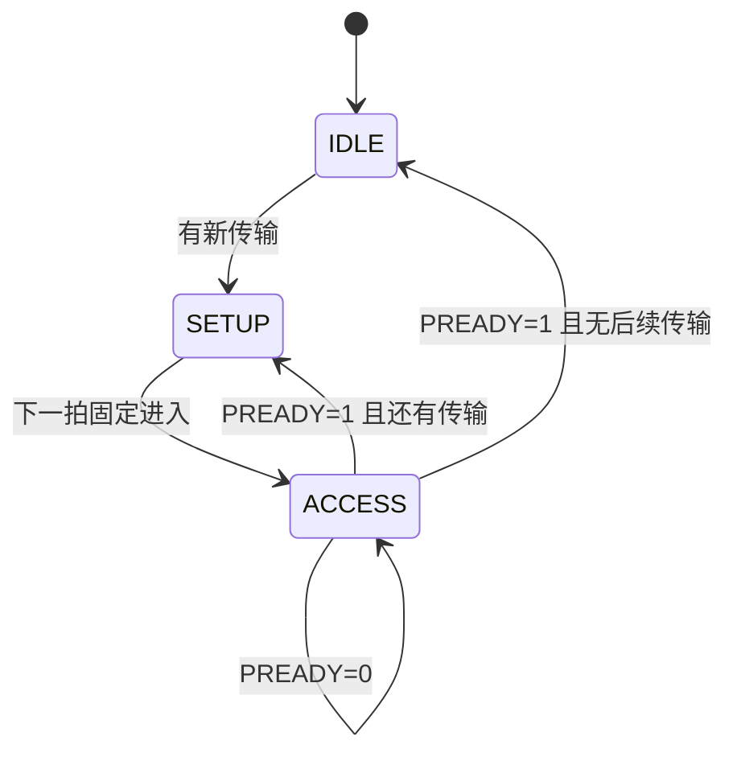

# AMBA APB 学习笔记：从寄存器读写到协议验证

> 适合读者：已经接触过 Verilog/SystemVerilog，准备学习片上总线和 UVM，但还没有总线协议基础。
>
> 学习目标：看懂 APB 波形；理解 Requester/Completer 的基本实现；能搭建简单 interface、monitor 和协议检查。

---

## 0. 文档定位与版本说明

本文主要依据 Arm《AMBA APB Protocol Specification》ARM IHI 0024E。该文档定义的是 APB5，并向下覆盖 APB2、APB3、APB4 的核心行为。

> **阅读主线：** 先记住 `SETUP -> ACCESS`，再看 `PREADY` 如何延长 ACCESS，最后学习 `PSTRB` 和 `PSLVERR`。
官方新版术语使用：

| 本文主要术语 | 旧资料常见术语 | 含义 |
|---|---|---|
| Requester | Master | 发起 APB 访问的一方，常见实现是 AXI-to-APB bridge |
| Completer | Slave | 被访问的外设，例如 UART、GPIO、Timer |

版本演进可以简记为：APB3 增加 `PREADY/PSLVERR`，APB4 增加 `PSTRB/PPROT`，APB5 再加入唤醒、用户信号、接口校验和可选 RME 支持。初学时先掌握两阶段传输、等待和错误响应。

---

## 1. APB 是什么

APB 全称 Advanced Peripheral Bus，定位是低成本、低功耗、低复杂度的外设寄存器访问接口。

常见系统结构：

```text
CPU / DMA
    |
  AXI Interconnect
    |
AXI-to-APB Bridge        <- APB Requester
    |
    +--------+---------+---------+
    |        |         |         |
  GPIO     UART      TIMER      SPI     <- APB Completer
```

APB 的特点：

- 同步协议，所有传输在 `PCLK` 上升沿采样。
- 不支持流水线。
- 一次传输至少需要两个时钟周期。
- 地址和数据不分成独立握手通道。
- 适合控制寄存器，不适合高带宽连续数据搬运。
- 通常不是 CPU 直接产生 APB 时序，而是桥接器将 AXI/AHB 请求转换为 APB。

### 1.1 为什么最少两个周期

APB 把一次传输拆成：

```text
SETUP  : 选中外设，给出地址、方向、写数据和属性
ACCESS : 拉高 PENABLE，等待外设完成
```

这两个阶段不能合并，所以即使外设零等待，一次访问也至少占两个周期。

### 1.2 APB 与存储器总线的直觉区别

APB 更像“访问一个寄存器”：

```text
选择设备 -> 告诉它访问哪个地址 -> 等它完成 -> 取回数据/错误
```

它不是用来追求每拍一个数据，也没有 burst、ID、乱序完成等机制。

---

## 2. 信号总览

### 2.1 基础信号

| 信号 | 方向 | 作用 |
|---|---|---|
| `PCLK` | Clock -> all | APB 时钟，上升沿采样 |
| `PRESETn` | System -> all | 低有效复位 |
| `PADDR` | Requester -> Completer | 字节地址，规范允许最高 32 位 |
| `PSELx` | Requester -> Completer | 选中某个 Completer；通常每个外设一根选择线 |
| `PENABLE` | Requester -> Completer | 表示进入 ACCESS 阶段 |
| `PWRITE` | Requester -> Completer | `1` 写，`0` 读 |
| `PWDATA` | Requester -> Completer | 写数据，宽度为 8、16 或 32 位 |
| `PRDATA` | Completer -> Requester | 读数据，与 `PWDATA` 等宽 |

### 2.2 APB3 常用扩展

| 信号 | 方向 | 作用 |
|---|---|---|
| `PREADY` | Completer -> Requester | `0` 延长 ACCESS，`1` 允许传输完成 |
| `PSLVERR` | Completer -> Requester | 最后一个 ACCESS 周期报告错误 |

### 2.3 APB4 常用扩展

| 信号 | 方向 | 作用 |
|---|---|---|
| `PSTRB` | Requester -> Completer | 每个数据字节一位写使能 |
| `PPROT[2:0]` | Requester -> Completer | 特权、安全、数据/指令属性 |

APB5 还定义了可选的 `PWAKEUP`、用户信号、RME 地址空间扩展和接口 check 信号。初学者实现外设时，先完成基础信号、`PREADY`、`PSLVERR` 和 `PSTRB` 即可。

---

## 3. 三个工作状态

APB 可以用三状态状态机理解：



| 状态 | `PSEL` | `PENABLE` | 含义 |
|---|---:|---:|---|
| IDLE | 0 | 0 | 没有传输 |
| SETUP | 1 | 0 | 给出本次传输信息 |
| ACCESS | 1 | 1 | Completer 执行并给出完成状态 |

### 3.1 最重要的完成条件

完成条件是 `PSEL && PENABLE && PREADY`。只有在时钟上升沿同时采到三个信号为 1，当前传输才完成。

不要只用 `PREADY` 判断完成，因为规范允许 `PENABLE=0` 时 `PREADY` 取任意值，零等待外设甚至可以把它常接 `1`。

### 3.2 `PENABLE` 不是“外设使能”

`PENABLE` 是整个 APB 接口共享的阶段信号，不是某个外设独有的片选。

某个 Completer 判断自己是否处于有效访问阶段，应使用本外设的 `PSEL_this && PENABLE`，不能只看共享的 `PENABLE`。

---

## 4. 基本读写传输

### 4.1 零等待写

```text
上升沿       T1              T2              T3
阶段       SETUP           ACCESS          完成后
PSEL         1               1               0/1
PENABLE      0               1               0
PWRITE       1               1               下一传输
PADDR       addr            addr             下一地址
PWDATA      data            data             下一数据
PREADY       X               1               X
                         T3 上升沿完成
```

流程：

1. Requester 在 SETUP 阶段拉高 `PSEL`。
2. 同时给出稳定的 `PADDR`、`PWRITE=1`、`PWDATA`、`PSTRB` 和属性。
3. 下一周期拉高 `PENABLE`，进入 ACCESS。
4. 若 `PREADY=1`，在该 ACCESS 周期末的上升沿完成写传输。
5. 完成后 `PENABLE` 必须拉低。

### 4.2 带等待状态的写

```text
阶段       SETUP     ACCESS     ACCESS     ACCESS      完成后
PSEL         1          1          1          1           0/1
PENABLE      0          1          1          1           0
PREADY       X          0          0          1           X
PADDR       A1         A1         A1         A1         next
PWDATA      D1         D1         D1         D1         next
```

只要处于 ACCESS 且 `PREADY=0`，Requester 必须保持本次传输信息不变：

- `PADDR`
- `PWRITE`
- `PSELx`
- `PENABLE`
- `PWDATA`
- `PSTRB`
- `PPROT`
- 对应用户信号

这条规则是 APB monitor 和 SVA 的重点。

### 4.3 零等待读

零等待读可以分成三步：

1. SETUP：Requester 给出 `PSEL=1、PENABLE=0、PWRITE=0` 和目标地址。
2. ACCESS：下一周期把 `PENABLE` 拉高。
3. 完成：`PSEL && PENABLE && PREADY` 同时为 1 时，采样 `PRDATA/PSLVERR`。

### 4.4 带等待读

`PREADY=0` 可以延长 ACCESS 任意多个周期。等待期间 Requester 保持地址、方向、选择和属性稳定。

Requester 只在最终完成沿采样 `PRDATA`，所以等待期间的数据不应被提前使用。

工程上常让 Completer 在等待时也保持 `PRDATA` 稳定，便于调试；但 monitor 仍然只能在完成后发布 transaction。

### 4.5 读传输时的 `PSTRB`

规范明确要求：读传输中所有 `PSTRB` 位必须为 `0`。

---

## 5. 连续传输

### 5.1 连续访问同一个 Completer

如果下一笔仍访问同一个外设，`PSEL` 可以保持为 `1`，但 `PENABLE` 必须在两笔传输之间回到 `0`：

```text
ACCESS(old) -> SETUP(new) -> ACCESS(new)
PSEL       1       1             1
PENABLE    1       0             1
```

不能连续两个完成周期都保持 `PENABLE=1`，否则没有新传输的 SETUP 阶段。

### 5.2 切换到另一个 Completer

通常每个外设有独立的 `PSELx`。完成旧访问后，下一个 SETUP 周期切换选择线：

```text
old_PSEL = 0
new_PSEL = 1
PENABLE  = 0
```

### 5.3 吞吐率直觉

零等待、连续传输情况下，一笔 APB 访问仍至少占两拍：

```text
SETUP0 ACCESS0 SETUP1 ACCESS1 SETUP2 ACCESS2
```

因此 APB 不适合追求每拍传一个数据。

---

## 6. 写字节使能 PSTRB

`PSTRB` 每一位对应 `PWDATA` 的一个字节：

```text
PSTRB[0] -> PWDATA[7:0]
PSTRB[1] -> PWDATA[15:8]
PSTRB[2] -> PWDATA[23:16]
PSTRB[3] -> PWDATA[31:24]
```

32 位数据总线下：

| `PSTRB` | 含义 |
|---|---|
| `4'b0001` | 只写最低字节 |
| `4'b0011` | 写低 16 位 |
| `4'b1100` | 写高 16 位 |
| `4'b1111` | 写完整 32 位 |
| `4'b0000` | 没有字节被更新 |

实现寄存器写入时，应逐字节检查 `PSTRB[i]`，只更新对应的 `PWDATA[i*8 +: 8]`。

### 6.1 常见错误

- 把 `PSTRB` 当成位写使能；它是字节写使能。
- 写寄存器时无条件覆盖全部字节。
- 读传输时仍驱动非零 `PSTRB`。
- 接口声明的数据宽度不是 8 的整数倍。

---

## 7. 错误响应 PSLVERR

`PSLVERR` 只在 `PSEL && PENABLE && PREADY` 同时成立的最后一个 ACCESS 周期有协议意义。

典型错误来源：

- 地址不存在。
- 写只读寄存器。
- 读只写寄存器。
- 不支持的 `PSTRB` 组合。
- 权限检查失败。

### 7.1 错误并不保证“没有副作用”

规范允许一次报错的访问已经改变了外设状态。

因此：

- 写错误不保证寄存器没被更新。
- 读错误时 `PRDATA` 可能无效。
- Requester 不能靠 `PSLVERR` 推断操作一定被回滚。

### 7.2 桥接后的响应

AXI-to-APB bridge 通常把：

```text
APB read  PSLVERR -> AXI RRESP
APB write PSLVERR -> AXI BRESP
```

---

## 8. 保护属性 PPROT

| 位 | `0` | `1` |
|---|---|---|
| `PPROT[0]` | Normal | Privileged |
| `PPROT[1]` | Secure | Non-secure |
| `PPROT[2]` | Data | Instruction |

`PPROT[2]` 更像提示，不一定能准确代表所有系统行为。

一个外设可以根据 `PPROT` 实现权限检查，例如只有 privileged access 才能写看门狗控制寄存器。

---

## 9. 地址与寄存器映射

### 9.1 `PADDR` 是字节地址

32 位寄存器常见映射：

| 地址 | 寄存器 |
|---|---|
| `0x00` | CTRL |
| `0x04` | STATUS |
| `0x08` | DATA |
| `0x0C` | IRQ_EN |

32 位寄存器通常忽略 `PADDR[1:0]`，使用更高位完成 word 地址译码。

### 9.2 非对齐地址

规范允许 `PADDR` 出现相对数据宽度非对齐的值，但结果是 UNPREDICTABLE。Completer 可能使用原地址、对齐后的地址或报错。

工程上通常约束 32 位访问满足 `addr[1:0]==0`，除非测试目标就是验证非法或非对齐访问。

---

## 10. 一个简单的 APB interface

```systemverilog
interface apb_if #(
    parameter int ADDR_WIDTH = 32,
    parameter int DATA_WIDTH = 32
) (
    input logic PCLK,
    input logic PRESETn
);
    logic [ADDR_WIDTH-1:0] PADDR;
    logic                  PSEL;
    logic                  PENABLE;
    logic                  PWRITE;
    logic [DATA_WIDTH-1:0] PWDATA;
    logic [DATA_WIDTH/8-1:0] PSTRB;
    logic [2:0]            PPROT;
    logic                  PREADY;
    logic [DATA_WIDTH-1:0] PRDATA;
    logic                  PSLVERR;
endinterface
```

这里只保留协议相关信号。实际 UVM 环境可以再加入 clocking block 和 modport，以避免 driver 与 DUT 的采样竞争。

---

## 11. 验证视角

### 11.1 Requester 与 Completer

Requester 的驱动流程与协议状态机一致：

1. SETUP 拍给出地址、方向和数据。
2. 下一拍拉高 `PENABLE` 进入 ACCESS。
3. 等待 `PREADY=1`。
4. 在完成沿采样响应，然后进入 IDLE 或下一笔 SETUP。
读任务类似：`PWRITE=0`、`PSTRB` 全 0，完成沿采样 `PRDATA`/`PSLVERR`。
driver 必须等真正的完成条件（`PSEL && PENABLE && PREADY`），不能假设外设永远零等待。

零等待外设可以把 `PREADY` 常接 1；地址译码用组合逻辑，读数据 `PRDATA` 只需在完成沿有效。
写副作用（寄存器更新）必须绑定到完成沿 `PSEL && PENABLE && PREADY && PWRITE`——否则 `PREADY=0` 等待期间会重复写入（例如 FIFO 被 push 多次）。

### 11.2 核心断言

核心断言包括：SETUP 后下一拍必须进入 ACCESS；等待期间请求字段保持稳定；`PENABLE` 有效时必须有 `PSEL`；读访问 `PSTRB` 为 0；`PSLVERR` 只在完成周期有效。

### 11.3 Monitor

SETUP 拍采样请求字段（addr/write/data/strb），完成沿（`PSEL && PENABLE && PREADY`）采样返回字段（rdata/slverr），只发布一次完整 transaction。

易错点：看到 `PSEL` 就发（响应字段还没出现）；每个等待周期都发；在 `PREADY=1` 但 `PENABLE=0` 时误判完成；连续传输中死等 `PSEL` 拉低（可能不拉低）。

### 11.4 常见错误

| 错误理解/实现 | 正确理解 |
|---|---|
| `PREADY=1` 就表示完成 | 必须同时有 `PSEL && PENABLE && PREADY` |
| `PENABLE` 可以一直为 1 | 每笔传输都必须先有 `PENABLE=0` 的 SETUP |
| 等待时可以先改地址 | `PREADY=0` 的 ACCESS 期间请求信息必须稳定 |
| 写逻辑见到 ACCESS 就执行 | 副作用应在完成沿执行，避免等待期间重复 |
| `PSTRB` 是位掩码 | 每位控制一个字节 |
| 读时 `PSTRB` 无所谓 | 读传输必须全 0 |
| `PSLVERR` 表示操作已回滚 | 规范不保证没有副作用 |
| 连续传输必须拉低 `PSEL` | 同一外设可保持 `PSEL=1`，但要插入 SETUP |
| Monitor 等 `PSEL` 下降才结束 | 连续传输可能不下降，应看完成条件 |
| APB 适合搬运大块数据 | APB 不流水，适合控制寄存器 |

---

## 12. 总结

### 12.1 学习重点排序

| 优先级 | 学习内容 |
|---|---|
| 🔴 高 | `SETUP -> ACCESS`、完成条件、等待期间保持稳定 |
| 🟡 中 | 连续传输、`PSTRB`、`PSLVERR`、地址译码 |
| 🟢 进阶 | `PPROT`、APB5 扩展、interface 和验证检查 |

### 12.2 易错点

| 易错理解 | 正确理解 |
|---|---|
| `PREADY=1` 就完成 | 必须同时满足 `PSEL && PENABLE && PREADY` |
| `PENABLE` 可以一直为 1 | 每笔传输前都需要一个 SETUP 周期 |
| 等待时可以修改地址 | `PREADY=0` 时请求字段必须保持稳定 |
| 写副作用在进入 ACCESS 时发生 | 应绑定到真正的完成沿 |
| 连续访问必须拉低 `PSEL` | 同一外设可保持 `PSEL=1`，但 `PENABLE` 必须回到 0 |

### 12.3 最重要的 10 条规则

1. APB 是同步、非流水协议，每笔至少两拍。
2. SETUP 时 `PSEL=1, PENABLE=0`。
3. ACCESS 时 `PSEL=1, PENABLE=1`。
4. 只有 `PSEL && PENABLE && PREADY` 才完成。
5. `PREADY=0` 时 Requester 必须保持传输信息稳定。
6. 每笔新传输前 `PENABLE` 都必须回到 `0`。
7. 读数据和错误响应在完成沿采样。
8. `PSTRB` 每一位控制一个写数据字节，读时必须为 0。
9. 外设副作用应只绑定到完成事件。
10. `PSLVERR` 不保证操作没有产生副作用。

---

## 参考资料

- Arm, *AMBA APB Protocol Specification*, ARM IHI 0024E, 2023。
- Arm, *Introduction to AMBA AXI4*, 102202 Issue 01, 2020（用于理解 AXI-to-APB 的系统定位）。
