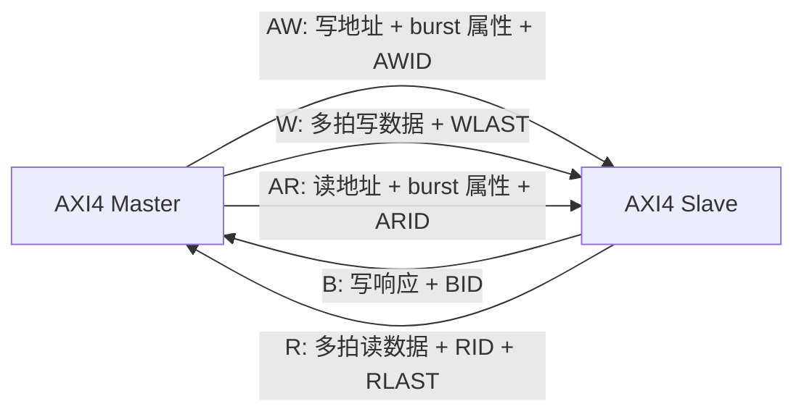

# AMBA AXI4 学习笔记：Burst、ID、Outstanding 与顺序模型

> 适合读者：已经理解 AXI4-Lite 的五通道和 VALID/READY，准备学习高性能存储映射接口。
>
> 学习目标：解释 AXI4 读写 burst；计算 beat 地址和有效 byte lane；理解 ID、未完成事务（outstanding）、乱序返回及基本验证方法。

---

## 0. 文档定位与版本说明

本文讲的是工程中最常见的 AMBA 4 AXI4，而不是把所有 AXI5、ACE 和 CHI 特性混在一起。

资料使用原则：

- 用 Arm《Introduction to AMBA AXI4》建立学习主线。
- 用 ARM IHI 0022H 中的 AXI4 章节补充精确定义。
- ARM IHI 0022 Issue L 用于对照新版术语和通用思想。它主要描述 AMBA 5，不能把其中 AXI5 专属的 opcode、atomic、tag 当成 AXI4 必选功能。

> **阅读主线：** 先掌握五通道握手，再学习一个地址如何展开成多个 beat，最后理解 ID 如何把多笔 outstanding 事务区分开。

术语对照：

| 传统 AXI4 资料 | 新版 Arm 术语 | 本文用法 |
|---|---|---|
| Master | Manager | 主要写 Master，首次出现时说明 |
| Slave | Subordinate | 主要写 Slave |
| Transaction | Transaction | 完整读或写事务 |
| Transfer / Beat | Transfer / Beat | 一次通道握手传输的数据单元 |

---

## 1. AXI4 解决什么问题

AXI4 面向高带宽、低延迟、高频率的片上互连。

与 APB/AXI4-Lite 相比，它增加的核心能力是：

- Burst：一个地址请求对应多个 data beat。
- Multiple outstanding：前一笔未完成时可以继续发请求。
- ID：区分多个逻辑事务。
- 不同 ID 可以乱序完成。
- 独立读写通道允许并发。
- 地址、数据和响应通道可以插入寄存级，便于时序收敛。
- 支持非对齐访问和 byte strobe。

典型用途：

- CPU 与 DDR 控制器。
- DMA 与系统内存。
- 高性能加速器读写共享存储器。
- NoC/interconnect 内部的 memory-mapped 通路。

### 1.1 AXI 定义的是接口协议

AXI 定义的是两个接口之间的信号和时序，不规定 interconnect 内部必须使用总线、crossbar 还是 NoC。

```text
Master interface <--- AXI point-to-point ---> Slave interface
```

多 Master、多 Slave 系统需要 interconnect 完成：

- 地址译码。
- 仲裁。
- 路由。
- ID 扩展和返回路由。
- 宽度/协议转换。
- 缓冲和时序切分。

---

## 2. Transfer 与 Transaction

### 2.1 Transfer / Beat

一个通道上发生一次 `VALID && READY` 握手，就是一次 transfer。

例如：

```systemverilog
// [1] 只有在这个 ACLK 上升沿同时采到 RVALID 和 RREADY，
// [2] Master 才真正消费一个 read data beat。
r_fire = RVALID && RREADY;
```

每个 `r_fire` 表示接收一个 read data beat。

### 2.2 Transaction

完整写事务：

```text
1 个 AW transfer
+ N 个 W transfers
+ 1 个 B transfer
```

完整读事务：

```text
1 个 AR transfer
+ N 个 R transfers
```

其中 `N = AxLEN + 1`。

初学者常把一个 data beat 叫成一个 transaction，之后统计 outstanding 或写 scoreboard 时就会出错。

---

## 3. 五通道与信号



每个通道独立握手：

```text
AWVALID/AWREADY
WVALID/WREADY
BVALID/BREADY
ARVALID/ARREADY
RVALID/RREADY
```

所有 AXI4-Lite 的握手规则在 AXI4 中仍成立：

1. 只在 `VALID && READY` 的上升沿发生 transfer。
2. Source 不得等待 READY 才拉 VALID。
3. VALID 拉高后必须保持到握手。
4. 阻塞期间 payload 必须稳定。
5. 接口输入和输出之间不能有组合路径。

### 3.1 AW/AR 地址通道共有字段

`Ax` 表示 `AW` 或 `AR`：

| 信号 | 作用 |
|---|---|
| `AxID` | 事务 ID |
| `AxADDR` | burst 第一个 transfer 的字节地址 |
| `AxLEN` | burst beat 数减 1 |
| `AxSIZE` | 每个 beat 的最大字节数，`bytes = 2^AxSIZE` |
| `AxBURST` | FIXED、INCR 或 WRAP |
| `AxLOCK` | exclusive access 属性 |
| `AxCACHE` | memory/cache 属性 |
| `AxPROT` | 特权、安全、指令/数据属性 |
| `AxQOS` | QoS 标识 |
| `AxREGION` | 同一物理接口中的逻辑区域 |
| `AxUSER` | 用户自定义 sideband |
| `AxVALID/AxREADY` | 地址通道握手 |

### 3.2 W 通道

| 信号 | 作用 |
|---|---|
| `WDATA` | 写数据 |
| `WSTRB` | 每字节写使能 |
| `WLAST` | 当前 beat 是 burst 最后一拍 |
| `WUSER` | 用户 sideband |
| `WVALID/WREADY` | 写数据握手 |

AXI4 没有 `WID`。写数据必须按写地址事务的发出顺序出现。

### 3.3 B 通道

| 信号 | 作用 |
|---|---|
| `BID` | 对应写事务 ID |
| `BRESP` | 写响应 |
| `BUSER` | 用户 sideband |
| `BVALID/BREADY` | 写响应握手 |

### 3.4 R 通道

| 信号 | 作用 |
|---|---|
| `RID` | 对应读事务 ID |
| `RDATA` | 读数据 |
| `RRESP` | 每个 read beat 的响应 |
| `RLAST` | 当前 beat 是该读 burst 最后一拍 |
| `RUSER` | 用户 sideband |
| `RVALID/RREADY` | 读数据握手 |

---

## 4. Burst 三要素

描述一个普通 AXI4 burst，至少先看：

```text
AxADDR  起始地址
AxLEN   一共有多少 beat
AxSIZE  每个 beat 最多多少字节
AxBURST 地址如何变化
```

### 4.1 `AxLEN`

```systemverilog
// [1] AxLEN 使用“拍数减 1”编码，所以 8'h00 代表 1 beat，8'hFF 代表 256 beats。
beats = AxLEN + 1;
```

例子：

| `AxLEN` | beat 数 |
|---:|---:|
| 0 | 1 |
| 3 | 4 |
| 15 | 16 |
| 255 | 256 |

AXI4 中：

- INCR burst 最多 256 beat。
- FIXED burst 最多 16 beat。
- WRAP burst 只能是 2、4、8、16 beat。

### 4.2 `AxSIZE`

```systemverilog
// [1] 左移等价于 2^AxSIZE：SIZE=0/1/2/3 分别表示 1/2/4/8 bytes。
bytes_per_beat = 1 << AxSIZE;
```

| `AxSIZE` | 每 beat 最大字节数 |
|---|---:|
| `3'b000` | 1 |
| `3'b001` | 2 |
| `3'b010` | 4 |
| `3'b011` | 8 |
| `3'b100` | 16 |
| `3'b101` | 32 |
| `3'b110` | 64 |
| `3'b111` | 128 |

`AxSIZE` 不能超过接口数据总线宽度。

例如 64-bit 总线有 8 个 byte lane，最大合法 `AxSIZE=3`。

### 4.3 `AxBURST`

| 编码 | 类型 | 地址变化 | 常见用途 |
|---|---|---|---|
| `2'b00` | FIXED | 每 beat 地址相同 | FIFO 端口 |
| `2'b01` | INCR | 每 beat 按 size 增加 | 普通连续内存 |
| `2'b10` | WRAP | 达到边界后回绕 | cache line fill |
| `2'b11` | Reserved | 不允许 | - |

---

## 5. Burst 地址计算

定义：

```text
Start_Address   = AxADDR
Number_Bytes    = 2^AxSIZE
Burst_Length    = AxLEN + 1
Aligned_Address = floor(Start_Address / Number_Bytes) * Number_Bytes
```

### 5.1 INCR burst

第一拍地址就是 `Start_Address`。后续 beat 按 `Number_Bytes` 递增，非对齐首拍之后从对齐边界继续。

例：

```text
64-bit data bus
AxADDR  = 0x1003
AxSIZE  = 2  -> 4 bytes/beat
AxLEN   = 3  -> 4 beats
AxBURST = INCR
```

概念地址序列：

```text
beat 0: 0x1003，首拍只使用从 byte lane 3 开始的合法字节
beat 1: 0x1004
beat 2: 0x1008
beat 3: 0x100C
```

有效 byte lane 还要结合数据总线宽度和 `WSTRB` 判断。

### 5.2 FIXED burst

```text
Address_N = Start_Address
```

每拍访问同一地址和同一组允许的 byte lane。常用于向 FIFO data register 连续 push/pop。

### 5.3 WRAP burst

限制：

- 起始地址必须对齐到每 beat 大小。
- beat 数只能为 2、4、8、16。

```text
total_bytes   = Number_Bytes * Burst_Length
wrap_boundary = floor(Start_Address / total_bytes) * total_bytes
upper_boundary = wrap_boundary + total_bytes
```

例：

```text
Start = 0x1C
Size  = 4 bytes
Len   = 4 beats
总范围 = 16 bytes
wrap boundary = 0x10
地址序列 = 0x1C, 0x10, 0x14, 0x18
```

### 5.4 4KB 边界规则

一个 AXI burst 不能跨越 4KB 地址边界。

原因是 4KB 常是最小页或地址译码边界，跨越后可能落到不同 Slave 或不同属性区域。

常用检查：

```systemverilog
// [1] 这里只表达“首地址与最后一个被访问字节仍在同一 4KB 页”的思路。
// [2] 真正计算 end_addr 时必须考虑 burst 类型、长度、size、非对齐和 wrap 行为。
(start_addr[ADDR_WIDTH-1:12] == end_addr[ADDR_WIDTH-1:12])
```

产生 sequence 时应约束 burst 不跨 4KB；协议错误测试则故意打破约束。

---

## 6. 非对齐传输与 byte lane

### 6.1 非对齐的含义

若 `AxADDR` 不是 `2^AxSIZE` 的整数倍，就是非对齐起始地址。

例如：

```text
AxSIZE=2 -> 每 beat 最多 4 bytes
自然对齐地址低 2 位应为 00
AxADDR=0x1002 -> 非对齐
```

### 6.2 写数据由 `WSTRB` 最终限定

`WSTRB[n]` 对应 `WDATA[8n +: 8]`。

Slave 只更新 strobe 为 1 的 byte lane。

关键检查：`WSTRB` 不能宣称本 beat 地址范围之外的 byte lane 有效。

### 6.3 窄传输

64-bit 数据总线上执行 32-bit transfer：

```text
data bus bytes = 8
AxSIZE = 2 -> 4 bytes/beat
```

根据地址低位，本 beat 使用低 4 个或高 4 个 byte lane。数据总线宽不等于每拍一定传满整条总线。

---

## 7. 写事务

### 7.1 AW 与 W 没有固定时序关系

合法情况：

```text
AW 在 W 前
W 在 AW 前
AW 与 W 同拍
```

interconnect 负责把地址和写数据重新对齐并路由到正确 Slave。

### 7.2 W beat 计数

每次：

```systemverilog
// [1] beat 计数、WLAST 检查和写数据入队都只能由 w_fire 触发，
// [2] WVALID 单独为 1 只表示 Source 正在等待 Receiver。
w_fire = WVALID && WREADY;
```

才增加已接收 beat 数。

期望：

```text
总 W fire 数 = AWLEN + 1
最后一个 W fire 时 WLAST=1
其他 W fire 时 WLAST=0
```

### 7.3 B 响应依赖

AXI4 Slave 必须等以下条件都发生后才断言对应 `BVALID`：

- 写地址已握手。
- 最后一个写数据 beat 已握手，即 `WVALID && WREADY && WLAST`。

`BVALID` 出现不需要等待 `BREADY`。Slave 先给出响应，Master 决定何时接收。

### 7.4 写数据顺序

AXI4 没有 WID，Master 必须按照 AW 地址事务的顺序发送完整 W burst。

```text
AW(ID=3, burst A)
AW(ID=7, burst B)
W burst A 的全部 beats
W burst B 的全部 beats
```

不能把 A、B 的 W beats 交织。

### 7.5 写响应可以乱序吗

不同 ID 的写响应可以乱序返回，只要 Slave/interconnect 支持。

同一 ID、同一目标的响应必须保持请求顺序。

---

## 8. 读事务

### 8.1 AR 请求

一次 AR handshake 携带完整 burst 描述：

```text
ARID, ARADDR, ARLEN, ARSIZE, ARBURST, attributes
```

### 8.2 R 返回

每个 read beat 都携带：

```text
RID + RDATA + RRESP + RLAST
```

每个 `RVALID && RREADY` 才消费一拍。

### 8.3 `RRESP` 是逐 beat 的

读 burst 的每一个 beat 都有 `RRESP`。不同 beat 可以出现不同响应，checker 不能只看最后一拍。

### 8.4 `RLAST`

对于 `ARLEN=N-1`：

```text
前 N-1 个已握手 R beat：RLAST=0
第 N 个已握手 R beat：RLAST=1
```

### 8.5 读数据交织与乱序

不同 RID 的事务可以乱序完成。支持读交织的实现甚至可以在 beat 粒度交替返回不同 RID：

```text
R(ID=1, beat0)
R(ID=2, beat0)
R(ID=1, beat1, last)
R(ID=2, beat1, last)
```

但同一 ID 的事务返回顺序必须符合 ordering 规则。

---

## 9. Response 编码

| 编码 | 名称 | 含义 |
|---|---|---|
| `2'b00` | OKAY | 普通成功；也可表示 exclusive write 未成功更新 |
| `2'b01` | EXOKAY | exclusive access 成功 |
| `2'b10` | SLVERR | 已到达 Slave，但操作失败 |
| `2'b11` | DECERR | interconnect 无法译码到目标 |

### 9.1 `SLVERR` 与 `DECERR`

```text
DECERR：不知道该把请求送到哪里
SLVERR：送到了某个 Slave，但它拒绝或执行失败
```

### 9.2 写响应与读响应粒度

```text
写：整个 burst 只有一个 BRESP
读：每个 data beat 都有一个 RRESP
```

---

## 10. ID、Outstanding 与乱序

这是完整 AXI4 与 Lite 的核心差异。

### 10.1 Outstanding

地址请求已经握手、最终响应却还没回来，这笔事务就叫 outstanding。白话说，就是“已经下单，但还没有收完货”。

例如：

```text
AR(ID=0) 已握手，还没收到最后 R beat
Master 又发送 AR(ID=1)
```

此时有两笔 outstanding read transactions。

### 10.2 为什么需要 ID

如果返回顺序与请求不同，Master 需要知道每个响应属于哪笔请求。

ID 就像事务的编号。不同编号可以并行处理和乱序返回；相同编号则提供必要的顺序约束。
```text
ARID -> RID
AWID -> BID
```

### 10.3 基本顺序保证

同一通道、同一 ID、同一目标的事务按序。

协议通常不自动保证以下情况之间的顺序：

- 不同 Master。
- 读与写之间。
- 不同 ID。
- 不同目标区域。
- 不同 memory location。

若软件/硬件算法需要额外顺序，Master 必须等待前一事务响应，或使用架构规定的 barrier/同步机制。

### 10.4 ID 不是地址

ID 表示逻辑事务流，不用于地址译码。相同 ID 可以访问不同地址，不同 ID 也可以访问同一地址，但会影响可用的顺序保证和冲突处理。

### 10.5 Interconnect 扩展 ID

多 Master interconnect 常在原 ID 前附加 Master port 编号：

```text
{master_port, original_id}
```

返回时用附加位路由到正确 Master，再移除附加位。

---

## 11. Ordering

### 11.1 “返回顺序”不等于“内存可见顺序”

收到 response，只说明接口协议已经走到规定的完成点；它不一定表示系统中所有处理器或设备已经看到这次写入。

AXI ordering model 还涉及：

- Memory location 与 Peripheral region。
- 事务何时被观察。
- Bufferable 属性。
- endpoint 前是否可以提前响应。

初学阶段先掌握接口级规则：

1. 同 ID 响应按请求顺序返回。
2. 不同 ID 可能乱序。
3. 读写之间没有天然顺序保证。
4. 需要强顺序时，不要仅靠“我先发了”。

因此，“先发请求”不等于“所有地方都先看到结果”。需要强顺序时，要等待响应或使用系统规定的 barrier/同步机制。
### 11.2 Peripheral region 为什么更敏感

外设寄存器访问可能有副作用，例如：

- 写 command 启动操作。
- 读 status 清中断。
- 访问一个地址影响另一个地址。

因此对外设访问的排序要求通常比普通内存更严格。

---

## 12. Exclusive Access

Exclusive access 用于实现 read-modify-write，而不是长时间锁住总线。

概念流程：

```text
1. Exclusive Read：读取位置，并让系统 monitor 记录地址/ID
2. 其他访问可能改变该位置
3. Exclusive Write：只有 monitor 条件仍成立才真正写入
```

响应：

- exclusive read 成功接受通常返回 `EXOKAY`。
- exclusive write 成功更新返回 `EXOKAY`。
- exclusive write 失败、不更新目标，返回 `OKAY`。

Master 看到 `OKAY` 不能把它当协议错误，而应理解为“条件写失败，需要重试算法”。

### 12.1 常见限制

Exclusive read/write 对必须保持关键属性匹配，例如 ID、地址、长度、大小、burst 类型等。具体实现还受 exclusive monitor 能力限制。

验证时应覆盖：

- 无冲突，exclusive write 成功。
- 中间有其他 Master 写同位置，exclusive write 失败。
- 不匹配属性导致失败。
- 多 ID 和多 monitor 情况。

---

## 13. 地址属性

### 13.1 `AxPROT`

| 位 | `0` | `1` |
|---|---|---|
| `[0]` | Unprivileged | Privileged |
| `[1]` | Secure | Non-secure |
| `[2]` | Data | Instruction |

### 13.2 `AxCACHE`

`AxCACHE` 描述事务可否 buffer、可否修改以及 cache 分配提示。它会影响 interconnect 能否拆分、合并、提前响应或经过缓存。

初学者不要把它简单理解成“是否 cacheable”一个布尔值。实际使用应严格对照项目 memory map 和 Arm 编码表。

### 13.3 `AxQOS`

提供 QoS 标识，interconnect 可以据此仲裁，但协议不规定唯一的 QoS 算法。

### 13.4 `AxREGION`

让一个物理 Slave 接口表示多个逻辑区域，区域可以有不同内部行为或属性。

### 13.5 `AxUSER/xUSER`

用户自定义 sideband。只有系统双方明确约定含义时才有意义，通用 VIP 不应擅自解释。

---

## 14. 验证视角

两条核心断言：

```systemverilog
// [1] sticky VALID：VALID=1 且未被接收时，下一拍必须保持（五条通道通用）
property p_valid_sticky(valid, ready);
    @(posedge ACLK) disable iff (!ARESETn)
    valid && !ready |=> valid;
endproperty
a_awvalid_sticky: assert property (p_valid_sticky(AWVALID, AWREADY));
a_wvalid_sticky : assert property (p_valid_sticky(WVALID,  WREADY));
a_bvalid_sticky : assert property (p_valid_sticky(BVALID,  BREADY));
a_arvalid_sticky: assert property (p_valid_sticky(ARVALID, ARREADY));
a_rvalid_sticky : assert property (p_valid_sticky(RVALID,  RREADY));

// [2] 反压时 payload 稳定（以 AW 为例；W/R 类似，W 要含 WLAST）
property p_aw_payload_stable;
    @(posedge ACLK) disable iff (!ARESETn)
    AWVALID && !AWREADY
    |=> AWVALID && $stable({AWID, AWADDR, AWLEN, AWSIZE, AWBURST});
endproperty
a_aw_payload_stable: assert property (p_aw_payload_stable);
```

WLAST/RLAST 检查更适合带计数状态的 checker：AW fire 时记录 expected_beats=AWLEN+1，W 握手时核对最后一拍。

写通路：AW fire 入队 → W fire 归到最早未收完数据的 AW 事务 → WLAST 完成数据部分 → B fire 按 BID 找同 ID 最早待响应事务并发布。（AXI4 W 没有 ID，数据按 AW 顺序归属。）

读通路：AR fire 按 ARID 入队 → R fire 找对应最早请求 → RLAST 完成发布。数据可能跨 RID 交织，不能只有一个全局 current_read。

协议错误：无 AW 收到 W beat、W 数与 AWLEN 不符、WLAST 过早/过晚、无待响应事务却收到 BID、无 ARID 却收到 RID、RLAST 与 ARLEN 不符、同 ID 响应乱序。

| 错误理解/实现 | 正确理解 |
|---|---|
| `AxLEN` 就是 beat 数 | beat 数是 `AxLEN+1` |
| 数据总线宽度就是每拍访问宽度 | 每拍宽度由 `AxSIZE` 决定 |
| W 与 AW 必须同拍 | 两通道独立，可任意先后 |
| AXI4 W 有 ID | AXI4 没有 WID，W burst 按 AW 顺序 |
| 每拍 WVALID 都计数 | 只在 `WVALID && WREADY` 计数 |
| 只在最后看 RRESP | 每个 R beat 都有 RRESP |
| 不同 ID 也必须按发出顺序返回 | 不同 ID 可以乱序 |
| 同一 ID 可以乱序返回 | 同一 ID、同一目标必须保序 |
| Response 出错就可以少发 beat | 错误也必须保持协议完整和正确 LAST |
| Exclusive write 返回 OKAY 是普通成功 | 通常表示 exclusive 条件失败、未更新 |
| Burst 可以跨 4KB | AXI burst 不允许跨 4KB |
| VALID 可以等 READY | Source 不允许形成这种依赖 |

---

## 15. 总结

### 15.1 学习重点排序

| 优先级 | 必须掌握 |
|---|---|
| 🔴 高 | 五通道握手和阻塞稳定性 |
| 🔴 高 | `LEN+1`、`2^SIZE`、三种 burst |
| 🔴 高 | WLAST/RLAST 与实际握手 beat 计数 |
| 🔴 高 | ID、outstanding、同 ID 保序 |
| 🟡 中 | 非对齐、WSTRB、4KB 边界 |
| 🟡 中 | Monitor 的 per-ID context |
| 🟡 中 | Response 与错误完整性 |
| 🟢 进阶 | Exclusive、cache 属性、系统可见顺序 |

### 15.2 易错点

| 易错理解 | 正确理解 |
|---|---|
| `AxLEN` 就是 beat 数 | 实际 beat 数是 `AxLEN+1` |
| 数据总线宽度就是每拍大小 | 每拍最大字节数由 `2^AxSIZE` 决定 |
| W 与 AW 必须同时出现 | 两个通道独立，W 甚至可以先握手 |
| AXI4 的 W 通道带 ID | AXI4 没有 WID，写数据按 AW 顺序归属 |
| 不同 ID 也必须按请求顺序返回 | 不同 ID 可以乱序，同 ID 受顺序规则约束 |
| 报错后可以少发几个 beat | 错误事务仍要保持正确 beat 数和 LAST |
| burst 可以跨 4KB | AXI burst 不允许跨越 4KB 边界 |

### 15.3 最重要的 12 条规则

1. AXI4 仍使用五个独立 VALID/READY 通道。
2. Transfer 只发生在 `VALID && READY` 的上升沿。
3. Transaction 由地址、多个数据 beat 和可能的响应组成。
4. beat 数等于 `AxLEN+1`。
5. 每 beat 最大字节数等于 `2^AxSIZE`。
6. Burst 类型为 FIXED、INCR 或 WRAP。
7. Burst 不允许跨 4KB 边界。
8. 写地址和写数据没有固定到达关系。
9. AXI4 没有 WID，写数据按 AW 事务顺序发送。
10. 同 ID 响应保序，不同 ID 可以乱序。
11. WLAST/RLAST 必须与实际握手的最后 beat 对齐。
12. Scoreboard 必须按 ID 建模，不能用一个全局 FIFO 假设全部有序。

---

## 参考资料

- Arm, *Introduction to AMBA AXI4*, 102202 Issue 01, 2020。
- Arm, *AMBA AXI and ACE Protocol Specification*, ARM IHI 0022H, Part A, 2020。
- Arm, *AMBA AXI Protocol Specification*, ARM IHI 0022 Issue L, 2025（用于通用架构与新版边界对照）。
