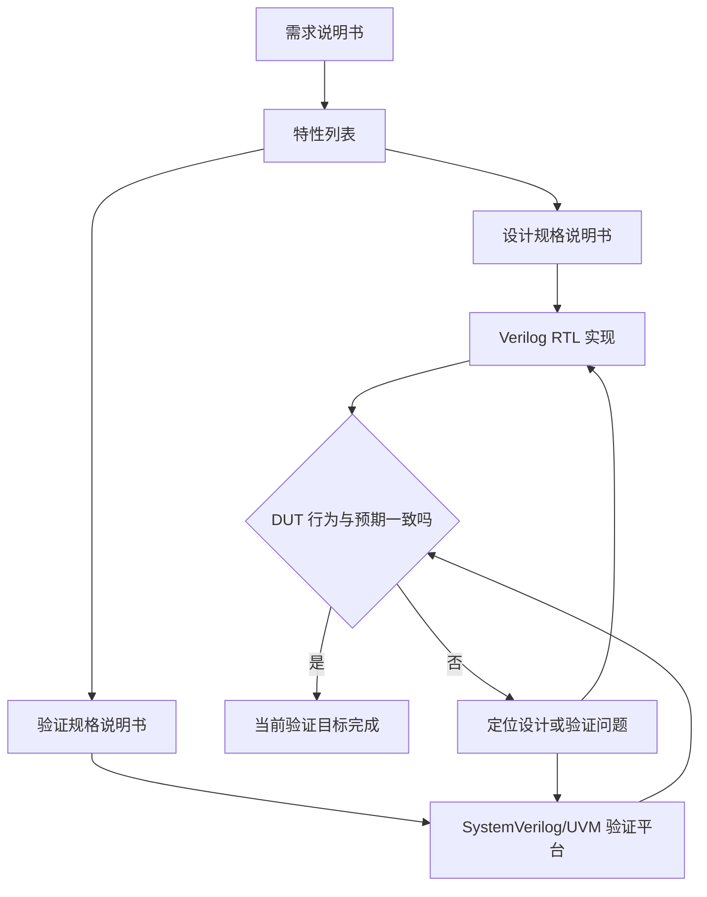

# UVM实战 第 1 章学习笔记：与 UVM 的第一次接触
> **核心结论**：UVM 不是一种新的编程语言，而是一套用 SystemVerilog 实现的通用验证方法学和类库。它帮助验证工程师统一验证平台的结构、组件通信、测试组织和复用方式。
>
> **记忆主线**：需求说明书 -> 特性列表 -> 设计与验证并行实现 -> 对比 DUT 行为 -> 定位并修正问题；SystemVerilog 提供语言能力，UVM 提供组织这些能力的方法。

---

## 1.0 本章定位
第 1 章不急着讲 UVM 类、宏和 phase，而是先回答三个问题：

1. 为什么现代 IC 项目必须进行专门的验证？
2. 为什么有了 SystemVerilog 还需要验证方法学？
3. 为什么在多种方法学中选择 UVM？

本章属于 UVM 学习的“地图章节”。 它不直接教我们搭建验证平台，却决定了后续知识应该放在什么位置理解。

| 本章主题 | 要回答的问题 |
|----------|----------------|
| 验证流程 | 验证在 IC 开发过程中处于什么位置 |
| 验证语言 | Verilog、SystemC、SystemVerilog 各有什么特点 |
| 方法学 | 为什么只掌握语言还不够 |
| UVM 选择 | UVM 相比 VMM、OVM 有什么优势 |
| 学习价值 | 验证工程师和设计工程师分别能获得什么 |

> **学习提示**：本章出现的许多术语会在后续章节变成具体代码。现在先记住它们解决什么问题，不必提前死记 API。

#### 与教材目录的对应关系

本笔记为了方便零基础阅读，把教材 1.1 中的几个主题拆开讲，但内容没有省略：

| 教材小节 | 本笔记位置 |
|----------|------------|
| 1.1.1 验证在现代 IC 流程中的位置 | 1.2 |
| 1.1.2 验证的语言 | 1.3 |
| 1.1.3 何谓方法学 | 1.4、1.5 |
| 1.1.4 为什么是 UVM | 1.6 |
| 1.1.5 UVM 的发展史 | 1.7 |
| 1.2.1 验证工程师 | 1.8.1 |
| 1.2.2 设计工程师 | 1.8.2 |

### 零基础阅读提示

- 这一章先建立地图，不要求会写 UVM 代码。
- 看到 driver、monitor、scoreboard 时，先把它们理解成“发送者、观察者、裁判”。
- 看到 transaction 时，先理解成“一次完整的数据包或总线操作”。
- 看到方法学时，理解成“大家约定用同一种方式搭平台”，而不是新的语法。
- 第一次阅读只要能说清楚“为什么需要 UVM”就足够，历史版本和组织名称以后再记。

---

## 1.1 UVM 是什么
### 1.1.1 一句话定义
UVM 的全称是 Universal Verification Methodology，即“通用验证方法学”。 可以从两个角度理解它：

| 角度 | 对 UVM 的理解 |
|------|----------------|
| 使用者角度 | 一套可直接使用和扩展的 SystemVerilog 类库 |
| 工程角度 | 一套组织验证平台、测试用例和验证流程的规范 |

UVM 不是：

- 新的硬件描述语言。
- RTL 设计语言的替代品。
- 自动发现所有 bug 的工具。
- 不需要验证计划就能使用的万能框架。
- 一套只属于某家 EDA 厂商的私有库。

UVM 是：

- 建立在 SystemVerilog 之上的验证类库。
- 多家 EDA 厂商共同支持的行业方法学。
- 对验证平台常见问题的标准化解决方案。
- 提高组件复用性和测试组织效率的工程框架。
- 从 OVM、VMM 等方法学演化而来的统一方案。

> **关系式**：SystemVerilog 是语言基础，UVM 是基于该语言实现的方法学库。

---

## 1.2 验证在现代 IC 流程中的位置
### 1.2.1 从需求到特性列表
现代 IC 前端开发通常从需求说明书开始。 需求说明书描述产品希望实现什么，但通常还不够具体，不能直接写成 RTL 或测试平台。 工程团队需要把需求进一步细化成特性列表。 特性列表是设计和验证共同工作的起点。

| 文档 | 主要内容 | 主要使用者 |
|------|----------|------------|
| 需求说明书 | 产品目标、用户需求、总体功能 | 产品与项目团队 |
| 特性列表 | 可实现、可检查的功能条目 | 设计与验证团队 |
| 设计规格说明书 | 架构、接口、时序、资源和异常处理 | 设计工程师 |
| 验证规格说明书 | 平台结构、测试方法、检查方法和完备性 | 验证工程师 |

特性列表必须尽量做到：

- 每条特性含义明确。
- 可以被设计实现。
- 可以被验证检查。
- 正常行为和异常行为都有说明。
- 输入条件和预期输出尽量清晰。

如果特性本身含糊，设计和验证可能各自形成不同理解。 这时即使 RTL 与测试平台都“按自己的理解正确”，两者仍会不一致。
### 1.2.2 设计与验证并行展开
特性列表确定后，设计和验证进入并行路径。

这里最重要的不是工具名称，而是设计与验证都源于同一份特性列表。

| 设计路径 | 验证路径 |
|----------|----------|
| 把特性转换为 RTL | 把特性转换为测试与检查 |
| 关注如何实现功能 | 关注如何证明功能正确 |
| 输出 DUT | 输出验证平台和测试用例 |
| 根据失败结果修正 RTL | 根据调试结果修正平台或测试 |

验证不是等设计完全结束后才开始。 验证工程师可以在 RTL 完成前：

- 阅读需求和特性列表。
- 参与接口与异常行为评审。
- 编写验证规格说明书。
- 规划验证平台架构。
- 准备参考模型和检查策略。
- 设计第一批测试用例。

这种并行工作能更早发现规格问题，也能缩短 RTL 完成后的验证时间。
### 1.2.3 DUT 与 DUV
DUT 是 Design Under Test 的缩写，表示被测试设计。 DUV 是 Design Under Verification 的缩写，表示被验证设计。 两者在很多语境中可以表示同一对象。 本书统一使用 DUT。

| 缩写 | 英文 | 中文理解 |
|------|------|----------|
| DUT | Design Under Test | 被测试设计 |
| DUV | Design Under Verification | 被验证设计 |
| RTL | Register Transfer Level | 寄存器传输级描述 |
| IC | Integrated Circuit | 集成电路 |

> **记忆**：看到 DUT 时，不要把它局限为整个芯片；一个模块、子系统或完整 SoC 都可以成为 DUT。
### 1.2.4 验证到底要保证什么
验证的核心目标是确认从特性列表到 RTL 的转换是否正确。 至少包括以下四类问题。
#### 1. 行为一致性
DUT 在规定输入和状态下的输出，是否符合特性列表和设计规格。 例如：

- 接口握手是否符合时序要求。
- 数据变换结果是否正确。
- 寄存器读写行为是否一致。
- 状态机跳转是否符合协议。

#### 2. 功能完整性
DUT 是否实现了特性列表中的全部特性。 “已经实现的功能没有出错”不等于“所有功能都已经实现”。 验证既要发现错误实现，也要发现遗漏实现。
#### 3. 异常处理正确性
DUT 遇到异常状况时，反应是否与规格一致。 例如：

- 非法命令是否被拒绝。
- 缓冲区溢出是否报告错误。
- 超时是否产生中断。
- 校验失败是否丢弃错误数据。
- 复位期间输出是否进入规定状态。

#### 4. 异常恢复能力
DUT 不仅要识别异常，还要能够回到正常工作状态。 验证应继续追问：

- 错误标志是否能正确清除？
- 中断响应后模块能否继续工作？
- 局部复位后上下文是否符合规格？
- 异常事务会不会污染后续正常事务？

| 检查维度 | 关键问题 |
|----------|----------|
| 正确性 | 做出来的功能对不对 |
| 完整性 | 要求的功能是否都做了 |
| 异常性 | 错误输入下的反应是否正确 |
| 稳健性 | 出错后能否恢复并继续工作 |

> **关键认识**：验证不只是“给输入、看输出”，还要覆盖功能遗漏、异常路径和恢复过程。

---

## 1.3 验证语言的发展与选择
本章重点比较三类基于 Verilog 设计生态的验证方案：

1. Verilog。
2. SystemC。
3. SystemVerilog。

语言选择会影响测试平台的模块化、随机化、参考模型集成和可维护性。
### 1.3.1 使用 Verilog 验证
Verilog 首先是一门面向硬件设计的语言。 它也包含一些可以用于验证的语句和结构，例如：

- `initial`。
- `task`。
- `function`。
- 延时控制。
- 系统任务。
- 层次化信号访问。

下面是典型的定向激励示意：
```systemverilog
initial begin
    reset_n = 1'b0;              // 先让 DUT 进入复位状态
    req     = 1'b0;              // 复位期间不发送请求
    data    = '0;                // 初始化输入，避免出现 X
    #100;
    reset_n = 1'b1;              // 解除复位
    #20;
    req     = 1'b1;              // 固定时刻发送固定请求
    data    = 32'h1234_5678;      // 激励内容在代码中直接写死
    #10;
    req     = 1'b0;              // 结束本次请求
end
```
这类测试的优点是过程明确，调试时容易重现。 但是测试行为固定，状态空间主要依靠人工枚举。
#### Verilog 验证的主要局限

| 局限 | 直接影响 |
|------|----------|
| 功能模块化能力有限 | 平台规模增大后难以维护 |
| 缺少面向对象机制 | 组件扩展和替换困难 |
| 随机化能力不足 | 容易依赖大量定向测试 |
| 约束表达能力不足 | 很难高效生成合法又丰富的激励 |
| 测试组织不统一 | 不同开发者容易形成完全不同的结构 |

定向测试用例的特点是：

- 激励取值固定。
- 行为顺序固定。
- 预期路径固定。
- 重复运行时通常得到相同刺激。

它适合：

- 基本功能冒烟测试。
- bug 的最小复现用例。
- 极少出现的精确边界场景。
- 上电和复位等固定流程。

它不适合单独承担大规模状态空间验证。 当每一种输入组合和协议行为都需要单独编写测试时，测试数量会迅速膨胀。
> **本章观点**：Verilog 可以完成验证，但面对复杂 IC 时，测试复用和随机化效率会成为明显瓶颈。
### 1.3.2 使用 SystemC 验证
SystemC 本质上是一个 C++ 类库。 它特别适合与 C/C++ 算法模型结合。 在图像、音视频、通信算法等设计中，团队常先建立软件参考模型，再实现 RTL。 验证平台需要把 DUT 输出与参考模型输出进行比较。 此时 SystemC 与 C++ 的天然兼容性非常有吸引力。
```text
输入事务
   |--> C/C++ 或 SystemC 参考模型 --> 期望结果
   |
   +--> DUT RTL ------------------> 实际结果
期望结果与实际结果进入比较器，判断 DUT 是否正确。
```
#### SystemC 的优势

- 建立在 C++ 之上。
- 容易复用已有 C/C++ 算法代码。
- 适合建立高层次参考模型。
- 可以描述硬件并发和时间行为。
- 对算法密集型设计较友好。

#### SystemC 的代价

- 需要具备较扎实的 C++ 基础。
- 指针和对象生命周期增加复杂度。
- 用户需要关注内存管理。
- 内存泄漏可能导致长期仿真不稳定。
- 构造异常和随机测试场景不如 SystemVerilog 直接。

| 适合场景 | 原因 |
|----------|------|
| 算法参考模型 | 可直接使用 C/C++ 生态 |
| 系统级高层建模 | 抽象层次高、执行速度较好 |
| 软硬件协同验证 | 与软件模型衔接自然 |

> **不要绝对化**：SystemC 并不是“不能做验证”，它的强项与 SystemVerilog 不同，实际项目也可能混合使用两者。
### 1.3.3 使用 SystemVerilog 验证
SystemVerilog 是 Verilog 的扩展，能够兼容 Verilog 设计代码。 它在语言层面加入了大量面向验证的能力。
#### 面向对象能力

- 封装。
- 继承。
- 多态。
- 类与对象。
- 虚方法。

#### 验证专用能力

- 受约束随机化 `constraint`。
- 功能覆盖率 `covergroup`。
- 断言 SVA。
- 接口 `interface`。
- 队列、动态数组和关联数组。
- 进程间通信机制。

下面只用一个小示意说明受约束随机与固定激励的区别：
```systemverilog
class Packet;
    rand bit [7:0]  length;       // 每次 randomize 时可产生新长度
    rand bit [15:0] address;      // 每次可产生新的合法地址
    constraint legal_c {
        length inside {[1:64]};   // 长度只能位于协议允许的范围
        address[1:0] == 2'b00;    // 地址必须按 4 字节对齐
    }
endclass
initial begin
    Packet pkt = new();           // 先创建对象，再调用随机化
    repeat (100) begin
        if (!pkt.randomize())     // 始终检查随机化是否成功
            $error("randomize failed");
        // 此处可以把 pkt 转换成接口信号并发送给 DUT
    end
end
```
这个例子体现了两点：

1. 激励可以在合法范围内自动变化。
2. 约束把“什么样的数据合法”与“如何发送数据”分开。

SystemVerilog 对 Verilog 用户较友好，因为：

- 基本语法延续 Verilog。
- 可以直接例化和连接 RTL DUT。
- 信号级与事务级代码可以共存。
- 不需要把设计语言和验证语言完全割裂。

### 1.3.4 SystemVerilog 与 C/C++ 的连接
SystemVerilog 可以通过 DPI 调用 C/C++ 函数。 DPI 的全称是 Direct Programming Interface。 它适合把已有算法或软件模型接入验证平台。
```systemverilog
// 声明外部 C 函数；真正的算法实现在 C/C++ 文件中
import "DPI-C" function int reference_model(
    input int input_data
);
initial begin
    int expected;
    expected = reference_model(100);  // 像调用普通 SV 函数一样调用 C 模型
    $display("expected = %0d", expected);
end
```
DPI 解决的是语言连接问题。 它本身不负责：

- 自动建立完整验证平台。
- 自动同步 DUT 与参考模型。
- 自动比较期望值和实际值。
- 自动生成覆盖率目标。

这些仍然需要验证平台架构来组织。 SystemVerilog 还提供 `$system`，可调用外部可执行程序。
```systemverilog
initial begin
    int status;
    // 调用已经编译好的外部程序；返回值可用于判断执行是否成功
    status = $system("./reference_model input.bin output.bin");
    if (status != 0)
        $error("external reference model failed");
end
```

| 连接方式 | 适合情况 | 特点 |
|----------|----------|------|
| DPI | 高频函数调用、紧密交互 | 数据可直接通过函数参数传递 |
| `$system` | 调用独立工具或离线模型 | 进程边界清晰，常通过文件交换数据 |

SystemVerilog 自带对象内存管理机制，通常不需要像 C++ 那样手动释放普通类对象。 这降低了验证代码中部分内存管理负担。
### 1.3.5 三种语言横向比较

| 比较项 | Verilog | SystemC | SystemVerilog |
|--------|---------|---------|---------------|
| 主要定位 | RTL 设计 | C++ 系统级建模 | RTL 设计与验证 |
| 面向对象 | 不具备完整能力 | 具备 | 具备 |
| 约束随机 | 弱 | 通常需自行搭建 | 语言原生支持 |
| 功能覆盖率 | 缺少原生高级机制 | 依赖库或自建 | 语言原生支持 |
| C/C++ 模型集成 | 较繁琐 | 天然方便 | 可通过 DPI 或 `$system` |
| 内存管理 | 不是主要问题 | 需关注 C++ 生命周期 | 语言提供自动管理 |
| 连接 Verilog DUT | 直接 | 需要接口连接 | 直接且自然 |
| 复杂验证平台 | 可做但维护困难 | 可以实现 | 非常适合 |

选择语言时不能只看“能不能完成”，还要看：

- 平台规模扩大后是否容易维护。
- 测试是否容易随机化。
- 组件是否容易复用。
- 算法模型是否容易接入。
- 团队是否具有相应语言经验。
- EDA 工具支持是否成熟。

---

## 1.4 为什么有了 SystemVerilog 还需要方法学
### 1.4.1 语言只提供积木
SystemVerilog 提供类、随机化、覆盖率、接口等强大机制。 但是语言不会自动告诉开发者如何组合这些机制。 仅使用语言仍要自行决定：

- 验证平台有哪些组件。
- 每个组件承担什么职责。
- 组件之间如何通信。
- 测试用例如何组织。
- 哪些部分允许变化。
- 哪些部分保持稳定。
- 数据流与控制流如何分离。
- 寄存器访问如何抽象。
- 子系统平台如何复用到系统级。

如果每个项目都从头回答这些问题，团队会反复付出架构成本。 如果每位工程师给出不同答案，代码也很难互相复用。 方法学就是对这些反复出现的问题给出一套经过实践的组织方式。
> **类比**：语言提供词汇和语法，方法学提供文章结构和常用表达方式。
### 1.4.2 平台基本组件问题
一个完整验证平台通常需要处理以下职责：

| 职责 | 要解决的问题 |
|------|--------------|
| 激励生成 | 测什么数据和行为 |
| 激励驱动 | 如何把事务转换成引脚信号 |
| 信号监测 | 如何从接口恢复出事务 |
| 结果预测 | 正确结果应该是什么 |
| 自动比较 | DUT 实际结果是否正确 |
| 覆盖收集 | 已经测试了哪些功能 |
| 配置管理 | 不同测试如何改变平台行为 |
| 报告管理 | 信息、警告和错误如何统一输出 |

这些职责可以全写在一个巨大的 `initial` 块里，但很快会失去可维护性。 方法学强调职责分离，使每个组件专注于一个清晰任务。
### 1.4.3 组件通信问题
平台组件并不是孤立的。 它们需要传递：

- 输入事务。
- DUT 监测事务。
- 期望结果。
- 配置信息。
- 控制命令。
- 状态与统计信息。

如果组件直接读写彼此内部变量，就会形成强耦合。 强耦合会导致：

- 一个组件修改后影响多个组件。
- 替换协议或接口变得困难。
- 子系统环境难以提升到系统级。
- 测试代码了解过多底层细节。

UVM 在后续章节会提供事务级通信、配置机制等标准方案。 本章只需要记住：方法学不仅规定“有哪些组件”，还规定“组件怎样合作”。
### 1.4.4 测试用例组织问题
复杂项目可能包含大量测试场景。 如果每个测试都重新搭建整个平台，会产生严重重复。 合理的测试组织应该做到：

- 平台结构尽量稳定。
- 不同测试只替换必要的激励和配置。
- 公共初始化流程可以复用。
- 协议行为可以组合。
- 错误注入可以局部打开。
- 测试意图容易从代码中看出来。

| 稳定部分 | 常变化部分 |
|----------|------------|
| agent、driver、monitor 的结构 | sequence 和约束 |
| 接口连接方式 | 是否打开某种错误注入 |
| scoreboard 基本框架 | 配置参数和工作模式 |
| 公共报告机制 | 本次测试的检查重点 |

方法学的价值之一，就是减少“为了换一个测试场景而复制整个平台”的情况。
### 1.4.5 数据流与控制流分离
数据流描述的是事务内容如何在平台中传递。 控制流描述的是何时开始、停止、切换模式或触发某种行为。

| 类型 | 例子 |
|------|------|
| 数据流 | packet 从发生器传给 driver |
| 数据流 | monitor 把采集事务送入 scoreboard |
| 控制流 | 复位结束后开始发送事务 |
| 控制流 | 达到目标数量后停止测试 |
| 控制流 | 在指定阶段打开错误注入 |

如果两者混在一起，数据组件会知道太多测试流程细节。 分离后，数据处理组件更容易在不同测试和项目中复用。
### 1.4.6 寄存器解决方案
现代 DUT 常包含大量可配置寄存器。 直接在每个测试中手写地址和值，会遇到：

- 地址容易写错。
- 字段位宽和偏移容易写错。
- 寄存器版本变化后修改范围很大。
- 前门访问和后门访问难以统一。
- 镜像值与 DUT 实际值难以维护。

方法学需要给寄存器提供统一抽象。 UVM 吸收了 VMM 的 RAL 思想，形成标准寄存器模型方案。 这里先记住三个词：

- Register Model：寄存器模型。
- RAL：Register Abstraction Layer。
- 抽象访问：测试尽量使用寄存器名和字段名，而不是裸地址。

> **预告**：寄存器模型是 UVM 相比早期 OVM 更完整的重要部分。
### 1.4.7 可重用性问题
复用不是简单地把旧文件复制到新项目。 真正的复用意味着组件在新环境中只需少量修改，甚至无需修改即可工作。 可重用性至少包含三个层次：

| 层次 | 目标 |
|------|------|
| 个人复用 | 当前项目代码能用于下一个项目 |
| 团队复用 | 其他工程师能理解并使用该组件 |
| 层级复用 | 模块/子系统环境能提升到芯片系统级 |

影响复用性的常见因素：

- 是否把接口细节封装在 driver 和 monitor 中。
- 是否使用配置而不是硬编码路径。
- 是否把测试意图与底层信号操作分离。
- 是否提供清晰的事务抽象。
- 是否避免组件之间的私有依赖。
- 是否遵守统一的生命周期和通信规范。

UVM 的核心价值不只是“代码少”，更是让代码更容易组合、替换和迁移。

---

## 1.5 对“方法学”的三层理解
### 1.5.1 第一层：抽象的指导思想
初次接触方法学时，它容易显得像一个哲学概念。 这种理解并非完全错误，因为方法学确实包含：

- 如何分解问题。
- 如何组织系统。
- 如何处理变化。
- 如何形成可复用的工程经验。

但只停留在抽象概念上，仍然不能写出验证平台。 学习时需要把问题落实为具体组件、接口和代码。
### 1.5.2 第二层：一套可以使用的库
学完基本 UVM 用法后，工程师会发现它首先是一套 SystemVerilog 类库。 方法学要被程序员使用，必须通过代码实现。 从这个层次看，UVM 提供：

- 基础组件类。
- 对象与组件的创建机制。
- 组件生命周期。
- 事务级通信。
- sequence 激励机制。
- factory 替换机制。
- callback 扩展机制。
- 寄存器模型。
- 报告和配置机制。

把 UVM 暂时当成库，有助于降低初学阶段的理解负担。 先学会“怎样使用”，再逐渐理解“为什么这样设计”。
### 1.5.3 第三层：库背后的工程思想
有一定项目经验后，会发现方法学不等于类库本身。 类库只是方法学的一种具体实现。 真正重要的是库背后的原则：

- 关注点分离。
- 稳定结构与变化行为分离。
- 高层测试与底层协议分离。
- 事务抽象与信号细节分离。
- 组件低耦合。
- 通过标准接口实现组合。
- 通过配置和替换实现扩展。

即使熟记所有 UVM API，如果平台结构高度耦合，也没有真正掌握方法学。 反过来，理解这些原则后，面对不同框架也能快速找到共同逻辑。

| 理解层次 | 典型认识 | 学习重点 |
|----------|----------|----------|
| 第一层 | 方法学是一种抽象思想 | 了解它要解决什么问题 |
| 第二层 | UVM 是一套类库 | 掌握组件和 API 用法 |
| 第三层 | 类库承载工程原则 | 理解架构、边界和复用 |

> **推荐顺序**：初学时先把 UVM 当成库，能搭平台后再回头理解方法学思想。

---

## 1.6 为什么选择 UVM
### 1.6.1 VMM
VMM 的全称是 Verification Methodology Manual。 它由 Synopsys 在 2006 年推出。 早期 VMM 是闭源的，后来面对开放方法学竞争而开源。 VMM 的重要特点之一是集成了寄存器抽象层 RAL。

| VMM 特点 | 说明 |
|----------|------|
| 推出者 | Synopsys |
| 推出时间 | 2006 年 |
| 早期状态 | 闭源，后来开源 |
| 重要能力 | RAL 寄存器解决方案 |

### 1.6.2 OVM
OVM 的全称是 Open Verification Methodology。 它由 Cadence 和 Mentor 在 2008 年推出。 OVM 从一开始就是开源方法学。 它引入了功能强大的 factory 机制。 OVM 本身缺少完整集成的寄存器方案。 Cadence 后来推出 RGM 补足寄存器能力，但 RGM 不是 OVM 的内建组成部分，需要额外获取。

| OVM 特点 | 说明 |
|----------|------|
| 推出者 | Cadence、Mentor |
| 推出时间 | 2008 年 |
| 开放性 | 从开始即开源 |
| 重要能力 | factory 机制 |
| 主要短板 | 缺少内建寄存器解决方案 |
| 后续状态 | 已停止更新，被 UVM 取代 |

### 1.6.3 UVM
UVM 正式版由 Accellera 于 2011 年 2 月推出。 它得到 Synopsys、Mentor 和 Cadence 的共同支持。 UVM 基本继承了 OVM 的平台结构和机制。 同时，它吸收了 VMM 中成熟的寄存器解决方案和部分优秀实现方式。 因此可以把 UVM 的来源简化为：
```text
OVM 的主体结构与 factory 等机制
                 +
VMM 的 RAL 和部分优秀实现
                 |
                 v
                UVM
```

| 方法学 | 核心贡献 | 在 UVM 中的体现 |
|--------|----------|------------------|
| OVM | 开放平台、factory 等主体机制 | UVM 大量继承 OVM |
| VMM | RAL 寄存器抽象及部分实现经验 | UVM 纳入寄存器模型 |
| UVM | 统一并标准化双方优势 | 成为主流通用方法学 |

### 1.6.4 判断方法学前景的三个问题
#### 问题一：EDA 厂商是否支持
验证方法学最终要运行在仿真器和相关 EDA 工具上。 没有主流工具支持，再好的方法也难以进入工程流程。 UVM 得到三大 EDA 厂商的共同支持，这是其成功的重要基础。 厂商支持意味着：

- 主流仿真器能够编译和运行 UVM。
- 工具会提供调试、覆盖率和数据库支持。
- 项目迁移时不必完全绑定单一厂商。
- UVM 标准和实现更容易持续演进。

#### 问题二：行业是否广泛使用
工具支持只是必要条件，不是充分条件。 一种方法学还必须证明：

- 方便实际项目使用。
- 能承受大型平台复杂度。
- 团队能够招聘到相关人才。
- 有足够的案例、资料和经验积累。
- 在不同公司和不同芯片类型中具有适用性。

UVM 已经被大量 IC 公司采用，降低了新团队选择它的风险。
#### 问题三：是否出现更好的统一替代方案
方法学选择具有迁移成本。 只有新方案在工具、生态、工程能力和人才储备上形成明显优势，行业才会大规模迁移。 本书写作时，UVM 是年轻且有活力的主流方法学，没有出现更好的统一替代方案。

| 决策维度 | 为什么重要 |
|----------|------------|
| EDA 支持 | 决定能否稳定落地运行 |
| 公司采用 | 决定工程实践和人才生态 |
| 替代方案 | 决定学习投资是否可持续 |

> **方法选择不是只比较语法**：标准、工具、生态和工程经验同样重要。

---

## 1.7 UVM 的发展历史
### 1.7.1 从 OVM 到 UVM
UVM 的直接前身是 OVM。 2010 年，Accellera 采纳 OVM，并在此基础上推动统一验证方法学。 为了让 OVM 用户提前适应，Accellera 在 2010 年 5 月推出 UVM 1.0 EA。 EA 是 Early Adoption 的缩写，表示早期采用版本。 UVM 1.0 EA 与 OVM 很接近，主要变化之一是把 `ovm_*` 前缀改为 `uvm_*`。 这降低了 OVM 用户迁移的认知成本。
### 1.7.2 版本时间线

| 时间 | 版本 | 主要说明 |
|------|------|----------|
| 2008 年 | OVM 发布 | Mentor 与 Cadence 联合推出 |
| 2010 年 5 月 | UVM 1.0 EA | 供用户提前适应，整体接近 OVM |
| 2011 年 2 月 | UVM 1.0 | 正式版本，加入寄存器解决方案 |
| 2011 年 6 月 | UVM 1.1 | 修正 1.0 中大量问题，差异较明显 |
| 2011 年 12 月 | UVM 1.1a | 1.1 系列迭代 |
| 2012 年 5 月 | UVM 1.1b | 1.1 系列迭代 |
| 2012 年 10 月 | UVM 1.1c | 1.1 系列迭代 |
| 2013 年 3 月 | UVM 1.1d | 本书示例采用的版本 |

#### UVM 1.0
UVM 1.0 是备受关注的正式版本。 它纳入了来自 Synopsys 的寄存器解决方案。 由于发布较仓促，该版本存在较多问题。 因此仅四个月后就发布了 UVM 1.1。
#### UVM 1.1 系列
UVM 1.1 修正了 1.0 的大量问题。 之后的 1.1a、1.1b、1.1c、1.1d 主要是同一系列的持续改进。 本书全部示例基于 UVM 1.1d。
> **版本意识**：阅读代码时要知道教材使用 UVM 1.1d。遇到其他版本文档时，应先确认 API 和默认行为是否有差异。
### 1.7.3 历史信息应该怎么记
不需要把每个日期都当成考试式知识死背。 更重要的是理解演化逻辑：

1. VMM 带来了成熟的寄存器抽象经验。
2. OVM 带来了开放平台和 factory 等机制。
3. Accellera 推动标准化与统一。
4. UVM 汇合主要厂商和既有方法学优势。
5. UVM 1.1d 是本书代码的版本背景。

简化记忆：
```text
VMM ---- RAL -----------+
                        +--> UVM 1.0 --> UVM 1.1 --> 1.1a/b/c/d
OVM ---- 平台主体 ------+
```

---

## 1.8 学了 UVM 之后能做什么
### 1.8.1 对验证工程师的价值
本书希望验证工程师掌握的不只是几个宏，而是一套完整的建台和扩展能力。
#### 1. 搭建完整 UVM 验证平台
后续将逐步学习：

- UVM 基础组件。
- driver、monitor、agent 等平台结构。
- sequence 机制。
- factory 机制。
- callback 机制。
- register model。
- 组件连接与通信。
- 测试启动和运行控制。

#### 2. 建立验证基本常识
验证知识不只存在于 UVM API 中。 工程师还需要理解：

- 如何从规格提取测试点。
- 如何设计正常和异常场景。
- 如何自动检查结果。
- 如何判断验证是否充分。
- 如何调试设计问题与平台问题。
- 如何平衡随机测试与定向测试。

#### 3. 使用高级机制
只会运行固定模板并不等于熟练使用 UVM。 高级使用包括：

- 灵活组合 sequence。
- 使用 factory 在不修改原组件的情况下替换类型。
- 使用 callback 增加局部行为。
- 通过配置适配不同项目和层级。
- 在保持平台结构稳定的同时扩展测试。

#### 4. 提高代码复用性
复用要求工程师在编写代码时提前考虑边界。

| 问题 | 复用目标 |
|------|----------|
| 下个项目还能用吗 | 跨项目复用 |
| 别人能直接用吗 | 跨人员复用 |
| 子系统环境能提升吗 | 跨层级复用 |
| 下一代产品能继承吗 | 跨版本复用 |

#### 5. 学会比较多种实现方式
同一个验证需求常常有多种实现方式。 学习 UVM 不能只问“能不能工作”，还应比较：

- 是否容易理解。
- 是否容易调试。
- 是否容易扩展。
- 是否符合团队规范。
- 是否破坏复用性。
- 是否会形成隐藏耦合。

#### 6. 理解 OVM 遗留用法
UVM 从 OVM 演化而来，因此部分代码风格和历史问题与 OVM 有关。 理解这些背景，有助于阅读旧项目和理解某些 API 的设计原因。
### 1.8.2 对设计工程师的价值
设计与验证从不同角度处理同一个产品目标。 “验证与设计不分家”强调的是协作，不是职责完全相同。 设计工程师学习验证知识，可以获得以下收益。
#### 1. 写出更容易验证的 RTL
容易验证的设计通常具备：

- 清晰稳定的接口协议。
- 明确的复位行为。
- 可观察的状态和错误信息。
- 可控制的工作模式。
- 一致的寄存器语义。
- 可预测的异常恢复过程。

#### 2. 更快理解验证失败
了解验证平台结构后，设计工程师可以区分：

- DUT 真实功能错误。
- 验证激励不合法。
- checker 期望模型错误。
- 时序采样位置错误。
- 配置与设计模式不一致。

这会明显降低设计与验证之间来回传递问题的时间。
#### 3. 更早参与验证规划
设计工程师熟悉验证思路后，可以在规格阶段主动说明：

- 哪些状态最危险。
- 哪些异常难以触发。
- 哪些内部状态需要增强可观察性。
- 哪些接口行为需要断言。
- 哪些寄存器副作用容易误解。

#### 4. 快速搭建基本测试
本书从第 2 章开始提供完整 UVM 示例。 设计工程师理解这些基础后，可以结合公司的现有环境建立简单测试。 如果缺少 SystemVerilog 基础，可先学习本书附录 A。

| 角色 | 学习 UVM 后的直接收益 |
|------|----------------------|
| 验证工程师 | 独立搭建、扩展和复用验证平台 |
| 设计工程师 | 提升可验证性并加快联合调试 |
| 项目团队 | 建立统一术语、平台结构和协作方式 |

---

## 本章总结（1.1-1.2）
### 学习重点排序
| 优先级 | 必须掌握 |
|--------|----------|
| 🔴 高 | UVM 是 SystemVerilog 类库和验证方法学，不是新语言 |
| 🔴 高 | 验证要检查正确性、完整性、异常处理和恢复能力 |
| 🔴 高 | 语言提供能力，方法学负责平台结构、通信和复用 |
| 🟡 中 | Verilog、SystemC、SystemVerilog 的特点与适用场景 |
| 🟢 进阶 | UVM 继承 OVM 主体并吸收 VMM 的 RAL 等经验 |
### 最重要的 10 条规则
| # | 规则 | 说明 |
|---|------|------|
| 1 | 验证目标追溯到特性列表 | 不能只从 RTL 反推测试目标 |
| 2 | 设计和验证尽早并行 | RTL 完成前即可规划平台和测试 |
| 3 | 正常与异常场景都要验证 | 还要检查异常恢复能力 |
| 4 | SystemVerilog 不等于 UVM | 前者是语言，后者是方法学库 |
| 5 | 定向与随机测试各有用途 | 一个便于复现，一个探索状态空间 |
| 6 | 组件职责必须清晰 | 激励、监测、预测和检查应分离 |
| 7 | 数据流与控制流尽量分离 | 降低组件耦合 |
| 8 | 复用不是复制代码 | 复用要求明确边界和标准接口 |
| 9 | 方法选择要看工具和生态 | EDA 支持与行业采用同样重要 |
| 10 | 先学会使用，再理解方法学思想 | 降低初学阶段的抽象负担 |
### 最容易错的点
| 易错点 | 正确理解 |
|--------|----------|
| UVM 是新语言 | 错，它建立在 SystemVerilog 之上 |
| 有 UVM 就不需要验证计划 | 错，验证计划决定验证什么 |
| 验证只比较输入输出 | 错，还要检查遗漏、异常和恢复 |
| Verilog 完全不能验证 | 错，只是大型平台的随机化和复用较弱 |
| 方法学只是一堆 API | 不完整，API 背后还有职责分离与低耦合原则 |

