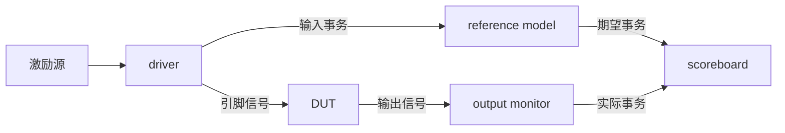

# UVM实战 第 2 章学习笔记：一个简单的 UVM 验证平台
> **核心结论**：完整的 UVM 平台把“产生激励、驱动信号、监测接口、预测结果和自动比较”拆成独立组件，再通过 transaction、TLM 端口和 phase 连接起来。sequence 决定发送什么，driver 决定怎样发送，monitor 负责把信号还原为 transaction，scoreboard 负责判断 DUT 是否正确。
>
> **记忆主线**：driver -> factory -> objection -> virtual interface -> transaction -> env -> monitor -> agent -> reference model -> scoreboard -> field automation -> sequencer/sequence -> base_test -> 命令行启动 test。

---

## 2.0 本章定位
第 1 章回答“为什么需要 UVM”，第 2 章开始回答“怎样搭建 UVM 验证平台”。 教材没有直接给出最终平台，而是从一个只有 driver 的环境开始，逐步加入新机制。 这种增量方式非常重要，因为每次增加的组件都对应一个明确问题。

| 增量步骤 | 解决的问题 |
|----------|------------|
| driver | 如何给 DUT 施加激励 |
| factory | 如何注册、创建和替换 UVM 类型 |
| objection | 如何控制任务 phase 的结束 |
| virtual interface | 类如何访问 HDL 接口信号 |
| transaction | 如何用事务代替零散信号传递信息 |
| env | 把多个组件放入统一容器 |
| monitor | 如何从接口采集并恢复 transaction |
| agent | 如何封装一套协议相关组件 |
| reference model | 如何产生期望结果 |
| scoreboard | 如何自动比较期望值和实际值 |
| field automation | 如何减少 copy/compare/print/pack 重复代码 |
| sequence/sequencer | 如何把激励生成与信号驱动分离 |
| base_test/test | 如何组织并从命令行选择测试用例 |

> **本章最终目标**：看懂一棵完整 UVM 树，并能解释树中每个结点为什么存在。

### 零基础阅读提示

本章代码最多，第一次阅读建议按数据流看，不要一开始就背所有宏：

1. sequence 产生 transaction。
2. sequencer 把 transaction 交给 driver。
3. driver 把 transaction 变成接口信号。
4. monitor 再把信号恢复成 transaction。
5. model 产生期望值，scoreboard 完成比较。

看到 `type_id::create()` 时先读成“创建对象”；看到 `connect()` 时读成“接线”；看到 `raise/drop_objection()` 时读成“测试还没结束/现在可以结束”。

---

## 2.1 验证平台的组成
### 2.1.1 验证平台的四项基本能力
验证平台用于找出 DUT 中的 bug。 一个最基本的验证平台需要具备四项能力。

| 能力 | 对应组件 | 核心问题 |
|------|----------|----------|
| 产生并施加激励 | sequence、driver | DUT 要经历哪些输入场景 |
| 采集 DUT 行为 | monitor | DUT 实际接收和输出了什么 |
| 计算期望结果 | reference model | 正确结果应该是什么 |
| 自动判断结果 | scoreboard | 实际结果与期望结果是否一致 |

激励既要包含正常场景，也要包含异常场景。 例如：

- 正常长度的数据包。
- 最小包和最大包。
- 连续数据包。
- 总线空闲。
- 协议允许的异常组合。
- 复位前后事务。

scoreboard 比较时需要两个输入：

1. reference model 产生的期望 transaction。
2. 输出 monitor 采集到的实际 transaction。

### 2.1.2 简单平台的数据流

这个框图说明两条并行路径。
#### DUT 路径
```text
输入 transaction -> driver -> DUT 输入信号
                  -> DUT 处理
                  -> DUT 输出信号 -> output monitor -> 实际 transaction
```
#### 期望路径
<code>输入 transaction -&gt; reference model -&gt; 期望 transaction</code> 两条路径最后在 scoreboard 汇合。
> **关键**：reference model 不是用来“再实现一个 RTL”，而是用较高抽象层次描述正确功能。
### 2.1.3 典型 UVM 平台
完整平台通常包含输入 agent 和输出 agent。

| 组件 | 输入端 agent | 输出端 agent |
|------|--------------|--------------|
| sequencer | 有 | 通常没有 |
| driver | 有 | 没有 |
| monitor | 有 | 有 |
| 工作模式 | active | passive |

输入 agent 既产生驱动，也监测真正送到 DUT 的内容。 输出 agent 只监测 DUT 输出，不应主动驱动输出端。 典型数据流如下：
```text
sequence
   |
   v
sequencer <-> driver ---> DUT
                |
input monitor --+--> reference model --> expected
DUT ---> output monitor ----------------> actual
expected + actual ---> scoreboard ---> PASS / FAIL
```

---

## 2.2 只有 driver 的验证平台
### 2.2.1 最简单的验证平台
#### 教材 DUT
本章使用一个非常简单的环回 DUT。 输入有效时，DUT 把 <code>rxd</code> 延迟后送到 <code>txd</code>，并把 <code>rx_dv</code> 送到 <code>tx_en</code>。
```systemverilog
module dut (
    input  logic       clk,
    input  logic       rst_n,
    input  logic [7:0] rxd,
    input  logic       rx_dv,
    output logic [7:0] txd,
    output logic       tx_en
);
    always_ff @(posedge clk) begin
        if (!rst_n) begin
            txd   <= '0;          // 复位时清空输出数据
            tx_en <= 1'b0;        // 复位时输出无效
        end
        else begin
            txd   <= rxd;         // 把输入数据转发到输出
            tx_en <= rx_dv;       // 把输入有效信号转发到输出
        end
    end
endmodule
```
这个 DUT 功能简单，因此验证重点不在算法，而在 UVM 平台结构。

| 信号 | 方向 | 含义 |
|------|------|------|
| <code>clk</code> | 输入 | 工作时钟 |
| <code>rst_n</code> | 输入 | 低有效复位 |
| <code>rxd[7:0]</code> | 输入 | 接收数据 |
| <code>rx_dv</code> | 输入 | 接收数据有效 |
| <code>txd[7:0]</code> | 输出 | 发送数据 |
| <code>tx_en</code> | 输出 | 发送数据有效 |

#### driver 的职责
driver 是信号级激励的执行者。 它负责：

- 从上层取得 transaction。
- 按协议时序拆解 transaction。
- 驱动 virtual interface。
- 在一个 transaction 驱动完成后通知 sequencer。

driver 不应该长期承担：

- 决定测试场景。
- 随机化所有 transaction。
- 计算期望结果。
- 检查 DUT 输出。

本节前半为了逐步学习，暂时在 driver 内部产生随机数据；加入 sequence 后会移除这部分职责。
#### 最简单的 driver
UVM 中 driver 应派生自 <code>uvm_driver</code>。
```systemverilog
class my_driver extends uvm_driver;
    function new(
        string name = "my_driver",
        uvm_component parent = null
    );
        super.new(name, parent);  // 把实例名和父结点交给 uvm_component
    endfunction
    extern virtual task main_phase(uvm_phase phase);
endclass
task my_driver::main_phase(uvm_phase phase);
    top_tb.rxd   <= '0;           // 先初始化 DUT 输入
    top_tb.rx_dv <= 1'b0;
    while (!top_tb.rst_n)
        @(posedge top_tb.clk);    // 等待复位释放
    for (int i = 0; i < 256; i++) begin
        @(posedge top_tb.clk);
        top_tb.rxd   <= $urandom_range(0, 255);
        top_tb.rx_dv <= 1'b1;
        `uvm_info("DRV", "one byte driven", UVM_LOW)
    end
    @(posedge top_tb.clk);
    top_tb.rx_dv <= 1'b0;         // 所有数据发送完成后撤销 valid
endtask
```
这个例子还不是规范平台，主要用于认识 UVM component 的基本外形。
#### component 的 new 函数
所有派生自 <code>uvm_component</code> 的类，其构造函数通常有两个参数。

| 参数 | 含义 |
|------|------|
| <code>name</code> | 当前实例在 UVM 树中的名字 |
| <code>parent</code> | 当前实例的父 component |

标准写法：
```systemverilog
function new(string name, uvm_component parent);
    super.new(name, parent);      // 必须先完成父类构造
endfunction
```
<code>name</code> 不是类名，而是实例名。 同一个类可以创建多个实例，每个实例应有自己的 name。 <code>parent</code> 决定组件挂到 UVM 树的哪个位置。
#### main_phase
UVM 使用 phase 管理组件生命周期。 <code>main_phase</code> 是任务 phase，可以消耗仿真时间。 driver 的主要运行行为通常放在 <code>main_phase</code> 或其他 run-time phase 中。 典型耗时语句包括：

- <code>@(posedge clk)</code>。
- <code>#10</code>。
- 阻塞式 TLM get。
- 等待 semaphore、mailbox 或 event。

普通函数调用、变量赋值和日志打印本身不推进仿真时间。
#### UVM 日志宏
教材使用 <code>uvm_info</code> 代替普通 <code>$display</code>。
```systemverilog
`uvm_info("DRV", "begin to drive packet", UVM_LOW)
```
三个参数分别是：

| 参数 | 示例 | 含义 |
|------|------|------|
| ID | <code>"DRV"</code> | 日志分类标签 |
| message | <code>"begin..."</code> | 具体信息 |
| verbosity | <code>UVM_LOW</code> | 冗余度级别 |

常见 verbosity：

| 级别 | 使用建议 |
|------|----------|
| <code>UVM_LOW</code> | 默认希望看到的重要过程 |
| <code>UVM_MEDIUM</code> | 普通调试信息 |
| <code>UVM_HIGH</code> | 更详细的过程信息 |

UVM 日志通常自动包含：

- severity。
- 源文件和行号。
- 仿真时间。
- component 层次路径。
- 自定义 ID。
- 消息正文。

获取当前 component 完整路径：
```systemverilog
`uvm_info("PATH", get_full_name(), UVM_LOW)
```
与普通打印相比，UVM 日志更容易过滤、统计和定位。
### 2.2.2 加入 factory 机制
#### component 注册
要让 UVM factory 认识一个 component，需要注册类型。
```systemverilog
class my_driver extends uvm_driver;
    `uvm_component_utils(my_driver) // 把 my_driver 注册到 factory
    function new(string name = "my_driver",
                 uvm_component parent = null);
        super.new(name, parent);
    endfunction
endclass
```
注册后，UVM 可以：

- 根据字符串找到类型。
- 通过 type_id 创建实例。
- 在后续使用 type override 或 instance override。

> **规则**：派生自 <code>uvm_component</code> 的自定义 component 通常使用 <code>uvm_component_utils</code>。
#### run_test
最初的示例手工 new driver，并显式调用 <code>main_phase</code>。 这并没有真正使用 UVM 的生命周期管理。 加入 factory 注册后，可以写：
```systemverilog
initial begin
    run_test("my_driver");        // 按注册类型名创建测试顶层
end
```
<code>run_test</code> 会启动 UVM phase 机制。 本章初期把 driver 临时作为树根，仅用于展示自动创建和 phase 调用。 无论传给 <code>run_test</code> 的类型是什么，UVM 创建的根实例名通常是： <code>uvm_test_top</code> 需要区分：

| 名称 | 示例 | 作用 |
|------|------|------|
| 类型名 | <code>my_driver</code> | factory 查找哪个类 |
| 实例名 | <code>uvm_test_top</code> | UVM 树中根结点的名字 |

#### 为什么要使用 type_id::create
普通 SystemVerilog 创建： <code>drv = new(&quot;drv&quot;, this);</code> UVM component 推荐创建： <code>drv = my_driver::type_id::create(&quot;drv&quot;, this);</code> 二者都能创建对象，但 <code>type_id::create</code> 会经过 factory。 只有经过 factory 创建，类型替换机制才有机会生效。
> **工程规则**：UVM 组件注册用 utils 宏，创建用 <code>type_id::create</code>。
### 2.2.3 加入 objection 机制
#### 为什么 main_phase 刚开始就结束
UVM 不会因为某个 component 的 <code>main_phase</code> 仍有后续代码，就自动一直等待。 如果当前任务 phase 中没有 objection，UVM 可以结束该 phase，并终止仍在其中运行的进程。 因此，driver 可能只打印“main_phase is called”，还没来得及等待时钟就被结束。
#### raise 与 drop
```systemverilog
task my_driver::main_phase(uvm_phase phase);
    phase.raise_objection(this);  // 声明：当前组件还有工作未完成
    // 所有需要消耗仿真时间的激励都放在二者之间
    repeat (256) begin
        @(posedge vif.clk);
        vif.data  <= $urandom_range(0, 255);
        vif.valid <= 1'b1;
    end
    @(posedge vif.clk);
    vif.valid <= 1'b0;
    phase.drop_objection(this);   // 声明：当前组件的工作已完成
endtask
```
objection 必须成对。

| 操作 | 含义 |
|------|------|
| <code>raise_objection</code> | 阻止当前 phase 立即结束 |
| <code>drop_objection</code> | 撤销自己的反对票 |

只有当所有 objection 都被撤销后，phase 才能结束。
#### raise 必须足够早
错误写法：
```systemverilog
task my_driver::main_phase(uvm_phase phase);
    @(posedge vif.clk);           // 已经先消耗仿真时间
    phase.raise_objection(this);  // 可能根本来不及执行
endtask
```
正确原则：
> 在本 phase 第一个耗时语句之前 raise objection。
日志打印可以放在 raise 前，因为它通常不推进仿真时间；但统一把 raise 放在开头更清楚。
#### objection 应由谁控制
本章早期把 objection 放在 driver 中是为了教学。 加入 sequence 后，更合理的做法是让控制测试时长的 sequence 或 test 管理 objection。 原因：

- driver 是常驻组件，通常有 <code>while (1)</code>。
- driver 不知道本次测试计划发送多少事务。
- sequence 最清楚激励何时开始、何时结束。

> **记忆**：谁决定“测试内容已经发完”，谁更适合控制 objection。
### 2.2.4 加入 virtual interface
#### 为什么不能写绝对层次路径
下面的写法把 driver 与 <code>top_tb</code> 层次绑定：
```systemverilog
top_tb.rxd   <= data;
@(posedge top_tb.clk);
```
一旦 testbench 层次变化，driver 就要修改。 例如时钟从 <code>top_tb.clk</code> 变成 <code>top_tb.clk_gen.clk</code>，所有引用都可能失效。 宏只能缓解单一路径变化，不能真正消除信号与层次结构的耦合。
#### 定义 interface
```systemverilog
interface my_if(input logic clk, input logic rst_n);
    logic [7:0] data;             // 协议数据
    logic       valid;            // 数据有效
endinterface
```
在 <code>top_tb</code> 中创建输入和输出 interface。
```systemverilog
my_if input_if (clk, rst_n);
my_if output_if(clk, rst_n);
dut u_dut (
    .clk   (clk),
    .rst_n (rst_n),
    .rxd   (input_if.data),
    .rx_dv (input_if.valid),
    .txd   (output_if.data),
    .tx_en (output_if.valid)
);
```
#### 类中使用 virtual interface
interface 实例属于静态 HDL 层次。 class 对象属于动态面向对象世界。 class 中不能像 module 一样直接例化并持有普通 interface 实例，需要声明 virtual interface 句柄。
```systemverilog
class my_driver extends uvm_driver;
    virtual my_if vif;            // 指向 top_tb 中真实 interface 实例
endclass
```
之后 driver 只通过 <code>vif</code> 操作信号。
```systemverilog
@(posedge vif.clk);
vif.data  <= req.data;
vif.valid <= 1'b1;
```
这样 driver 不再知道 interface 在 HDL 层次中的绝对路径。
#### config_db 的 set
在 <code>top_tb</code> 中把 interface 放入 config_db。
```systemverilog
initial begin
    uvm_config_db#(virtual my_if)::set(
        null,                    // top_tb 不是 component，没有 this
        "uvm_test_top.env.i_agt.drv",
        "vif",                   // 字段名，必须与 get 保持一致
        input_if                 // 真正传递的 interface 实例
    );
end
```
可以把 set 理解为“寄信”。 四个参数用于回答：

1. 从哪个上下文出发。
2. 发给哪个 component 路径。
3. 数据使用什么字段名。
4. 数据值是什么。

#### config_db 的 get
driver 在 <code>build_phase</code> 中取出 interface。
```systemverilog
function void my_driver::build_phase(uvm_phase phase);
    super.build_phase(phase);     // 保留父类必要行为
    if (!uvm_config_db#(virtual my_if)::get(
            this,                 // 从当前 driver 上下文查找
            "",                   // 当前实例自身
            "vif",                // 必须与 set 的字段名相同
            vif                   // 获取结果写入成员变量
        )) begin
        `uvm_fatal("NO_VIF", "virtual interface vif was not configured")
    end
endfunction
```
get 失败后不能继续驱动，因此使用 <code>uvm_fatal</code>。
#### uvm_fatal
```systemverilog
`uvm_fatal("NO_VIF", "virtual interface must be set")
```
<code>uvm_fatal</code> 只有 ID 和 message 两个主要参数。 它表示平台存在无法恢复的问题，报告后会结束仿真。 适用场景：

- virtual interface 未配置。
- 关键配置对象为空。
- 必要连接不存在。
- 平台结构与预期不一致。

#### config_db 类型必须匹配
config_db 是参数化类。 传递 int： <code>uvm_config_db#(int)::set(null, &quot;uvm_test_top&quot;, &quot;packet_num&quot;, 100);</code> 获取 int：
```systemverilog
int packet_num;
if (!uvm_config_db#(int)::get(this, "", "packet_num", packet_num))
    `uvm_fatal("NO_CFG", "packet_num was not configured")
```
set 和 get 需要同时匹配：

- 参数化类型。
- 目标路径。
- 字段名。

#### build_phase
<code>build_phase</code> 是函数 phase，不消耗仿真时间。 主要用途：

- 创建子 component。
- 读取配置。
- 根据配置决定平台结构。
- 准备端口和成员对象。

执行顺序： <code>树根 -&gt; 中间结点 -&gt; 树叶</code> 即 top-down。 <code>build_phase</code> 通常在仿真时间 0 完成。

---

## 2.3 为验证平台加入各个组件
### 2.3.1 加入 transaction
#### transaction 的意义
真实协议通常以帧、包或命令为单位交换信息，而不是孤立的 bit 或 byte。 transaction 用一个对象表示一次有意义的数据交换。 以太网 transaction 可以包含：

- 目的 MAC 地址。
- 源 MAC 地址。
- 类型字段。
- payload。
- CRC。

transaction 让组件之间传递“包”，driver/monitor 才处理“线”。
#### transaction 定义
```systemverilog
class my_transaction extends uvm_sequence_item;
    rand bit [47:0] dmac;         // 目的 MAC 地址
    rand bit [47:0] smac;         // 源 MAC 地址
    rand bit [15:0] ether_type;   // 以太网类型
    rand byte       pload[];      // 可变长 payload
    rand bit [31:0] crc;          // 校验值
    constraint payload_c {
        pload.size() inside {[46:1500]};
    }
    function bit [31:0] calc_crc();
        return 32'h0;             // 教材示例省略真实 CRC 算法
    endfunction
    function void post_randomize();
        crc = calc_crc();         // 随机化后根据其他字段重新计算 CRC
    endfunction
    `uvm_object_utils(my_transaction)
    function new(string name = "my_transaction");
        super.new(name);          // object 没有 parent 参数
    endfunction
endclass
```
#### component 与 object 的区别

| 对比项 | uvm_component | uvm_object |
|--------|---------------|------------|
| 典型类型 | driver、monitor、env、agent | transaction、sequence |
| 生命周期 | 通常贯穿整个仿真 | 按需创建和销毁 |
| 是否进入 UVM 树 | 是 | 否 |
| new 参数 | name、parent | 通常只有 name |
| 注册宏 | <code>uvm_component_utils</code> | <code>uvm_object_utils</code> |
| 创建方式 | <code>type_id::create(name, parent)</code> | <code>type_id::create(name)</code> |

<code>uvm_sequence_item</code> 最终继承自 <code>uvm_object</code>。 因此 transaction 不是 UVM 树结点。
#### driver 把 transaction 串行化
driver 要把一个 transaction 转换为 interface 上的 byte 流。
```systemverilog
task my_driver::drive_one_pkt(my_transaction tr);
    byte unsigned data_q[$];
    // 按协议规定顺序把字段压入队列
    for (int i = 0; i < 6; i++)
        data_q.push_back(tr.dmac[8*i +: 8]);
    for (int i = 0; i < 6; i++)
        data_q.push_back(tr.smac[8*i +: 8]);
    data_q.push_back(tr.ether_type[7:0]);
    data_q.push_back(tr.ether_type[15:8]);
    foreach (tr.pload[i])
        data_q.push_back(tr.pload[i]);
    for (int i = 0; i < 4; i++)
        data_q.push_back(tr.crc[8*i +: 8]);
    `uvm_info("DRV", "begin to drive one packet", UVM_LOW)
    while (data_q.size() != 0) begin
        @(posedge vif.clk);
        vif.valid <= 1'b1;
        vif.data  <= data_q.pop_front();
    end
    @(posedge vif.clk);
    vif.valid <= 1'b0;
endtask
```
这一过程叫 serialization 或 packing。 monitor 执行相反的 deserialization 或 unpacking。
### 2.3.2 加入 env
#### 为什么需要 env
<code>run_test</code> 只创建一个测试顶层。 完整平台却有 driver、monitor、model 和 scoreboard 等多个组件。 因此需要一个容器统一创建这些组件。 UVM 中这个容器通常派生自 <code>uvm_env</code>。
```systemverilog
class my_env extends uvm_env;
    my_driver drv;
    `uvm_component_utils(my_env)
    function new(string name = "my_env",
                 uvm_component parent = null);
        super.new(name, parent);
    endfunction
    function void build_phase(uvm_phase phase);
        super.build_phase(phase);
        drv = my_driver::type_id::create("drv", this);
    endfunction
endclass
```
#### parent 建立树形关系
创建 driver 时： <code>drv = my_driver::type_id::create(&quot;drv&quot;, this);</code> 这里：

- <code>"drv"</code> 是 driver 实例名。
- <code>this</code> 指向当前 env。
- driver 的 parent 是 env。

路径因此变成： <code>uvm_test_top.drv</code> 加入 base_test 后会继续变为： <code>uvm_test_top.env.i_agt.drv</code> 路径中的每一段都来自 create 时传入的实例名。
#### 路径变化必须同步配置
如果 driver 从根结点移动到 env 之下：
```text
原路径：uvm_test_top
新路径：uvm_test_top.drv
```
那么 config_db set 的目标路径也必须更新。 这是初学时最常见的 virtual interface 获取失败原因之一。
> **调试方法**：使用 <code>get_full_name()</code> 打印真实组件路径，不要凭记忆猜路径。
### 2.3.3 加入 monitor
#### monitor 的职责
monitor 与 driver 方向相反。

| driver | monitor |
|--------|---------|
| transaction -> signal | signal -> transaction |
| 主动驱动接口 | 被动观察接口 |
| 了解发送时序 | 了解采样时序 |
| 不能用于输出端主动驱动 | 可用于输入端和输出端 |

monitor 应该是非侵入式的，不能改变 DUT 信号。
#### monitor 骨架
```systemverilog
class my_monitor extends uvm_monitor;
    virtual my_if vif;
    uvm_analysis_port #(my_transaction) ap;
    `uvm_component_utils(my_monitor)
    function new(string name = "my_monitor",
                 uvm_component parent = null);
        super.new(name, parent);
    endfunction
    function void build_phase(uvm_phase phase);
        super.build_phase(phase);
        if (!uvm_config_db#(virtual my_if)::get(
                this, "", "vif", vif))
            `uvm_fatal("NO_VIF", "monitor vif was not configured")
        ap = new("ap", this);      // analysis_port 必须先创建
    endfunction
    task main_phase(uvm_phase phase);
        my_transaction tr;
        while (1) begin           // monitor 是常驻组件
            tr = my_transaction::type_id::create("tr");
            collect_one_pkt(tr);  // 从接口恢复出一个完整包
            ap.write(tr);         // 广播给后续订阅者
        end
    endtask
endclass
```
monitor 不需要自己 raise objection。 它可以一直运行，phase 结束时由 UVM 终止其循环。
#### 为什么输入端也需要 monitor
driver 已经拥有输入 transaction，看起来可以直接送给 reference model。 教材仍推荐使用 input monitor，原因包括：

- monitor 看到的是 DUT 引脚上真正发生的数据。
- driver 与 monitor 可由不同人员实现，形成交叉检查。
- 能发现 driver 串行化或接口时序错误。
- 更适合把模块级平台复用到系统级。
- reference model 不必依赖 driver 内部实现。

> **原则**：预测路径最好使用“实际送到 DUT 的事务”，而不是“本来打算送的事务”。
### 2.3.4 封装成 agent
#### agent 封装协议组件
driver、monitor 和 sequencer 都围绕同一接口协议工作。 UVM 通常把它们封装成 agent。 不同 agent 通常代表不同协议或接口实例。
```systemverilog
class my_agent extends uvm_agent;
    my_sequencer sqr;
    my_driver    drv;
    my_monitor   mon;
    uvm_analysis_port #(my_transaction) ap;
    `uvm_component_utils(my_agent)
    function new(string name, uvm_component parent);
        super.new(name, parent);
    endfunction
endclass
```
#### active 与 passive
<code>uvm_agent</code> 自带 <code>is_active</code>。 其类型是 <code>uvm_active_passive_enum</code>。

| 模式 | sequencer | driver | monitor | 用途 |
|------|-----------|--------|---------|------|
| <code>UVM_ACTIVE</code> | 创建 | 创建 | 创建 | 主动产生和驱动流量 |
| <code>UVM_PASSIVE</code> | 不创建 | 不创建 | 创建 | 只观察接口 |

```systemverilog
function void my_agent::build_phase(uvm_phase phase);
    super.build_phase(phase);
    if (is_active == UVM_ACTIVE) begin
        sqr = my_sequencer::type_id::create("sqr", this);
        drv = my_driver   ::type_id::create("drv", this);
    end
    mon = my_monitor::type_id::create("mon", this);
endfunction
```
monitor 无论 active 还是 passive 都应创建。
#### env 中创建两个 agent
```systemverilog
function void my_env::build_phase(uvm_phase phase);
    super.build_phase(phase);
    i_agt = my_agent::type_id::create("i_agt", this);
    o_agt = my_agent::type_id::create("o_agt", this);
    i_agt.is_active = UVM_ACTIVE;   // 输入端需要产生并驱动流量
    o_agt.is_active = UVM_PASSIVE;  // 输出端只允许观察
endfunction
```
更完整的项目常通过 config_db 配置 <code>is_active</code>，减少 env 对 agent 内部的直接控制。
#### component 必须在 build 阶段完成
UVM 要求 component 树最晚在 build 阶段完成。 错误做法：
```systemverilog
task my_env::main_phase(uvm_phase phase);
    // 错误：build_phase 已结束，再创建 component 会触发 fatal
    i_agt = my_agent::type_id::create("i_agt", this);
endtask
```
推荐：
```systemverilog
function void my_env::build_phase(uvm_phase phase);
    super.build_phase(phase);
    i_agt = my_agent::type_id::create("i_agt", this);
endfunction
```
虽然理论上可在 new 中创建子组件，但会让配置读取和条件构建变得困难。
> **约定**：component 统一在 <code>build_phase</code> 中创建。
### 2.3.5 加入 reference model
#### reference model 的作用
reference model 根据输入 transaction 计算期望 transaction。 本章 DUT 只是转发数据，因此 model 只复制输入事务。 复杂项目中的 model 可能：

- 执行协议变换。
- 运行算法模型。
- 维护寄存器或状态机状态。
- 调用 C/C++ DPI 模型。
- 根据配置产生不同期望结果。

#### model 的端口
```systemverilog
class my_model extends uvm_component;
    uvm_blocking_get_port #(my_transaction) port; // 获取输入事务
    uvm_analysis_port     #(my_transaction) ap;   // 广播期望事务
    `uvm_component_utils(my_model)
    function new(string name, uvm_component parent);
        super.new(name, parent);
    endfunction
    function void build_phase(uvm_phase phase);
        super.build_phase(phase);
        port = new("port", this);
        ap   = new("ap",   this);
    endfunction
    task main_phase(uvm_phase phase);
        my_transaction in_tr;
        my_transaction exp_tr;
        while (1) begin
            port.get(in_tr);      // 阻塞，直到收到输入 monitor 的事务
            exp_tr = my_transaction::type_id::create("exp_tr");
            exp_tr.copy(in_tr);   // 本章 DUT 是环回，所以期望值等于输入
            ap.write(exp_tr);     // 把期望事务送给 scoreboard
        end
    endtask
endclass
```
复制 transaction 很重要。 如果直接把同一个句柄传给多个组件，任一组件修改对象都会影响其他组件看到的内容。
#### Transaction 级通信
##### 为什么使用 transaction 级通信
组件之间不应通过层次化变量访问交换数据。 UVM 使用 TLM 端口传递 transaction。 优点：

- 组件边界清晰。
- 发送端不需要了解接收端实现。
- 容易插入 FIFO、覆盖率收集器或多个订阅者。
- 平台更容易复用和扩展。

##### analysis_port
monitor 使用 analysis_port 广播事务。 <code>uvm_analysis_port #(my_transaction) ap;</code> 创建： <code>ap = new(&quot;ap&quot;, this);</code> 发送： <code>ap.write(tr);                    // 非阻塞广播，不等待接收方处理完成</code> analysis_port 适合：

- monitor 发布采集事务。
- model 发布期望事务。
- 一份数据同时送多个订阅者。

##### blocking_get_port
消费者可使用 blocking get 取得事务。 <code>uvm_blocking_get_port #(my_transaction) port;</code> 接收： <code>port.get(tr);                    // 没有数据时阻塞等待</code> 发送端 write 非阻塞，而接收端 get 可能阻塞，因此二者之间通常需要 FIFO。
##### analysis FIFO
<code>uvm_tlm_analysis_fifo #(my_transaction) agt_mdl_fifo;</code> 在 env 的 <code>build_phase</code> 中创建： <code>agt_mdl_fifo = new(&quot;agt_mdl_fifo&quot;, this);</code> FIFO 提供：

- <code>analysis_export</code>，连接 analysis_port。
- <code>blocking_get_export</code>，连接 blocking_get_port。
- transaction 暂存空间。

##### connect_phase
连接在 <code>connect_phase</code> 中完成。
```systemverilog
function void my_env::connect_phase(uvm_phase phase);
    super.connect_phase(phase);
    // 输入 monitor -> FIFO
    i_agt.ap.connect(agt_mdl_fifo.analysis_export);
    // FIFO -> reference model
    mdl.port.connect(agt_mdl_fifo.blocking_get_export);
endfunction
```
<code>connect_phase</code> 的典型执行顺序是 bottom-up。 <code>树叶 -&gt; 中间结点 -&gt; 树根</code> 这使子组件先准备好端口，父组件再连接它们。
##### agent 暴露 monitor 端口
env 不必深入访问 <code>i_agt.mon.ap</code>。 agent 可以对外暴露统一的 <code>ap</code>。
```systemverilog
function void my_agent::connect_phase(uvm_phase phase);
    super.connect_phase(phase);
    ap = mon.ap;                  // agent.ap 指向 monitor.ap
endfunction
```
由于 agent 的 connect_phase 先于 env 的 connect_phase 执行，env 连接时 <code>i_agt.ap</code> 已有效。
### 2.3.6 加入 scoreboard
#### scoreboard 的两个输入
scoreboard 需要：

- <code>exp_port</code>：接收 reference model 的期望事务。
- <code>act_port</code>：接收 output monitor 的实际事务。

```systemverilog
class my_scoreboard extends uvm_scoreboard;
    my_transaction expect_queue[$];
    uvm_blocking_get_port #(my_transaction) exp_port;
    uvm_blocking_get_port #(my_transaction) act_port;
    `uvm_component_utils(my_scoreboard)
    function void build_phase(uvm_phase phase);
        super.build_phase(phase);
        exp_port = new("exp_port", this);
        act_port = new("act_port", this);
    endfunction
endclass
```
#### 并行接收与比较
```systemverilog
task my_scoreboard::main_phase(uvm_phase phase);
    my_transaction get_expect;   // 只由期望事务进程写入
    my_transaction get_actual;   // 只由实际事务进程写入
    my_transaction expected;     // 从期望队列弹出的待比较事务
    fork
        // 进程一：持续收集期望事务
        forever begin
            exp_port.get(get_expect);
            expect_queue.push_back(get_expect);
        end
        // 进程二：持续收集 DUT 实际输出并比较
        forever begin
            act_port.get(get_actual);
            if (expect_queue.size() == 0) begin
                `uvm_error("SCB", "actual transaction arrived before expected")
            end
            else begin
                expected = expect_queue.pop_front();
                if (get_actual.compare(expected))
                    `uvm_info("SCB", "compare successfully", UVM_LOW)
                else begin
                    `uvm_error("SCB", "compare failed")
                    expected.print();   // 打印期望值便于定位
                    get_actual.print(); // 打印实际值便于定位
                end
            end
        end
    join
endtask
```
本章方案假设 reference model 比 DUT 更早产生结果。 因此期望事务先进入队列，实际事务到来后再取出比较。 真实项目还要考虑：

- DUT 乱序输出。
- transaction ID 匹配。
- 多通道数据。
- 丢包和重复包。
- 延迟超时。
- 仿真结束时队列是否清空。

#### uvm_error
```systemverilog
`uvm_error("SCB", "compare failed")
```
<code>uvm_error</code> 表示检查失败，但通常不会立即结束仿真。 这允许一次回归收集多个错误。

| 宏 | 用途 | 一般行为 |
|----|------|----------|
| <code>uvm_info</code> | 普通信息 | 受 verbosity 控制 |
| <code>uvm_warning</code> | 可疑但可继续 | 继续仿真 |
| <code>uvm_error</code> | 明确错误 | 计数并继续 |
| <code>uvm_fatal</code> | 无法继续的平台错误 | 结束仿真 |

### 2.3.7 加入 field automation
#### 为什么需要字段自动化
没有自动化时，每个 transaction 都要手写：

- print。
- copy。
- compare。
- pack。
- unpack。

字段增加后，这些函数必须同步修改，容易遗漏。 UVM field 宏可以根据字段注册信息提供默认自动化操作。
#### 注册字段
```systemverilog
class my_transaction extends uvm_sequence_item;
    rand bit [47:0] dmac;
    rand bit [47:0] smac;
    rand bit [15:0] ether_type;
    rand byte       pload[];
    rand bit [31:0] crc;
    `uvm_object_utils_begin(my_transaction)
        `uvm_field_int      (dmac,       UVM_ALL_ON)
        `uvm_field_int      (smac,       UVM_ALL_ON)
        `uvm_field_int      (ether_type, UVM_ALL_ON)
        `uvm_field_array_int(pload,      UVM_ALL_ON)
        `uvm_field_int      (crc,        UVM_ALL_ON)
    `uvm_object_utils_end
    function new(string name = "my_transaction");
        super.new(name);
    endfunction
endclass
```
使用 begin/end 版本时，中间列出所有需要参与自动操作的字段。 字段类型不同，使用的宏也不同。
#### 自动方法
注册后可直接使用：
```systemverilog
dst.copy(src);                    // 复制已注册字段
same = actual.compare(expected);  // 比较已注册字段
tr.print();                       // 打印已注册字段
```
还可以 pack 成 byte 数组：
```systemverilog
byte unsigned data_array[];
int bit_count;
bit_count = tr.pack_bytes(data_array);
```
monitor 可反向 unpack：
```systemverilog
tr.pload = new[payload_size];     // 动态数组必须先分配正确大小
bit_count = tr.unpack_bytes(data_array);
```
#### 字段顺序影响 pack 顺序
<code>pack_bytes</code> 按 field 宏注册顺序打包字段。 例如：
```systemverilog
`uvm_field_int(dmac, UVM_ALL_ON)
`uvm_field_int(smac, UVM_ALL_ON)
```
打包时先 dmac，再 smac。 如果交换宏顺序，byte 流顺序也可能改变。
> **警告**：field automation 能减少代码，但协议线序仍必须认真确认。
#### field automation 的取舍
优点：

- 快速搭建平台。
- 减少机械性代码。
- 新字段容易加入 print/compare/copy。

需要注意：

- 宏展开可能增加编译和运行开销。
- 默认 compare 不一定符合协议语义。
- pack 顺序和大小端必须核对。
- 深拷贝需求复杂时应检查默认 copy 行为。
- 大型项目可能选择手写关键方法。

本章重点是理解自动化机制，不是要求所有项目一律使用。

---

## 2.4 UVM 的终极大作：sequence
### 2.4.1 在验证平台中加入 sequencer
#### 为什么把激励生成移出 driver
规范平台中：

- sequence 决定产生什么 transaction。
- sequencer 负责仲裁和转发。
- driver 只负责把 transaction 驱动到接口。

如果 driver 同时随机化和驱动：

- 不同测试必须修改 driver。
- 协议时序和测试场景耦合。
- driver 难以复用。
- 多个 sequence 无法仲裁。

#### sequencer 定义
```systemverilog
class my_sequencer extends uvm_sequencer #(my_transaction);
    `uvm_component_utils(my_sequencer)
    function new(string name, uvm_component parent);
        super.new(name, parent);
    endfunction
endclass
```
sequencer 是 parameterized component。 参数 <code>my_transaction</code> 表示它传递哪种 sequence item。
#### driver 也要参数化
```systemverilog
class my_driver extends uvm_driver #(my_transaction);
    `uvm_component_utils(my_driver)
    // uvm_driver 中的 req 因参数化而成为 my_transaction 类型
endclass
```
参数化后，driver 内建的 <code>req</code> 句柄就是 <code>my_transaction</code> 类型。
### 2.4.2 sequence 机制
#### sequence 定义
```systemverilog
class my_sequence extends uvm_sequence #(my_transaction);
    my_transaction m_trans;
    `uvm_object_utils(my_sequence)
    function new(string name = "my_sequence");
        super.new(name);
    endfunction
    virtual task body();
        repeat (10) begin
            `uvm_do(m_trans)     // 创建、随机化并发送 transaction
        end
    endtask
endclass
```
sequence 是 object，不是 component。 因此：

- 不进入 UVM 树。
- 使用 <code>uvm_object_utils</code>。
- 有自己的生命周期。
- 启动后执行 <code>body</code>。

#### uvm_do 做了什么
初学阶段可把 <code>uvm_do(m_trans)</code> 理解为：

1. 创建 <code>m_trans</code>。
2. 等待 sequencer 授权。
3. 随机化 transaction。
4. 把 transaction 交给 sequencer。
5. 等待 driver 完成该 transaction。

后续章节会学习 <code>start_item</code> 和 <code>finish_item</code> 的展开写法。 带临时约束：
```systemverilog
`uvm_do_with(m_trans, {
    m_trans.pload.size() == 60;
})
```
#### 连接 driver 与 sequencer
active agent 在 build_phase 中同时创建二者。
```systemverilog
if (is_active == UVM_ACTIVE) begin
    sqr = my_sequencer::type_id::create("sqr", this);
    drv = my_driver   ::type_id::create("drv", this);
end
```
在 connect_phase 中连接：
```systemverilog
if (is_active == UVM_ACTIVE) begin
    drv.seq_item_port.connect(sqr.seq_item_export);
end
```
passive agent 没有 driver 和 sequencer，因此连接前必须判断 <code>is_active</code>。
#### driver 获取 item
```systemverilog
task my_driver::main_phase(uvm_phase phase);
    vif.data  <= '0;
    vif.valid <= 1'b0;
    while (!vif.rst_n)
        @(posedge vif.clk);
    forever begin
        seq_item_port.get_next_item(req); // 阻塞等待下一个事务
        drive_one_pkt(req);               // 按接口协议完成驱动
        seq_item_port.item_done();        // 确认该事务已经处理完成
    end
endtask
```
<code>get_next_item</code> 与 <code>item_done</code> 必须正确配对。 如果漏掉 <code>item_done</code>：

- sequence 可能一直等待。
- 下一次 <code>uvm_do</code> 不会继续。
- 仿真表现为“卡住”。

#### sequence-driver 握手
```text
sequence        sequencer             driver
   |                |                    |
   | request item   |                    |
   |--------------->|                    |
   |                |<-- get_next_item --|
   |<-- grant ------|                    |
   | randomize/item |                    |
   |--------------->|---- req ---------->|
   |                |                    | drive
   |                |<--- item_done -----|
   |<-- uvm_do 返回-|                    |
```
<code>uvm_do</code> 通常要等 driver 调用 <code>item_done</code> 后才完成。 这保证 sequence 产生事务的节奏与 driver 实际处理能力同步。
#### get_next_item 与 try_next_item

| 方法 | 类型 | 没有 transaction 时 |
|------|------|----------------------|
| <code>get_next_item</code> | 阻塞 | 一直等待 |
| <code>try_next_item</code> | 非阻塞 | 立即返回，req 可能为 null |

```systemverilog
forever begin
    seq_item_port.try_next_item(req);
    if (req == null) begin
        @(posedge vif.clk);       // 没有数据时保持总线空闲
    end
    else begin
        drive_one_pkt(req);
        seq_item_port.item_done();
    end
end
```
#### 启动 sequence
##### 手工 start
可以在 env 的 main_phase 中创建并启动 sequence。
```systemverilog
task my_env::main_phase(uvm_phase phase);
    my_sequence seq;
    phase.raise_objection(this);
    seq = my_sequence::type_id::create("seq");
    seq.start(i_agt.sqr);         // 明确指定目标 sequencer
    phase.drop_objection(this);
endtask
```
<code>start</code> 的参数告诉 sequence 把 transaction 发给哪个 sequencer。
### 2.4.3 default_sequence 的使用
本书使用 config_db 设置 sequencer 某个 phase 的 default sequence。
```systemverilog
uvm_config_db#(uvm_object_wrapper)::set(
    this,
    "i_agt.sqr.main_phase",
    "default_sequence",
    my_sequence::type_id::get()
);
```
路径中必须包含目标 phase： <code>i_agt.sqr.main_phase</code> 原因是 sequencer 可在不同任务 phase 启动不同 default sequence。
#### 相对路径与绝对路径
在 env 内 set：
```systemverilog
uvm_config_db#(uvm_object_wrapper)::set(
    this,
    "i_agt.sqr.main_phase",
    "default_sequence",
    my_sequence::type_id::get()
);
```
第二个参数是相对 env 的路径。 在 top_tb 内 set：
```systemverilog
uvm_config_db#(uvm_object_wrapper)::set(
    null,
    "uvm_test_top.env.i_agt.sqr.main_phase",
    "default_sequence",
    my_sequence::type_id::get()
);
```
因为 top_tb 不是 component，使用 null 和完整路径。
#### default_sequence 的 objection
教材 UVM 1.1d 示例使用 <code>starting_phase</code>。
```systemverilog
virtual task body();
    if (starting_phase != null)
        starting_phase.raise_objection(this);
    repeat (10)
        `uvm_do(m_trans)
    #1000;                       // 给 DUT 和 scoreboard 留出处理时间
    if (starting_phase != null)
        starting_phase.drop_objection(this);
endtask
```
先判断 null，是因为 sequence 也可能通过手工 <code>start</code> 启动，此时 <code>starting_phase</code> 不一定有效。
> **版本提醒**：教材基于 UVM 1.1d；其他 UVM 版本对 default sequence 和 starting_phase 的推荐用法可能不同。

---

## 2.5 建造测试用例
### 2.5.1 加入 base_test
#### 为什么 test 才是树根
教学过程中的树根依次是 driver、env。 实际平台通常让 <code>uvm_test</code> 派生类作为根类型。 base_test 负责：

- 创建 env。
- 设置公共配置。
- 设置默认 sequence 或测试基础策略。
- 配置超时。
- 在 report_phase 汇总测试结果。

#### base_test 示例
```systemverilog
class base_test extends uvm_test;
    my_env env;
    `uvm_component_utils(base_test)
    function new(string name = "base_test",
                 uvm_component parent = null);
        super.new(name, parent);
    endfunction
    function void build_phase(uvm_phase phase);
        super.build_phase(phase);
        env = my_env::type_id::create("env", this);
        uvm_config_db#(uvm_object_wrapper)::set(
            this,
            "env.i_agt.sqr.main_phase",
            "default_sequence",
            my_sequence::type_id::get()
        );
    endfunction
    function void report_phase(uvm_phase phase);
        uvm_report_server server;
        int error_num;
        super.report_phase(phase);
        server    = get_report_server();
        error_num = server.get_severity_count(UVM_ERROR);
        if (error_num == 0)
            $display("TEST CASE PASSED");
        else
            $display("TEST CASE FAILED");
    endfunction
endclass
```
#### report_phase
<code>report_phase</code> 在运行 phase 结束后执行。 适合：

- 统计 UVM_ERROR 数量。
- 输出 PASS/FAIL 标志。
- 检查 scoreboard 未匹配队列。
- 输出覆盖率或事务统计。
- 给日志分析脚本提供统一结果。

注意：
> 只检查 UVM_ERROR 数量可能不够，项目还应考虑 UVM_FATAL、scoreboard 残留和协议超时。
#### 加入 base_test 后的 UVM 树
```text
uvm_test_top : my_caseN / base_test
└── env : my_env
    ├── i_agt : my_agent [ACTIVE]
    │   ├── sqr : my_sequencer
    │   ├── drv : my_driver
    │   └── mon : my_monitor
    ├── mdl : my_model
    ├── scb : my_scoreboard
    └── o_agt : my_agent [PASSIVE]
        └── mon : my_monitor
```
transaction、sequence 和 FIFO 中暂存的对象不是这棵 component 树的普通结点。
### 2.5.2 UVM 中测试用例的启动
#### 测试用例不应修改公共平台
随着验证推进，test 数量会不断增加。 新增 test 不应破坏已存在 test。 推荐结构：
```text
uvm_test
   |
base_test
   |-- my_case0
   |-- my_case1
   |-- my_case2
   ...
```
公共平台放在 base_test 和 env。 每个具体 test 只改变本场景需要的 sequence 和配置。
#### case0
```systemverilog
class case0_sequence extends uvm_sequence #(my_transaction);
    my_transaction m_trans;
    `uvm_object_utils(case0_sequence)
    function new(string name = "case0_sequence");
        super.new(name);
    endfunction
    task body();
        if (starting_phase != null)
            starting_phase.raise_objection(this);
        repeat (10)
            `uvm_do(m_trans)     // 使用 transaction 原有约束
        if (starting_phase != null)
            starting_phase.drop_objection(this);
    endtask
endclass
class my_case0 extends base_test;
    `uvm_component_utils(my_case0)
    function new(string name = "my_case0",
                 uvm_component parent = null);
        super.new(name, parent);
    endfunction
    function void build_phase(uvm_phase phase);
        super.build_phase(phase); // 先创建 base_test 中的 env
        uvm_config_db#(uvm_object_wrapper)::set(
            this,
            "env.i_agt.sqr.main_phase",
            "default_sequence",
            case0_sequence::type_id::get()
        );
    endfunction
endclass
```
#### case1 与 uvm_do_with
```systemverilog
class case1_sequence extends uvm_sequence #(my_transaction);
    my_transaction m_trans;
    `uvm_object_utils(case1_sequence)
    task body();
        if (starting_phase != null)
            starting_phase.raise_objection(this);
        repeat (10) begin
            `uvm_do_with(m_trans, {
                m_trans.pload.size() == 60; // 本 test 固定 payload 长度
            })
        end
        if (starting_phase != null)
            starting_phase.drop_objection(this);
    endtask
endclass
```
<code>uvm_do_with</code> 在 transaction 原约束基础上加入本次随机化的临时约束。 它适合把“测试场景要求”放在 sequence 中，而不是修改 transaction 的通用合法约束。
#### 命令行选择 test
top_tb 只保留：
```systemverilog
initial begin
    run_test();                   // 不在源码中写死具体 test 类型
end
```
运行 case0： <code>&lt;sim_command&gt; ... +UVM_TEST_NAME=my_case0</code> 运行 case1： <code>&lt;sim_command&gt; ... +UVM_TEST_NAME=my_case1</code> 这样切换 test 不需要修改和重新编译顶层源码。 前提是目标 test 已：

- 被编译。
- 使用 factory 宏注册。
- 名字拼写正确。

#### 一次 test 的完整执行链
从命令行启动到比较结果，可以按下面的顺序理解：
```text
+UVM_TEST_NAME=my_case0
        |
        v
run_test() 通过 factory 创建 uvm_test_top
        |
        v
my_case0.build_phase
        |
        +--> base_test.build_phase 创建 env
        |       |
        |       +--> env 创建 input/output agent、model、scoreboard、FIFO
        |               |
        |               +--> active agent 创建 sqr/driver/monitor
        |               +--> passive agent 只创建 monitor
        |
        +--> my_case0 设置 default_sequence
        |
        v
connect_phase 连接 vif、seq_item_port 和 TLM 端口
        |
        v
main_phase 启动 sequence
        |
        v
sequence -> sequencer -> driver -> DUT
        |
        +--> input monitor -> model -> expected FIFO
        +--> output monitor ---------> actual FIFO
                                      |
                                      v
                                  scoreboard
```

各阶段应看到的关键现象：

| 阶段 | 关键检查 |
|------|----------|
| run_test | test 类型已注册，根实例为 uvm_test_top |
| build_phase | UVM 树完整，active/passive 配置正确 |
| config_db | driver/monitor 均取得正确 virtual interface |
| connect_phase | driver-sqr、monitor-FIFO、FIFO-scoreboard 已连接 |
| sequence | objection 已提起，item 能够持续产生 |
| driver | get_next_item 与 item_done 成对 |
| monitor | 每个完整协议包只发布一次 |
| model | 输入事务转换为独立的期望事务 |
| scoreboard | expected/actual 数量一致且最终队列清空 |
| report_phase | ERROR/FATAL 数量和残留事务共同决定 PASS/FAIL |

推荐在初次搭建时加入以下结构日志：
```systemverilog
function void base_test::end_of_elaboration_phase(
    uvm_phase phase
);
    super.end_of_elaboration_phase(phase);

    uvm_top.print_topology();     // 检查实例名、父子关系和 active 结构
endfunction
```

在连接完成后检查端口：
```systemverilog
function void my_env::connect_phase(uvm_phase phase);
    super.connect_phase(phase);

    // 所有 connect 完成后再打印关键路径，便于和 config_db 对照
    `uvm_info("PATH", i_agt.drv.get_full_name(), UVM_LOW)
    `uvm_info("PATH", o_agt.mon.get_full_name(), UVM_LOW)
endfunction
```

如果仿真卡住，按数据流方向排查：

1. sequence 是否真的启动。
2. sequencer 是否把 item 交给 driver。
3. driver 是否完成 item_done。
4. monitor 是否采到 valid 和完整包。
5. analysis_port 是否写入 FIFO。
6. model/scoreboard 的 blocking_get 是否返回。
7. objection 是否因未 drop 而保持非零。

---

## 本章总结（2.1-2.5）
### 学习重点排序
| 优先级 | 必须掌握 |
|--------|----------|
| 🔴 高 | component/object 的区别及两类注册宏 |
| 🔴 高 | build、connect、main、report phase 的职责 |
| 🔴 高 | virtual interface 与 config_db 的传递方式 |
| 🔴 高 | sequence、sequencer、driver 的 item 握手 |
| 🟡 中 | agent、model、scoreboard 和 TLM 数据流 |
### 最重要的 10 条规则
| # | 规则 | 说明 |
|---|------|------|
| 1 | component 用 component_utils | object 用 object_utils |
| 2 | UVM 类型通过 type_id::create 创建 | factory override 才能生效 |
| 3 | 子 component 在 build_phase 创建 | build 结束前完成 UVM 树 |
| 4 | TLM 端口在 connect_phase 连接 | 创建与连接分离 |
| 5 | objection 在首个耗时语句前 raise | 否则 phase 可能提前结束 |
| 6 | vif 的类型、路径和字段名都要匹配 | 任一项错误都会 get 失败 |
| 7 | active agent 有 sqr/driver/monitor | passive agent 通常只有 monitor |
| 8 | monitor 只观察接口 | 不应驱动 DUT 信号 |
| 9 | get_next_item 后必须 item_done | 完成 sequence-driver 握手 |
| 10 | 用 +UVM_TEST_NAME 选择 test | 切换用例无需修改 top_tb |
### 最容易错的点
| 易错点 | 正确理解 |
|--------|----------|
| main_phase 有代码就会执行完 | 错，没有 objection 可能立即结束 |
| transaction 是 UVM 树结点 | 错，它是 uvm_object |
| analysis_port.write 会等待接收方 | 错，它是非阻塞广播 |
| sequence 位于 sequencer 树下 | 错，sequence 不进入 component 树 |
| field 宏顺序不影响数据 | 错，pack/unpack 顺序可能随之变化 |

