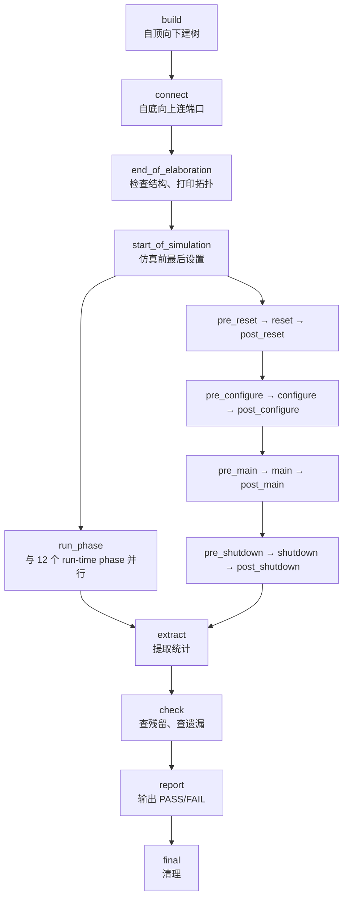
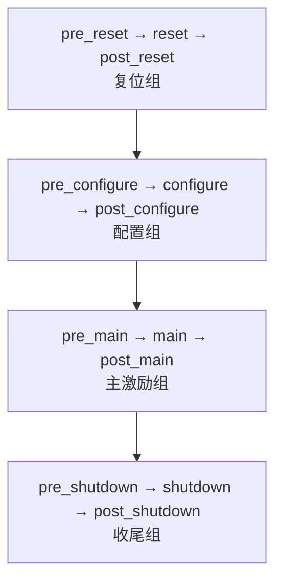
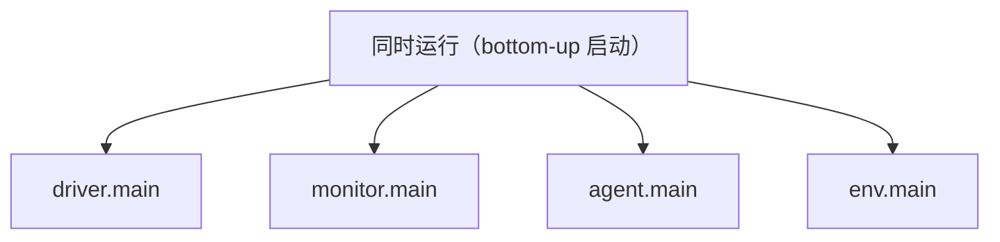
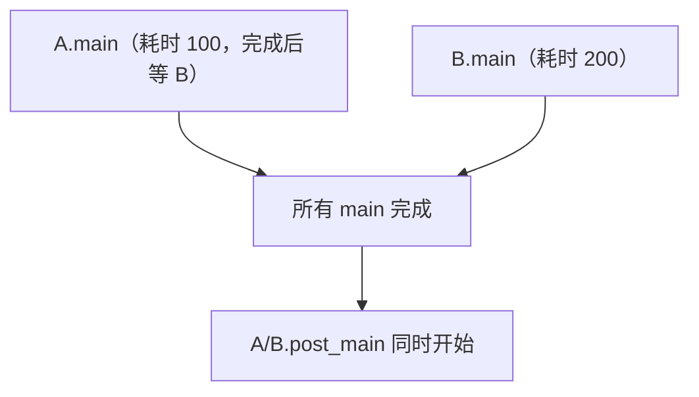
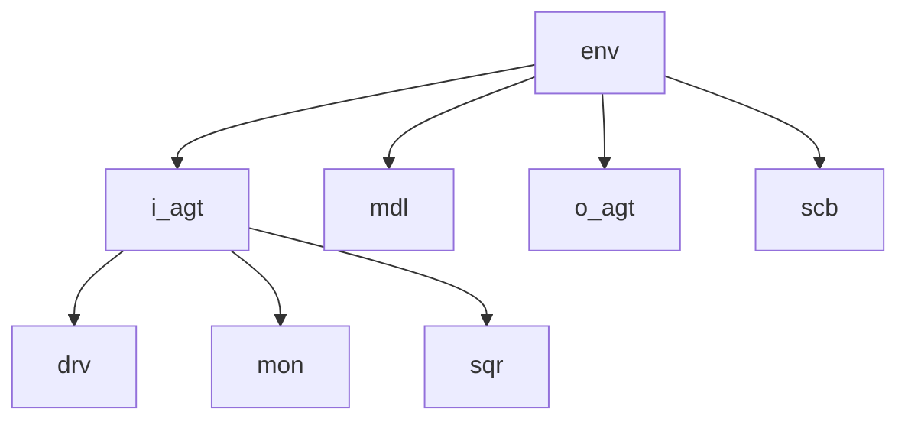
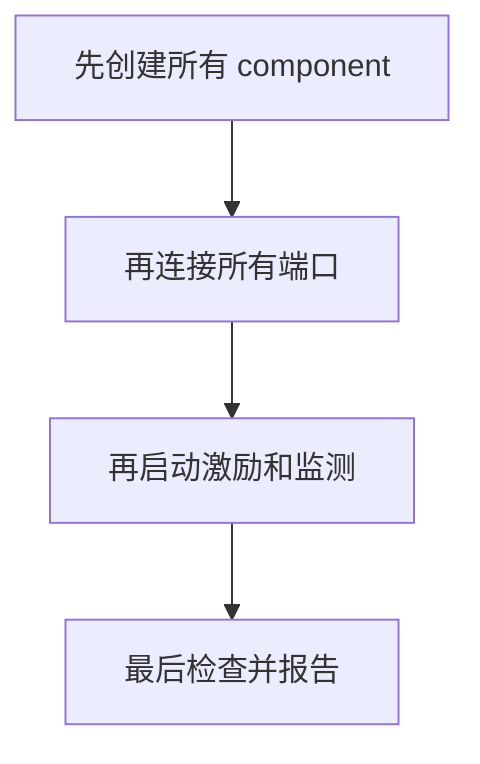
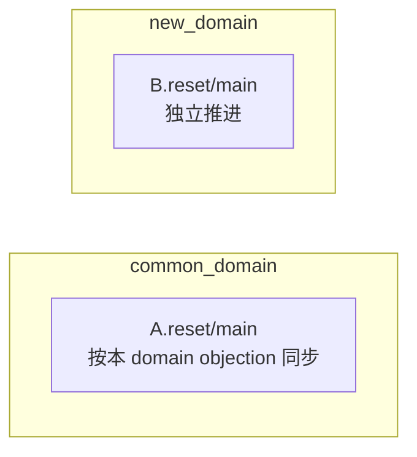
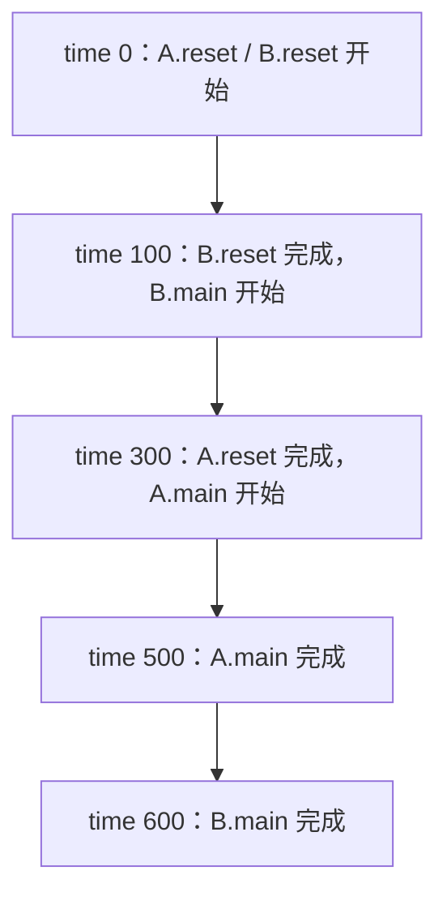

# UVM实战 第 5 章学习笔记：UVM 验证平台的运行
> **核心结论**：phase 决定平台在什么阶段做什么，objection 决定耗时 phase 何时结束，domain 决定哪些 component 的动态 phase 必须同步。三者共同构成 UVM 验证平台的运行控制。
>
> **记忆主线**：function phase 建结构和收尾 -> task phase 驱动仿真时间 -> objection 保持 phase 存活 -> drain time 等待流水排空 -> domain 隔离独立运行区域。

---

## 5.0 本章定位

| 章节 | 核心问题 |
|------|----------|
| 5.1 | phase 的类型、顺序、跳转、调试和超时 |
| 5.2 | objection 如何控制 task phase 生命周期 |
| 5.3 | 多个 domain 如何让动态 phase 独立运行 |

本章需要同时从三个视角理解 phase：

1. 时间顺序：build 之后 connect，run-time 之后 extract。
2. 空间顺序：同一 phase 如何遍历 UVM component 树。
3. 生命周期：objection 何时让 phase 等待或结束。

### 零基础阅读提示

- phase 是 UVM 规定的“工作时间表”。
- function phase 不能等待时钟，主要用于搭结构和收尾。
- task phase 可以等待时钟，主要用于真正运行测试。
- objection 像“还有人没做完”的计数器，计数归零后 phase 才能结束。
- domain 是高级功能，用来让部分组件拥有独立的动态 phase 节奏。

初学阶段先掌握 build、connect、main、check、report 和 objection；phase jump、domain 可以第二遍再深入。

---

## 5.1 phase 机制
### 5.1.1 task phase 与 function phase
phase 按是否允许消耗仿真时间分成两类。

| 类型 | 实现 | 是否耗时 | 典型 phase |
|------|------|----------|------------|
| function phase | function | 否 | build、connect、extract、report |
| task phase | task | 是 | run、reset、main、shutdown |

#### function phase
function phase 在仿真时间上不允许使用延时或事件等待。

```systemverilog
function void my_env::build_phase(uvm_phase phase);
    super.build_phase(phase);     // 先保留父类已有的 build 行为

    // build_phase 只创建结构，不在这里等待时钟。
    // this 作为 parent，使两个组件挂到当前 env 下面。
    i_agt = my_agent::type_id::create("i_agt", this);
    scb   = my_scoreboard::type_id::create("scb", this);
endfunction
```

常见职责：

| phase | 典型职责 |
|-------|----------|
| build_phase | 创建 component、读取配置 |
| connect_phase | 连接 TLM 端口 |
| end_of_elaboration_phase | 检查最终结构、打印拓扑 |
| start_of_simulation_phase | 仿真开始前最后设置 |
| extract_phase | 从运行结果提取统计 |
| check_phase | 检查队列、状态和遗漏 |
| report_phase | 输出 PASS/FAIL 与汇总 |
| final_phase | 关闭文件、最终清理 |

#### task phase
```systemverilog
task my_driver::main_phase(uvm_phase phase);
    forever begin
        seq_item_port.get_next_item(req); // 阻塞等待 sequence 的下一个请求
        drive_one_packet(req);    // 包含时钟等待，可消耗仿真时间
        seq_item_port.item_done();        // 与 get_next_item 成对，释放当前请求
    end
endtask
```

task phase 可包含：

- <code>#delay</code>。
- <code>@event</code>。
- <code>wait</code>。
- blocking TLM get/put。
- fork/join 并发进程。

#### 总体 phase 顺序


<code>run_phase</code> 与 12 个 run-time phase 并行。

---

### 5.1.2 动态运行 phase（12 个 run-time phase）

12 个 run-time phase 分 4 组，每组是"pre_* → 核心 → post_*"的包裹结构：



核心四阶段：

| 核心 phase | 典型行为 |
|------------|----------|
| reset_phase | 复位 DUT 和验证平台状态 |
| configure_phase | 配置寄存器和工作模式 |
| main_phase | 主要激励、监测和检查 |
| shutdown_phase | 结束流量、断电或收尾 |

pre_* 是开场白、post_* 是谢幕：给各组件留出统一的前后准备位置。例如 scoreboard 在 reset_phase 清空旧数据，防止新旧数据混在一起：

```systemverilog
task my_scoreboard::reset_phase(uvm_phase phase);
    expected_q.delete();          // [1] 清掉复位前未比较的数据
    error_count = 0;              // [2] 错误计数归零
endtask
```

两个容易忽略的点：

1. **task phase 靠 objection 续命**：没人 raise_objection，phase 会被瞬间跳过（详见 5.2）。
2. **全树同步**：所有组件的同一个 phase 都执行完，才进入下一个 phase，各组件因此能在同一语义阶段对齐动作。

#### 为什么要拆成 4 组

- 不同场景挂不同 sequence（如 ch2 的 `i_agt.sqr.main_phase`）。
- 支持运行中重新复位（phase jump）。
- 各组件在同一语义阶段同步动作，不会错位。

---

### 5.1.3 phase 的执行顺序
“自上而下”有两种含义。

| 维度 | 含义 |
|------|------|
| 时间上的自上而下 | 不同 phase 按 phase 图顺序推进 |
| 空间上的自上而下 | 同一 phase 按 UVM 树从 parent 到 child 执行 |

#### build_phase：top-down
```text
test.build → env.build → agent.build → driver.build
```

原因：child 必须先由 parent 的 build_phase 创建，之后才能执行 child.build_phase。

**机制**：phase 调度器调用某节点 build_phase 的前提是它已存在于树上，而节点上树靠 parent 在自己的 build_phase 里 create。因此 top-down 不是约定而是因果：env.build 不执行，i_agt 就不存在，调度器永远不会调 i_agt.build。遍历方式为深度优先前序（pre-order）：先调父的 build，再递归进整棵子树。

```systemverilog
function void env::build_phase(uvm_phase phase);
    super.build_phase(phase);
    i_agt = my_agent::type_id::create("i_agt", this);  // [1] env 先造出 i_agt
    scb   = my_scoreboard::type_id::create("scb", this);
endfunction
```

**易错点**：漏创建或拼错名字的组件不在树上，它的 build 及之后所有 phase 静默不执行，后续引用得到 null，错误往往在很后面才暴露。

component 必须在 build 阶段完成创建。

object 不进入 component 树，可在任意合理阶段创建。

#### 其他 function phase：bottom-up
教材指出，除 build_phase 外，大多数 function phase 按树从叶到根执行。

```text
driver.connect → agent.connect → env.connect → test.connect
```

这让子组件先准备好端口，父组件随后完成跨组件连接。

**机制**：端口在 build 阶段已全部创建，bottom-up 真正解决的是"连接依赖链"——agent.connect 先把内部端口暴露给 ap（ap = mon.ap），env.connect 才能用 i_agt.ap 做跨组件连接；若 env.connect 先跑，i_agt.ap 还是 null。这体现封装：env 只面对 agent 的对外接口，不关心其内部结构。

```systemverilog
// agent 的 connect：把内部 mon 的端口暴露出来
function void i_agt::connect_phase(uvm_phase phase);
    ap = mon.ap;                 // [1] agent.ap 指向 mon.ap
endfunction

// env 的 connect：用 agent 暴露的端口做跨组件连接
function void env::connect_phase(uvm_phase phase);
    i_agt.ap.connect(mdl.port);  // [2] 需要 i_agt.ap 已经有效
endfunction
```

#### task phase：bottom-up 启动、并发运行
task phase 不是等 child 完成后才执行 parent，而是按遍历顺序启动多个并行进程。



不要依赖 task phase 的启动先后完成通信同步。

**机制**：调度器按树顺序逐个调用各组件 main_phase，但每个调用 fork 成独立进程互不阻塞；全部启动后统一等待"完成条件"。等价逻辑：

```systemverilog
foreach (comp in tree) begin
    fork comp.main_phase(phase);   // [1] 全部 fork，不等待
    join_none
end
wait (phase.phase_done == 0);      // [2] 统一等待：objection 归零且进程结束
// 到达 [2] 后才进入 post_main_phase
```

#### 兄弟 component 的顺序
教材在 UVM 1.1d 源码中观察到同层 component 按实例名字典序遍历，而非创建顺序。

```systemverilog
A_inst0 = A::type_id::create("dddd", this);
A_inst1 = A::type_id::create("zzzz", this);
A_inst2 = A::type_id::create("jjjj", this);
A_inst3 = A::type_id::create("aaaa", this);
```

观察顺序可能是：
```text
aaaa -> dddd -> jjjj -> zzzz
```

但 UVM 标准不应被理解为保证此具体字典序。

> **规则**：兄弟 component 之间不能依赖 phase 执行顺序；有依赖就应使用显式配置、连接或同步机制。

**真相**：UVM 1.1d 中 m_children 是关联数组（uvm_component m_children[string]，key 为实例名），遍历按 key 字典序，与创建顺序无关。这是实现细节，标准不保证，工程上不应依赖。

#### run-time phase 的全局同步
假设 A.main 耗时 100，B.main 耗时 200：



每个 component 完成自己的 main 后，要等待该 domain 中其他 component 的 main 完成。

下一 run-time phase 只有在当前 phase 的 objection 全部结束后才开始。

**机制**：每个 run-time phase 维护"完成计数" phase_done——raise_objection +1、drop_objection -1，加上仍在运行的 phase 进程，全部归零才放行。用 A.main=100、B.main=200 走一遍：

| 时间 | phase_done | 状态 |
|------|-----------|------|
| 0 | 2（A、B 各 raise 一次） | main 运行中 |
| 100 | 1（A drop 并结束，B 仍在跑） | A 等 B |
| 200 | 0（B drop 并结束） | 归零，main 结束 |

"快的等慢的"不是 A 主动等待，而是 phase 完成条件是所有参与者都完成（rendezvous 会合点）；post_main 是独立 phase，计数从 0 重新开始，故 A/B 的 post_main 同时重新 raise 启动。

#### run_phase 与 run-time phase 同步
<code>run_phase</code> 与 12 个动态 phase 并行——两套独立运行的体系：

```text
体系 A：run_phase              ← 一条线，从 start_of_simulation 一路跑到 extract 前
体系 B：12 个 run-time phase   ← 一条线，pre_reset → ... → post_shutdown 顺序走
两者并行，各有各的 objection 计数
```

进入 extract 的判据 = 两条线都收工：

- 体系 B：12 个动态 phase 全部走完（各自 objection 归零）。
- 体系 A：run_phase 完成或被终止（objection 归零，或进程被 kill）。
- 相关 objection 全部撤销。

#### phase 时间线示例
```systemverilog
task A::main_phase(uvm_phase phase);
    phase.raise_objection(this);
    #100;
    phase.drop_objection(this);
endtask

task B::main_phase(uvm_phase phase);
    phase.raise_objection(this);
    #200;
    phase.drop_objection(this);
endtask

task A::post_main_phase(uvm_phase phase);
    phase.raise_objection(this);
    #300;
    phase.drop_objection(this);
endtask

task B::post_main_phase(uvm_phase phase);
    phase.raise_objection(this);
    #200;
    phase.drop_objection(this);
endtask
```
执行时间：

| 时间 | 事件 |
|------|------|
| 0 | A.main、B.main 并发开始 |
| 100 | A.main 完成，等待 B |
| 200 | B.main 完成，A/B.post_main 同时开始 |
| 400 | B.post_main 完成，等待 A |
| 500 | A.post_main 完成，进入后续 phase |

时间轴推演（第一关 main_phase）：

```text
时间轴：  0            100          200
A 的活：  [============]                   ← 100 干完，drop
B 的活：  [=========================]      ← 200 才干完，drop
```

时间轴推演（第二关 post_main_phase）：

```text
时间轴：  200          400         500
A 的活：  [=========================]   ← 这关 A 要 300，干到 500
B 的活：  [============]                ← 这关 B 只要 200，干到 400
```

单个 component 提前完成不会独自进入下一动态 phase，同一 domain 必须在 phase 边界同步。

---

### 5.1.4 UVM 树的遍历
UVM 树遍历常见两种方式：

| 遍历 | 含义 |
|------|------|
| 广度优先 | 先访问所有兄弟，再访问孩子 |
| 深度优先 | 先完成一个子树，再访问兄弟子树 |

教材说明 UVM 使用深度优先遍历 phase。



可能先完成 <code>i_agt</code> 子树，再访问后续兄弟。

叔侄 component 的相对顺序也可能受兄弟结点名字和深度优先遍历共同影响。

不要写出以下隐式依赖：

```systemverilog
// 错误设计思路：假定 scoreboard.build 必然早于 driver.build
if (!scb.already_ready)
    `uvm_fatal("ORDER", "scoreboard should have run first")
```

应把共享条件设置在共同祖先或 config object 中。

---

### 5.1.5 super.phase 的内容（⚠️ 未理解，待复习，先跳过）
是否调用 <code>super.xxxx_phase</code> 取决于父类是否实现了必要行为。

#### build_phase 通常必须调用
```systemverilog
function void my_driver::build_phase(uvm_phase phase);
    super.build_phase(phase);     // 保留父类配置应用等行为
    // 用户自己的 build 代码
endfunction
```

教材特别强调，<code>uvm_component::build_phase</code> 会处理 field automation 的配置应用。

#### UVM 基类的其他 phase 多为空
uvm_component 的许多默认 phase 只调用旧式空方法或直接 return，因此直接继承 UVM 类时，某些 super 调用在功能上可省略。

但工程上保持调用通常更稳妥。

#### 用户父类不为空时必须保留
```systemverilog
class my_test extends base_test;
    function void connect_phase(uvm_phase phase);
        super.connect_phase(phase); // base_test 可能设置 report 或检查配置
        // my_test 的额外行为
    endfunction
endclass
```

> **判断原则**：不要只看 UVM 当前源码是否为空；要看直接父类和未来扩展是否需要该调用。

---

### 5.1.6 build 阶段出现 UVM_ERROR 停止仿真
在 end_of_elaboration_phase 及其之前出现 UVM_ERROR，UVM 会把 build/elaboration 错误汇总，并以内部 UVM_FATAL 停止运行。

```systemverilog
function void my_driver::build_phase(uvm_phase phase);
    super.build_phase(phase);

    if (!uvm_config_db#(virtual my_if)::get(
            this, "", "vif", vif))
        `uvm_error("NO_VIF", "virtual interface was not configured")
endfunction
```

即使这里是 UVM_ERROR，elaboration 结束时也可能因 BUILDERR 退出。

#### UVM_ERROR 与 UVM_FATAL 的取舍

| 选择 | 特点 |
|------|------|
| UVM_FATAL | 第一个问题出现时立即结束 |
| UVM_ERROR | 尽量收集多个 build 问题后统一结束 |

大型平台编译和优化耗时很长时，使用 ERROR 暴露多个配置错误可能更高效。

对会导致空句柄访问的关键问题，仍要谨慎决定是否立即 fatal。

---

### 5.1.7 phase 的跳转
<code>phase.jump(目标phase)</code> 可让当前 schedule 跳到另一 phase。

典型场景：运行中检测到 DUT 复位，main_phase 跳回 reset_phase。

```
正常流程：pre_reset → reset → ... → main → ...
跳转后：  main → jump → reset → ... → main（重新跑）
```

#### driver reset_phase

```systemverilog
task my_driver::reset_phase(uvm_phase phase);
    phase.raise_objection(this);

    vif.data  <= '0;              // [1] 接口立刻置空闲
    vif.valid <= 1'b0;

    while (!vif.rst_n)
        @(posedge vif.clk);       // [2] 等复位释放才继续

    phase.drop_objection(this);
endtask
```

#### main_phase 监测异步复位
```systemverilog
task my_driver::main_phase(uvm_phase phase);
    fork
        forever begin
            seq_item_port.get_next_item(req);   // [1] 正常发激励
            drive_one_packet(req);
            seq_item_port.item_done();
        end

        begin
            @(negedge vif.rst_n);               // [2] 盯异步复位
            phase.jump(uvm_reset_phase::get()); // [3] 发现复位 → 跳回 reset
        end
    join
endtask
```

#### jump 的影响
phase jump 影响当前 domain，不只是调用 jump 的单个 component。

跳转时要处理：

- 当前 phase 中的并发进程会被终止。
- objection 可能被清理并产生 warning。
- driver 手中的 req 可能未 item_done。
- scoreboard 期望队列可能残留。
- FIFO 和 reference model 状态需要复位。
- DUT 跳转后可能输出尾部异常数据。

#### 可跳转范围
教材示例指出：

- 不能从运行时跳回 build/connect 等已完成的 function phase。
- run_phase 与 12 个 run-time phase 是并行关系，不能简单互跳。
- run-time schedule 内可向前或向后跳到合法前驱/后继 phase。
- 向后跳到后续收尾 phase 也需确认资源清理。

#### 防止无限跳转
```systemverilog
if (!has_jumped) begin
    has_jumped = 1;
    phase.jump(uvm_reset_phase::get());
end
```

跳转条件必须防止每次返回 main 后再次无条件跳转。

---

### 5.1.8 phase 机制的必要性
phase 把“创建、连接、运行、检查、报告”分配到确定阶段。

没有 phase 时，用户必须手工保证：



若创建和连接语句交错，很容易在对象尚未创建时连接。

UVM 的设计：

| 阶段 | 统一工作 |
|------|----------|
| build_phase | 创建结构 |
| connect_phase | 建立连接 |
| run-time phase | 执行耗时行为 |
| check/report | 检查和汇总 |

自动 phase 调度让每个 component 只实现自己的局部行为，框架负责全局顺序。

---

### 5.1.9 phase 的调试
命令行打开 phase trace：
```text
<sim_command> +UVM_PHASE_TRACE
```

常见 trace 状态：

| 标记 | 含义 |
|------|------|
| STRT | phase 开始 |
| SKIP | 没有 objection，phase 被快速跳过 |
| DONE | phase 完成 |
| SCHEDULED | 后续 phase 已调度 |

适合排查：

- 为什么 main_phase 没执行耗时代码。
- 哪个 phase 停住。
- phase jump 是否发生。
- 某个 domain 当前位于什么 phase。

trace 输出很大，通常只在调试时开启。

---

### 5.1.10 超时退出
测试挂起时，仿真时间可能持续前进但没有 transaction 或 error。

设置全局 timeout：
```systemverilog
function void base_test::build_phase(uvm_phase phase);
    super.build_phase(phase);

    uvm_top.set_timeout(
        500ns,                    // 最大仿真时间
        0                         // 0：允许后续覆盖
    );
endfunction
```

达到 timeout 后，UVM 报 fatal 并结束。

命令行：
```text
+UVM_TIMEOUT="300ns,YES"          // YES/NO：是否允许被代码里的设置覆盖
```

参数含义：`set_timeout(时间, 可否覆盖)`——第二参数 0 表示"这次设置不是最终的，后面还能改"，1 表示"锁死"。

timeout 应根据最长合法测试设置，过短会误杀慢场景，过长会浪费回归资源。

| timeout 设置 | 建议 |
|--------------|------|
| 单元测试 | 略高于最长合法场景 |
| 随机回归 | 结合 transaction 数量和最大延迟估算 |
| 调试模式 | 可适当放宽，但不能完全取消保护 |

---

## 5.2 objection 机制
### 5.2.1 objection 与 task phase
objection 是 task phase 的存活计数。

```systemverilog
task my_sequence::body();
    if (starting_phase != null)              // [1] sequence 通常由 phase 启动才有 starting_phase
        starting_phase.raise_objection(this); // [2] 举手：我要干活，phase 别结束

    // 需要仿真时间的测试行为

    if (starting_phase != null)
        starting_phase.drop_objection(this);  // [3] 放手：我干完了
endtask
```

#### 基本规则

- **drop 前必须 raise**，raise 让计数 +1，drop 让计数 -1，**顺序错（先 drop）就是非法操作**，UVM 会报错。
- **所有 objection 归零后，当前 phase 才能结束**——即 5.1.3 的 phase_done 计数：同一 domain 所有组件的 raise/drop 累加在**同一个计数器**上，计数归零且进程结束才放行；"快的等慢的"就是计数还没归零。
- **若 phase 从未 raise，UVM 可在 0 时间立即跳过它**——即 5.1.9 trace 的 **SKIP**：计数恒为 0，phase 瞬间完成，耗时代码没机会跑。
- **phase 结束时仍运行的无限循环会被框架终止**——如果 raise 了、代码里有个 `forever` 循环，drop 永远执行不到，计数永远不归零 → phase 永远不结束 → 仿真挂死；UVM 会在 phase 结束条件满足时强制杀掉仍在跑的 phase 进程。

#### 只有 driver raise

**核心**：objection 是**挂在 phase 上**的，不是挂在组件上的。同一个 phase 里，**任何一个**组件的 raise 都能让整个 phase 活着。

```systemverilog
task driver::main_phase(uvm_phase phase);
    phase.raise_objection(this);
    #100;
    phase.drop_objection(this);
endtask

task monitor::main_phase(uvm_phase phase);
    forever collect_one_packet(); // 可在这 100 时间内并发运行（它不需要 raise，因为 driver 的 raise 已经保住了 phase）
endtask
```

monitor 不必自己 raise；同一 phase 中任一 component 的 objection 都能保持整个 phase 存活。

100 时间后 objection 归零，monitor 的 forever 进程被终止。、

> 这就是"同计数器"的威力：**一个组件的 raise 保护了所有组件**。monitor 只管采集，不需要关心 phase 死活。

#### 完全没有 objection

**核心**：**代码里有延时 ≠ phase 会等待**。phase 的等待条件是"计数归零 + 进程结束"，不是"代码写完"。

```systemverilog
task driver::main_phase(uvm_phase phase);
    #100;                         // 不保证能执行完
endtask
```

即使代码写有延时，UVM 仍可立即进入下一 phase。

> **关键**：耗时代码存在并不等于 phase 会等待，必须至少有一个有效 objection。

#### run_phase 的特殊关系
run_phase 与动态 phase 并行——两条线各有独立的 objection 计数器，互不影响：

- **main_phase 有 objection 时，run_phase 即使不 raise 也可运行**：main 的 raise 只保护动态 phase 这条线；run_phase 在另一条线上，只要它自己的进程（如 forever 循环）还没结束，就会一直运行，不需要任何人替它 raise。
- **只有 run_phase raise，而 main_phase 没有 objection，main_phase 可能被快速跳过**：run 的 raise 只保护 run_phase 自己；main 这条线没人 raise，计数器恒为 0，main 会在 0 时间被跳过（SKIP），里面写的耗时代码不会执行——但测试还能靠 run_phase 继续跑。
- **进入 extract 前，run_phase 与动态 phase 的 objection 都必须结束**：extract 是 run 阶段的总出口，两条线都必须收工（动态 phase 链全部走完 + run_phase 结束）才能进入，任何一条线还挂着 objection 都进不去。

#### run_phase 与 main_phase 对照

| objection 位于 | main_phase | run_phase |
|----------------|------------|-----------|
| main_phase | main 正常存活 | run 可并行运行 |
| run_phase | main 仍可能快速跳过 | run 正常存活 |
| 两者都有 | 各自由自己的 objection 约束 | 最后统一等待 |
| 两者都没有 | 动态 phase 快速推进 | run 进程也可能很快被终止 |

因此不要用 run_phase 的 objection 假设 main_phase 一定执行完整，也不要反过来用 main 的时长代表 run 的完成条件。

---

### 5.2.2 参数 phase 的必要性
所有 phase 回调都接收 <code>uvm_phase phase</code>：
```systemverilog
task main_phase(uvm_phase phase);
```

这个参数代表当前正在执行的 phase 对象。

为什么必须传参——一个组件可实现多个 phase 回调，各自对应不同的 phase 对象：

```systemverilog
class my_driver extends uvm_driver;
    task reset_phase(uvm_phase phase);     // [1] 复位阶段的回调
        phase.raise_objection(this);
        ...
        phase.drop_objection(this);
    endtask

    task main_phase(uvm_phase phase);      // [2] 主激励阶段的回调
        phase.raise_objection(this);
        ...
        phase.drop_objection(this);
    endtask
endclass
```

reset 和 main 是两个不同的 phase 对象，各有自己的 objection 计数器。UVM 调度器跑哪个 phase 就把哪个 phase 对象传进来：raise/drop 中 <code>this</code> 表示"谁在举手"，<code>phase</code> 表示"举到哪个计数器上"。

用途：

| 用途 | 说明 |
|------|------|
| `phase.raise_objection(this)` | 在当前 phase 计数器 +1 |
| `phase.drop_objection(this)` | 在当前 phase 计数器 -1 |
| `phase.jump(uvm_reset_phase::get())` | 让当前 phase 所在 schedule 跳到别的 phase（5.1.7） |
| `phase.phase_done` | 访问当前 phase 的完成计数（objection 数） |
| 查名称/状态 | 比如 `phase.get_name()`，调试时打印"我现在在哪个 phase" |

function phase 语法上也能 raise/drop，但它不能耗时，通常没有必要用 objection 控制。

---

### 5.2.3 控制 objection 的最佳选择
driver、monitor、model 通常有 forever 循环，不适合自己决定测试结束。

#### 不推荐在 forever 外控制
```systemverilog
task driver::main_phase(uvm_phase phase);
    phase.raise_objection(this);

    forever begin                              // [1] 无限循环，永不退出
        seq_item_port.get_next_item(req);
        drive_one_packet(req);
    end

    phase.drop_objection(this);   // [2] 永远执行不到：循环出不来，计数无法归零
endtask
```

`forever` 循环根本不会退出，`drop` 这行代码**永远到不了** → 计数永远 ≥1 → phase 卡死。所以 **driver 这类"天生无限循环"的组件，不适合自己决定测试什么时候结束**。

#### 在 get_next_item 后 raise 也不可靠

如果**全平台没人 raise**，phase 在 driver 拿到第一个 item 之前就 SKIP 结束了——你在 `get_next_item` 之后才 raise，**根本没机会执行到**。

```systemverilog
task driver::main_phase(uvm_phase phase);
    forever begin
        seq_item_port.get_next_item(req);   // [1] 可能一直阻塞等待
        phase.raise_objection(this);        // [2] 太晚：phase 可能已 SKIP，raise 没机会执行
        drive_one_packet(req);
        phase.drop_objection(this);
    end
endtask
```

#### 策略一：scoreboard 控制
```systemverilog
task my_scoreboard::main_phase(uvm_phase phase);
    phase.raise_objection(this);

    fork
        forever begin                        // [1] 一直收期望数据
            packet expected;
            exp_port.get(expected);
            expected_q.push_back(expected);
        end

        begin
            repeat (packet_num) begin        // [2] 收够实际数据就停
                packet actual;
                act_port.get(actual);
                compare_one(actual);
            end
        end
    join_any                                 // [3] 等"收够实际数据"先完成

    phase.drop_objection(this);
endtask
```

**思路**：scoreboard 知道**预期包数**（packet_num）——它清楚"验证什么时候算完成"。收够 packet_num 个实际包就 drop。

#### 策略二：sequence 控制
```systemverilog
task case_sequence::body();
    if (starting_phase != null)
        starting_phase.raise_objection(this);   // [1] 发激励前举手

    repeat (packet_num)
        `uvm_do(req)                            // [2] 按计划发完激励

    if (starting_phase != null)
        starting_phase.drop_objection(this);    // [3] 发完就放手
endtask
```

sequence 是**唯一清楚"激励从哪开始、到哪结束"的组件**——它按计划发 packet_num 个包，发完就知道自己干完了，天然适合控制 objection。这就是 UVM 推荐的做法。

注意：激励发送完不代表 DUT 输出和 scoreboard 比较已经完成，需要 drain time 或显式完成条件。

---

### 5.2.4 set_drain_time 的使用
DUT 有流水延迟，最后一个输入 transaction 发送完成后，输出可能尚未出现。

```text
输入最后一包完成时间 n → DUT 处理延迟 p → 最后输出时间 n+p
```

若 n 时刻立即 drop，monitor 可能收不到最后输出。

```text
sequence 发完最后一包 → drop objection → 计数归零 → phase 结束
                                          ↑
                          但 DUT 还在流水线里处理最后几包！
                          monitor/scoreboard 还没收完输出
```

#### 不推荐每个 sequence 手写固定延时
```systemverilog
repeat (10)
    `uvm_do(req)

#100;                            // [1] 重复、难维护、难适配长短包
phase.drop_objection(this);
```

问题：每个 sequence 都要猜"等多久"，包长一变就要改。

#### 设置 drain time

```systemverilog
task base_test::main_phase(uvm_phase phase);
    phase.phase_done.set_drain_time(
        this,
        200ns                       // [1] objection 归零后继续等待
    );
endtask
```

**机制**：`set_drain_time` 挂在 phase_done 上——**当 objection 归零后，phase 不会立刻结束，而是再多等 200ns** 让流水排空。

流程：

```text
最后一个 drop → total objection = 0 
            → 等待 drain_time (200ns)
            → 进入 post_main_phase
```

**关键细节**：drain time 期间 phase **还没结束**，monitor、scoreboard 等进程**继续运行**——所以最后几包输出能被正常采集和比较。

#### 每个 phase 独立设置
main_phase 的 drain time 不会自动应用到 configure_phase。

未设置时默认 drain time 为 0。

#### drain time 的局限

| 局限 | 说明 |
|------|------|
| 拖慢测试 | 每个测试都固定多等 200ns，不管实际需要多久 |
| 不精确 | 乱序/可变深度流水，固定延时没法精确匹配 |
| 可能假结束 | 如果 DUT 卡死永远不输出，drain time 到点照样"结束"——实际上漏了数据 |

更可靠的完成条件可以是 scoreboard 的未匹配队列清空或显式 done 事件。

---

### 5.2.5 objection 的调试
命令行：
```text
<sim_command> +UVM_OBJECTION_TRACE
```

trace 会显示：

- 谁 raise/drop。
- 本对象 count。
- 向 parent 传播后的 total。
- objection 描述字符串。
- 发生时间。

#### 一次 raise 多个 objection
```systemverilog
phase.raise_objection(
    this,
    "case traffic",
    2                             // [1] 一次 +2
);

phase.drop_objection(
    this,
    "case traffic",
    2                             // [2] 必须对称 -2
);
```

- 第三个参数是**计数**（一次加减 N）；
- **必须对称**：raise 2 就必须 drop 2，数量不一致 = 永久挂起；
- 工程建议：**默认一次 1 个**，只有确有多独立工作单元（比如同时跑两个并发任务）才用多计数。

#### objection 沿树传播
```text
sequence raise → sequencer total +1 
               → agent total +1 
               → env total +1 
               → test total +1 
               → uvm_top total +1
```

**每个父节点的 total = 自己的 + 所有子节点传来的**。phase 最终看的是**全局 total 是否归零**。

#### 常见 objection 故障

| 现象 | 可能原因 |
|------|----------|
| phase 0 时间跳过 | 没有任何 raise |
| 仿真永不结束 | 漏掉 drop 或数量不对称 |
| 最后一包未比较 | drop 太早，缺少 drain/完成条件 |
| jump 出现清理 warning | 跳转前仍有 objection |
| sequence 卡住 | driver 未 item_done，不一定是 objection |

#### objection 设计检查清单

1. 谁真正知道测试何时开始、何时完成？
2. raise 是否发生在第一个耗时语句之前？
3. 所有退出路径是否都会执行 drop？
4. raise/drop 的数量参数是否一致？
5. phase jump 前是否还有未撤销 objection？
6. 最后输入完成后，DUT 流水和 scoreboard 是否已排空？
7. drain time 是否属于正确 phase？
8. 是否设置了 timeout 防止遗漏 drop 永久挂起？
9. 是否可用 <code>+UVM_OBJECTION_TRACE</code> 看到来源？
10. 是否把永久运行组件错误地当成测试结束控制者？

---

## 5.3 domain 的应用
### 5.3.1 domain 简介
默认情况下，所有 component 位于 common domain。

同一 domain 中，component 的 12 个 run-time phase 需要同步。

如果 DUT 有两个可独立复位、配置和运行的区域，可把其中一部分放入新 domain。



domain 主要隔离 12 个 run-time phase。

教材强调：

- function phase 仍保持全局同步。
- run_phase 仍与整体调度有关。
- 不同 domain 的 reset/main 等动态 phase 可异步推进。

---

### 5.3.2 多 domain 的例子
#### 创建并设置 domain
```systemverilog
class block_b extends uvm_component;
    uvm_domain local_domain;

    `uvm_component_utils(block_b)

    function new(string name, uvm_component parent);
        super.new(name, parent);
        local_domain = new("local_domain");
    endfunction

    function void connect_phase(uvm_phase phase);
        super.connect_phase(phase);

        set_domain(
            local_domain,
            1                     // 递归把所有后代放入该 domain
        );
    endfunction
endclass
```

为什么在 connect_phase 设置：

- 子 component 已在 build_phase 创建完成。
- 递归设置能覆盖完整子树。

<code>set_domain(domain, hier)</code> 中 <code>hier=1</code> 表示递归应用到后代。

#### 不同 domain 独立推进
A 在 common domain：
```systemverilog
task A::reset_phase(uvm_phase phase);
    phase.raise_objection(this);
    #300;
    phase.drop_objection(this);
endtask

task A::main_phase(uvm_phase phase);
    phase.raise_objection(this);
    #200;
    phase.drop_objection(this);
endtask
```

B 在 local domain：
```systemverilog
task B::reset_phase(uvm_phase phase);
    phase.raise_objection(this);
    #100;
    phase.drop_objection(this);
endtask

task B::main_phase(uvm_phase phase);
    phase.raise_objection(this);
    #500;
    phase.drop_objection(this);
endtask
```

时序：


两个 domain 不再要求 A.reset 与 B.reset 同时完成后才一起进入 main。

---

### 5.3.3 多 domain 中 phase 的跳转
phase jump 只影响调用者所在 domain。

```systemverilog
task B::main_phase(uvm_phase phase);
    phase.raise_objection(this);

    #500;

    if (!has_jumped) begin
        has_jumped = 1'b1;        // 防止第二次进入 main 后重复跳转
        phase.jump(uvm_reset_phase::get());
    end

    phase.drop_objection(this);
endtask
```

结果：

- B 所在 local domain 回到 reset。
- A 所在 common domain 不受影响。
- B 可第二次进入 reset 和 main。
- A 的 reset/main 只执行一次。

#### domain jump 的用途

- 单个子系统局部复位。
- 独立电源域重启。
- 某协议 agent 的局部恢复。
- 多时钟域不同步配置。

#### 风险

- 跨 domain scoreboard 可能同时接收不同运行阶段的数据。
- 共享 model 要知道每笔 transaction 属于哪个 domain/epoch。
- 一个 domain 清 FIFO 时不能破坏另一个 domain 数据。
- 跨 domain objection 和完成条件更难设计。

domain 是高级功能，普通单时钟、统一复位平台通常无需主动拆分。

---

## 本章总结（5.1-5.3）
### 学习重点排序

| 优先级 | 必须掌握 |
|--------|----------|
| 🔴 高 | function phase 与 task phase 的区别 |
| 🔴 高 | build top-down、其他 function phase bottom-up |
| 🔴 高 | run_phase 与 12 个 run-time phase 并行 |
| 🔴 高 | objection 归零决定 task phase 结束 |
| 🔴 高 | sequence 控制 objection 与 drain time |
| 🟡 中 | phase jump 的范围、清理与风险 |
| 🟡 中 | phase/objection trace 和 timeout |
| 🟢 进阶 | domain 对 run-time phase 的隔离 |

### 最重要的 10 条规则

| # | 规则 | 说明 |
|---|------|------|
| 1 | build_phase 只建 component 树 | connect_phase 再连接端口 |
| 2 | 不依赖兄弟 component 的 phase 顺序 | 标准不保证可依赖的先后 |
| 3 | 用户父类有逻辑时必须调用 super.phase | 保留基类行为 |
| 4 | 耗时 phase 至少要有一个 objection | 否则可能 0 时间结束 |
| 5 | raise/drop 必须成对且数量一致 | 防止提前结束或永久挂起 |
| 6 | forever 组件不负责决定测试结束 | sequence 或明确完成者控制 |
| 7 | 激励结束不等于检查完成 | 使用 drain time 或完成条件 |
| 8 | jump 前清理 objection、FIFO 和队列 | 避免旧状态污染重入 phase |
| 9 | 回归必须设置合理 timeout | 防止挂起无限占用资源 |
| 10 | domain 只在确需独立动态阶段时使用 | 避免无谓复杂度 |

### 最容易错的点

| 易错点 | 正确理解 |
|--------|----------|
| 所有 phase 都 top-down | 错，build 特殊，其他 function 多为 bottom-up |
| task phase 按树顺序逐个执行完 | 错，它们按顺序启动后并发运行 |
| main_phase 有延时就会等待 | 错，还必须有 objection |
| 每个 monitor 都要 raise | 错，同 phase 任一有效 objection 即可维持运行 |
| run_phase 与 main_phase 顺序执行 | 错，它们属于并行 schedule |
| driver forever 循环适合控制 objection | 错，drop 通常无法到达 |
| 最后一个 uvm_do 后立即 drop 总是安全 | 错，DUT 和 scoreboard 可能仍有尾部数据 |
| drain time 对所有 phase 通用 | 错，每个 phase 独立设置 |
| jump 只影响调用 jump 的 component | 错，它影响当前 domain |
| 新 domain 会隔离所有 function phase | 错，主要隔离动态 run-time phase |
