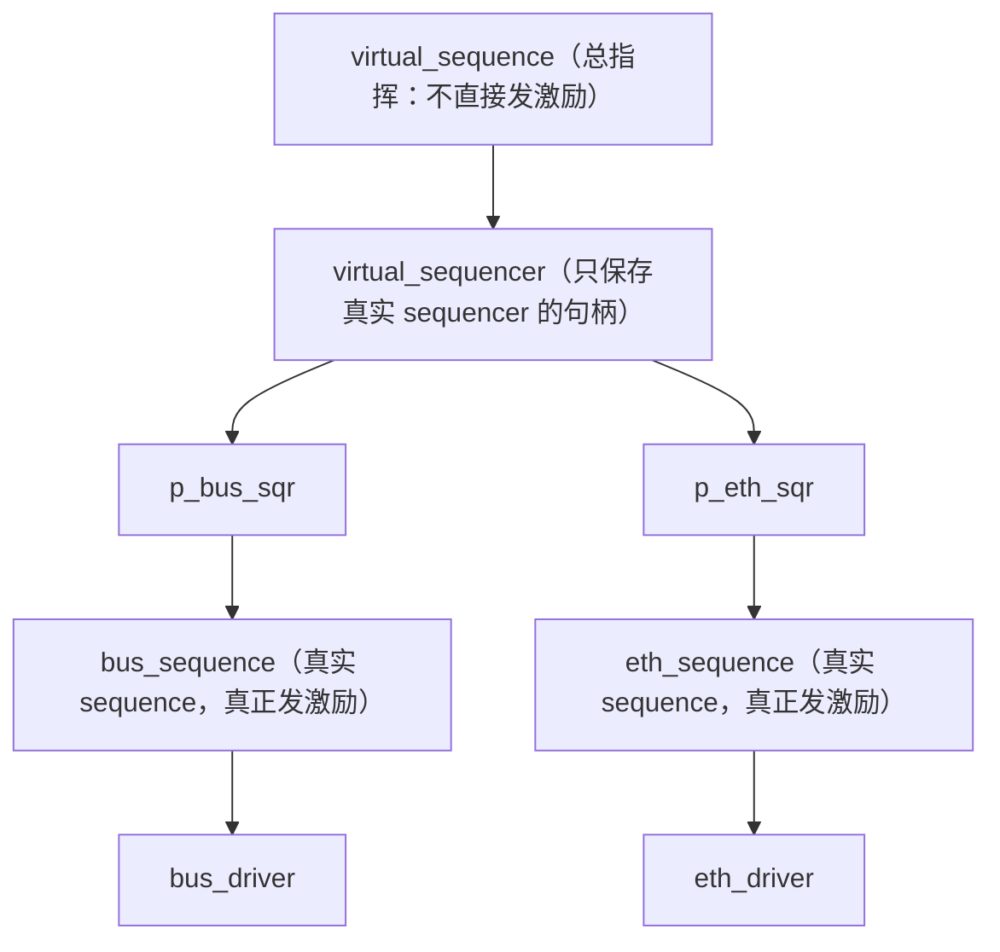
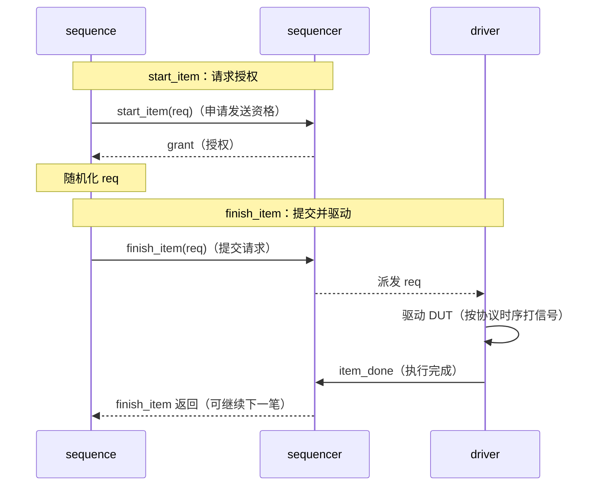

# UVM实战 第 6 章学习笔记：UVM 中的 sequence
> **核心结论**：sequence 负责描述“产生什么激励以及按什么顺序产生”，driver 只负责“怎样把 transaction 驱动到 DUT”。sequencer 位于二者之间，完成请求仲裁、握手和应答路由。
>
> **记忆主线**：sequence 产生 item -> sequencer 仲裁 -> driver 取 item 并驱动 -> item_done 完成握手 -> 可选 response 返回 sequence。

---

## 6.0 本章定位
本章把前面零散使用的 sequence 机制系统化。

| 章节 | 核心问题 |
|------|----------|
| 6.1 | 为什么要把激励产生从 driver 中剥离，sequence 如何启动 |
| 6.2 | 多个 sequence 竞争同一 sequencer 时如何仲裁 |
| 6.3 | `uvm_do` 系列宏到底完成了哪些步骤 |
| 6.4 | sequence 如何嵌套、继承并访问具体 sequencer |
| 6.5 | virtual sequence 如何协调多个接口 |
| 6.6 | sequence 如何使用 `config_db` |
| 6.7 | driver 如何向 sequence 返回 response |
| 6.8 | sequence library 如何随机选择测试场景 |
学习时要分清三个对象：

1. sequence 是 `uvm_object`，不是 component。
2. sequencer 是 `uvm_component`，负责仲裁与转发。
3. driver 是 `uvm_component`，负责引脚级驱动。

### 零基础阅读提示
先牢牢记住一条流水线——**sequence 管"造"，sequencer 管"派"，driver 管"打"**：

```text
sequence 造出 req → sequencer 排队 → driver 取走 req → item_done 告知完成
```

四个握手点对号入座：

| 方法 | 谁调用 | 干什么 | 类比 |
|------|--------|--------|------|
| `start_item()` | sequence | 申请发送资格（排队等批准） | 取号排队 |
| `finish_item()` | sequence | 提交 item，等 driver 完成握手 | 递交材料 |
| `get_next_item()` | driver | 主动取请求（没货就阻塞等） | 取货 |
| `item_done()` | driver | 归还完成通知 | 签收 |

- **virtual sequence 是"总指挥"**：不直接驱动 DUT，只负责协调多个真实 sequencer（比如同时启动读写两个 sequence）。
- **`uvm_do` 是"四合一"宏**：第一次写可以先用它，但要知道内部 = 创建 + 随机化 + 仲裁 + 发送四步。

典型数据通路（数据从 sequence 一路流到 DUT）：

```text
test / virtual sequence
          ↓
      sequence（造数据）
          ↓
    sequence_item（数据本身）
          ↓
      sequencer（排队调度）
          ↓
   seq_item_export/port（传递通道）
          ↓
       driver（驱动信号）
          ↓
         DUT
```

> 记忆：**sequence 管造、sequencer 管派、driver 管打；四个握手点 start/finish/get/done 把它们串成一条流水线。**

---

## 6.1 sequence 基础（🔴 高）
### 6.1.1 从 driver 中剥离激励产生功能（🔴 高）

**核心：激励"造什么"和"怎么打"必须分开——sequence 管造，driver 只管打。**

**坏写法：driver 又造又打（扩展性差）**

```systemverilog
task my_driver::main_phase(uvm_phase phase);
    my_transaction tr;
    phase.raise_objection(this);
    repeat (10) begin
        tr = new("tr");                 // [1] driver 负责创建
        assert(tr.randomize());         // [2] driver 决定激励内容（超长包/CRC 错包都写死在这）
        drive_one_pkt(tr);              // [3] driver 还负责引脚驱动
    end
    phase.drop_objection(this);
endtask
```

**为什么不行**：driver 把"造什么激励"（策略）和"怎么打时序"（实现）混在一起。要加 CRC 错包/超长包/短包测试，就得改 driver——**每加一个 case 改一次稳定代码，测试场景越多越痛苦**。

**正确职责划分：各管一段**

| 对象 | 管什么 | 不管什么 |
|------|--------|----------|
| sequence | 造什么：创建、随机化、组织 transaction | 引脚时序 |
| sequencer | 谁先发：仲裁多个 sequence、路由 req/rsp | 产生业务激励 |
| driver | 怎么打：transaction → pin-level 信号 | 决定测试场景 |

**拆分后：driver 只管"打"（几乎不再改）**

> "打" = driver 把 transaction 按协议时序驱动到接口上（拉 valid、放数据、握手）——**driver 的唯一职责**，不掺和测试意图。

```systemverilog
task my_driver::main_phase(uvm_phase phase);
    forever begin
        seq_item_port.get_next_item(req);   // [1] 取已经造好的请求（没有就等）
        drive_one_pkt(req);                 // [2] 只管按协议时序打信号
        seq_item_port.item_done();          // [3] 通知完成，接下一单
    end
endtask
```

driver 不关心 req 为什么有这些字段——**测试意图全在上游**。

**拆分后：sequence 只管"造"（场景随便换）**

```systemverilog
class normal_sequence extends uvm_sequence #(my_transaction);
    `uvm_object_utils(normal_sequence)
    virtual task body();
        repeat (10)
            `uvm_do(req);        // [1] 创建+随机化+发送一步完成
    endtask
endclass

// 换个场景 = 换一个 sequence，driver 一行不改
class crc_error_sequence extends uvm_sequence #(my_transaction);
    `uvm_object_utils(crc_error_sequence)
    virtual task body();
        repeat (10)
            `uvm_do_with(req, { crc_err == 1; });   // [2] 只改测试意图：强制 CRC 错误
    endtask
endclass
```

**核心收益**：加测试场景 = 加一个 sequence，**driver 和 sequencer 完全不用动**。

**sequence 的本质（能力清单）**

sequence 是一段**可复用的事务级激励程序**，能干的事按类分：

- **产生**：一个 transaction、一串 transaction；
- **组织**：嵌套调用其他 sequence、**协调多个 sequencer**、根据配置选激励；
- **交互**：接收 driver 的 response；
- **复用**：通过继承扩展已有场景。

**sequence 的继承关系**

```text
uvm_object
   └─ uvm_sequence_item
        └─ uvm_sequence_base
             └─ uvm_sequence #(REQ, RSP)
                  └─ 用户 sequence
```

注意：**sequence 本身也是 uvm_sequence_item 的派生**——所以宏（uvm_do）既能操作 item，也能操作子 sequence（嵌套调用就是靠这一点）。

> 记忆：**sequence 管造、driver 管打、sequencer 管派；加场景 = 加 sequence，稳定代码一行不改；sequence 本质是"可复用的事务级激励程序"。**
### 6.1.2 sequence 的启动与执行（🔴 高）

**核心：启动 sequence = 调 `start()`，指定跑在哪个 sequencer 上。**

**直接启动（最直观）**

```systemverilog
task my_test::main_phase(uvm_phase phase);
    normal_sequence seq;
    phase.raise_objection(this);
    seq = normal_sequence::type_id::create("seq");  // [1] sequence 是 object，用 create 创建
    seq.start(env.i_agt.sqr);                       // [2] 启动到指定 sequencer 上
    phase.drop_objection(this);
endtask
```

启动 sequence = `create` + `start(sequencer)`。

**`start()` 四个参数**（一般只关心第一个）：

| 参数 | 含义 | 常用值 |
|------|------|--------|
| sequencer | 跑在哪个 sequencer 上 | 必须 |
| parent_sequence | 父 sequence（嵌套时用） | 顶层启动 = null |
| priority | 仲裁优先级 | -1 = 默认 |
| call_pre_post | 是否调用 pre/post_body | 默认 1 |

**启动后的回调顺序（重点：你只需写 body）**

**把 `start()` 想成"开工"**，5 个回调是开工前后的固定节点：

```text
pre_start     开工前检查（几乎不用）
   ↓
pre_body      开工前准备（可选：抬 objection、设配置）
   ↓
body          ★ 正式干活（必须写：uvm_do 发激励）
   ↓
post_body     收尾（可选：统计、放 objection）
   ↓
post_start    收工清理（几乎不用）
```

**核心就一句：body 是你唯一要写的，其他 4 个不写也有默认空实现。**

**只写 body 的最简 sequence**（这就是平时写 sequence 的常态）：

```systemverilog
class simple_sequence extends uvm_sequence #(my_transaction);
    `uvm_object_utils(simple_sequence)
    virtual task body();            // ★ 唯一必须写的
        repeat (10) `uvm_do(req);   // [1] 发 10 笔激励
    endtask
endclass
```

**需要"干活前后做点什么"时，再加 pre/post**（最常用的是控制 objection）：

```systemverilog
virtual task pre_body();            // [1] 可选：body 前执行
    if (starting_phase != null)
        starting_phase.raise_objection(this);   // [2] 干活前举手
endtask
virtual task body();                // [3] ★ 必须
    repeat (10) `uvm_do(req);
endtask
virtual task post_body();           // [4] 可选：body 后执行
    if (starting_phase != null)
        starting_phase.drop_objection(this);    // [5] 干完放手
endtask
```

| 回调 | 时机 | 你要管吗 |
|------|------|----------|
| pre_start / post_start | 最外层包装 | 几乎不用 |
| pre_body / post_body | body 前后 | 可选（控制 objection 常用） |
| **body** | 中间 | **必须写** |

> 记忆：**回调流程 = 开工前准备(pre) → 正式干活(body) → 收尾(post)；body 必写，pre/post 可选——只有要在干活前后做点什么时才需要它们。**

**default_sequence：用 config_db "预约"序列**

不想手工 start，可以**提前把 sequence 挂到某个 sequencer 的某个 phase 上**，phase 一到自动启动：

```systemverilog
// 按类型挂（推荐：sequencer 启动时再创建，还能 override）
uvm_config_db #(uvm_object_wrapper)::set(
    this,                              // [1] 从当前 test 出发
    "env.i_agt.sqr.main_phase",        // [2] 目标：sequencer 的 main_phase
    "default_sequence",                // [3] 固定字段名
    normal_sequence::type_id::get()    // [4] 传类型包装器（不是实例）
);
```

**两种挂法对比**：

| 方式 | 特点 |
|------|------|
| 类型 wrapper | 启动时 factory 创建，可继续 override（推荐） |
| sequence 实例 | 可先改对象字段，但实例已定死 |

> 工程上通常更推荐 **test/virtual sequence 显式 `start()`**——控制关系最清晰，default_sequence 留给简单场景。

**starting_phase：sequence 怎么知道自己在哪个 phase？**

**sequence 不是 component，天然不知道自己在哪个 phase**，需要手工告诉它：

```systemverilog
seq.starting_phase = phase;      // [1] 手工赋值
seq.start(env.i_agt.sqr);
```

**为什么要有它**：sequence 要在 phase 上控制 objection（raise/drop），就得知道 phase 是谁：

```systemverilog
virtual task pre_body();
    if (starting_phase != null)
        starting_phase.raise_objection(this);   // [2] 举手：我要干活
endtask
virtual task post_body();
    if (starting_phase != null)
        starting_phase.drop_objection(this);    // [3] 放手：干完了
endtask
```

注意：**顶层 sequence 控制 objection；被嵌套的子 sequence 通常不重复控制**（避免重复 raise/drop）；现代写法也可用 `set_starting_phase()` 或 phase 自动机制。

> 记忆：**启动 = start(sequencer)；流程 = pre_start → pre_body → body → post_body → post_start；default_sequence 是"预约"，显式 start 是"直派"，推荐显式；starting_phase 让 sequence 知道在哪干活、好控制 objection。**
## 6.2 sequence 的仲裁机制（🟡 中）
### 6.2.1 在同一 sequencer 上启动多个 sequence（🟡 中）

**核心：多个 sequence 抢同一个 sequencer 时，谁先发由"仲裁"决定——仲裁粒度是"一次一个 item"，不是"一个 sequence 跑完"。**

**并发竞争：fork 同时启动两个 sequence**

```systemverilog
task my_test::main_phase(uvm_phase phase);
    short_sequence seq0;
    long_sequence  seq1;
    phase.raise_objection(this);
    seq0 = short_sequence::type_id::create("seq0");
    seq1 = long_sequence ::type_id::create("seq1");
    fork
        seq0.start(env.i_agt.sqr);   // [1] 两个 sequence 同时抢同一个 sequencer
        seq1.start(env.i_agt.sqr);
    join                            // [2] 等两个都结束
    phase.drop_objection(this);
endtask
```

**关键理解——仲裁是"轮流"不是"独占"**：sequencer 每发一个 item 就重新仲裁一次。所以两个 sequence 会**交替**发：

```text
seq0:item0 → seq1:item0 → seq0:item1 → seq1:item1 → ...
```

**没有"一个 sequence 发完才轮到另一个"这回事**——每次仲裁都是一次新的竞争。

**影响仲裁结果的因素**

请求先后时刻、仲裁算法、优先级、lock/grab 状态、is_relevant()、driver 消费速度。

**优先级：数值越大越优先（但不绝对）**

```systemverilog
fork
    seq0.start(env.i_agt.sqr, null, 100);   // [1] 优先级 100
    seq1.start(env.i_agt.sqr, null, 200);   // [2] 优先级 200（更高）
join
```

**⚠️ 关键坑**：优先级**是否真正生效取决于仲裁模式**——如果模式是 FIFO（按先来后到），优先级设了也白设。

**仲裁模式：6 种，按场景选**

| 模式 | 怎么选 | 用在哪 |
|------|--------|--------|
| `UVM_SEQ_ARB_FIFO` | 按请求到达顺序，忽略优先级 | **一般协议流量（默认）** |
| `UVM_SEQ_ARB_WEIGHTED` | 优先级当权重，随机选 | 模拟 QoS |
| `UVM_SEQ_ARB_RANDOM` | 有效请求里随机选 | 压力测试 |
| `UVM_SEQ_ARB_STRICT_FIFO` | 先选最高优先级，同优先级按 FIFO | QoS + 顺序 |
| `UVM_SEQ_ARB_STRICT_RANDOM` | 先选最高优先级，再随机 | QoS + 随机 |
| `UVM_SEQ_ARB_USER` | 调用户自定义仲裁函数 | 复杂业务规则 |

**选择建议**（面试可答）：协议流量用 FIFO；模拟 QoS 用 weighted/strict；压力测试用 random；复杂规则才 user。

**两个必须记住的结论**：

1. **高优先级 ≠ 永久独占**——它只影响"每一次"仲裁的选择，想独占必须用 lock/grab（6.2.2 讲）；
2. 优先级设了但模式是 FIFO = 白设（先确认仲裁模式）。

> 记忆：**仲裁粒度 = 一个 item 发一次、重新仲裁一次，所以多 sequence 是"交替发"不是"排队发完"；优先级只影响单次仲裁，要独占靠 lock/grab；选模式：流量 FIFO、QoS weighted/strict、压力 random。**
### 6.2.2 sequencer 的 lock 操作（🟡 中）

**核心：lock = "锁住 sequencer"——拿到锁后，其他 sequence 一律排队，你连续发完再解锁。适用于"一组 transaction 必须一口气发完、不能被插入"的场景。**

**用法：lock() → 连续发 → unlock()**

```systemverilog
virtual task body();
    repeat (3)
        `uvm_do(req)
    // [1] 提交锁请求（也要排队等仲裁，不是立刻生效）
    lock();
    repeat (5) begin
        `uvm_do_with(req, {
            packet_type == CONTROL;   // [2] 持锁期间连续发 5 个控制包，没人能插队
        })
    end
    // [3] 必须显式释放！否则其他 sequence 可能永久等待
    unlock();
    repeat (2)
        `uvm_do(req)
endtask
```

**lock 的语义（5 步，记住"排队申请 → 独占 → 释放"）**

1. **提交锁请求**——它自己也进仲裁队列，不是立刻生效；
2. 锁请求**按当前仲裁规则等待**（优先级照样起作用）；
3. **获得锁后**：其他 sequence 不再获得 item 授权（被挡在外面）；
4. 当前 sequence 可**连续发多个 item**（不会被打断）；
5. 调 `unlock()` 后恢复**正常仲裁**（其他人重新能发）。

**什么时候用 lock（面试可答 4 类）**

- 一组 transaction 必须**原子执行**（不能拆开）；
- 协议**配置序列**不能被普通流量插入；
- **连续 burst** 必须保持语义完整；
- 复位后的**初始化步骤**不能被打断。

**⚠️ 三个风险（重点记前两个）**

| 风险 | 后果 |
|------|------|
| **忘记 unlock()** | 其他 sequence 永远拿不到授权 = **饥饿/死锁**（仿真卡死） |
| 持锁期间阻塞等外部事件 | 长期占用 sequencer（别人全等着） |
| 子 sequence 锁范围不清 | 调试困难（不知道锁到哪一层） |

> 记忆：**lock 是"独占通行证"——排队申请 → 拿到后连续发、别人排队 → 用完必须 unlock，否则饿死别人。原子操作/配置序列/连续 burst/初始化 4 类场景用 lock。**
### 6.2.3 sequencer 的 grab 操作（🟡 中）

**核心：grab = lock 的"插队版"——同样独占 sequencer，但 grab 请求直接插到所有 lock 请求前面，适合真正紧急的控制流（复位、错误恢复）。**

**用法：grab() → 连续发 → ungrab()**

```systemverilog
virtual task body();
    grab();                          // [1] 插队申请：排到普通 lock 请求前面
    repeat (4) begin
        `uvm_do_with(req, {
            packet_type == EMERGENCY;   // [2] 紧急包连发 4 个，谁也别想插
        })
    end
    ungrab();                        // [3] 释放
endtask
```

**lock vs grab 对比**（记差异即可）

| 项目 | `lock()` | `grab()` |
|------|----------|----------|
| 是否独占 | 是 | 是 |
| 请求位置 | 正常仲裁**队列尾**（排队等） | **插队**：排到 lock 请求前面 |
| 紧急程度 | 普通原子操作 | 紧急控制流 |
| 释放方法 | `unlock()` | `ungrab()` |

**两个重要限制**（容易误解，记住）：

1. **grab 不能中断 driver 正在处理的 item**——它只能影响"下一次仲裁"，正在打的 item 照常打完；
2. 它只影响**后续的 sequencer 仲裁**，不是瞬间接管。

**使用原则**（4 条）

- 普通原子序列优先用 **lock()**（grab 太霸道，别滥用）；
- 真正紧急的**复位、错误恢复**才考虑 grab()；
- **独占范围越短越好**（锁/抢的时间越短，别人饿死的风险越小）；
- **所有退出路径都要释放**所有权（异常分支也别忘 unlock/ungrab）。

> 记忆：**grab = lock 的插队版——同样独占，但请求插队到最前面；只能影响后续仲裁、不能打断正在打的 item；普通原子用 lock、真紧急（复位/错误恢复）才 grab；范围越短越好、退出必释放。**
### 6.2.4 sequence 的有效性（🟢 进阶）
sequence 可以主动暂时退出仲裁。
sequencer 通过 `is_relevant()` 判断 sequence 当前是否有效。
默认实现返回 1。
```systemverilog
class throttled_sequence extends uvm_sequence #(my_transaction);
    `uvm_object_utils(throttled_sequence)
    int sent_count;
    bit ready_again;
    virtual function bit is_relevant();
        // 已发送 3 个 item 且尚未重新就绪时，暂不参与仲裁。
        return !((sent_count >= 3) && !ready_again);
    endfunction
    virtual task wait_for_relevant();
        // 当所有候选 sequence 都无效时，sequencer 可能调用此任务。
        #10us;
        // 必须改变导致无效的条件，否则会形成反复检查的死循环。
        ready_again = 1'b1;
    endtask
    virtual task body();
        repeat (10) begin
            `uvm_do(req)
            sent_count++;
        end
    endtask
endclass
```
关键规则：
- `is_relevant()` 是 function，不能耗时。
- `wait_for_relevant()` 是 task，可以等待。
- 两者一般应成对重载。
- `wait_for_relevant()` 返回前应使条件有机会变为有效。
- 不能在 `is_relevant()` 中依赖不稳定的副作用。
与独占机制的关系：
```text
lock/grab       主动扩大自己获得 sequencer 的机会
is_relevant=0   主动放弃自己参与 sequencer 仲裁的机会
```

---

## 6.3 sequence 相关宏及其实现（🔴 高）
### 6.3.1 `uvm_do` 系列宏（🔴 高）

**核心：uvm_do 是"四合一"便捷宏（创建 + 随机化 + 发送 + 等待完成）；它有个大家族，通过"要不要指定 sequencer / 优先级 / 约束"三选组合。面试常问：uvm_do 到底干了什么。**

**宏家族总表**（记住"三要素"组合）

| 宏 | 指定 sequencer | 优先级 | 附加约束 |
|----|:---:|:---:|:---:|
| `uvm_do(obj)` | 当前 | 否 | 否 |
| `uvm_do_pri(obj, pri)` | 当前 | 是 | 否 |
| `uvm_do_with(obj, c)` | 当前 | 否 | 是 |
| `uvm_do_pri_with(obj, pri, c)` | 当前 | 是 | 是 |
| `uvm_do_on(obj, sqr)` | 显式 | 否 | 否 |
| `uvm_do_on_pri(obj, sqr, pri)` | 显式 | 是 | 否 |
| `uvm_do_on_with(obj, sqr, c)` | 显式 | 否 | 是 |
| `uvm_do_on_pri_with(obj, sqr, pri, c)` | 显式 | 是 | 是 |

**记忆规律**：`_on` = 指定 sequencer，`_pri` = 带优先级，`_with` = 带内联约束，三者自由组合。

**三个典型示例**：

```systemverilog
`uvm_do(req)                                    // [1] 最简：发一个随机 req
`uvm_do_with(req, {                             // [2] 加约束：地址范围 + 固定长度
    addr inside {[16'h1000 : 16'h1fff]};
    length == 64;
})
`uvm_do_on_pri_with(req, p_sequencer.bus_sqr, 200, {  // [3] 指定别的 sequencer + 优先级 200 + 约束
    kind == WRITE;
})
```

**uvm_do 展开后干了什么（面试重点，背这个）**

```systemverilog
// `uvm_do(req) ≈ 下面四步：
`uvm_create(req)              // [1] factory 创建
start_item(req);              // [2] 请求授权（排队等仲裁）
if (!req.randomize())         // [3] 随机化（失败要报错，不能发未知内容）
    `uvm_error("SEQ", "req randomize failed")
finish_item(req);             // [4] 发送并等 driver 的 item_done
```

**完整概念流程**（了解即可）：

```text
create item → wait_for_grant/start_item → pre_do → randomize
→ mid_do → send_request/finish_item → wait_for_item_done → post_do
```

**内联约束的作用域**（两个易错点）

**① 直接写 item 字段**（不写对象名）：

```systemverilog
`uvm_do_with(req, {
    addr[1:0] == 0;   // [1] 直接写字段，默认作用在 req 上
    data != 0;
})
```

**② 同名变量歧义**：sequence 和 item 里都有 `length` 时，用对象名消除歧义：

```systemverilog
`uvm_do_with(req, {
    req.length == local::length;   // [2] req 的 length = sequence 里的 length
})
```

**三个工程要点**

1. **随机化失败必须报错**——不能把"未知内容"发出去；
2. **宏简洁，但调试复杂握手时展开成 start_item/finish_item**（看得清每一步）；
3. 需要显式指定 sequencer 用 `_on` 系列（virtual sequence 里常用）。

> 记忆：**uvm_do = 创建+随机化+发送+等完成 四合一；三要素（sequencer/优先级/约束）靠 _on/_pri/_with 组合；内联约束直接写字段、同名加对象名；随机化失败要报错、调试复杂握手就展开成显式四步。**
### 6.3.2 `uvm_create` 与 `uvm_send`（🔴 高）

**核心：uvm_do 是"一条龙"（创建+随机化+发送一起干），uvm_create/uvm_send 是"拆开干"——create 只管创建，send 只管发送，中间留出空间让你随机化后手动改数据。**

**为什么要拆开？（和 uvm_do 的区别）**

```
uvm_do        ：创建 → 随机化 → 发送（一条龙，中间插不进手）
uvm_create    ：只创建（不随机化、不发送）
uvm_send      ：只发送（不重新随机化）
create + send ：中间可以插你自己的代码
```

**典型用法：随机化后手动改字段（插入序号）**

```systemverilog
virtual task body();
    int sequence_number;
    repeat (10) begin
        sequence_number++;
        `uvm_create(req)                       // [1] 只创建
        assert(req.randomize() with {
            payload.size() >= 64;              // [2] 手动随机化（带约束）
        }) else
            `uvm_fatal("RAND", "req randomize failed")
        req.payload[req.payload.size()-1] = sequence_number;  // [3] 随机化后改字段：写入序号
        `uvm_send(req)                         // [4] 只发送
    end
endtask
```

**核心价值在 [3]**：`uvm_do` 做不到"随机化后再改一笔"——拆开后可以在随机化和发送之间插入任意处理（这里是写序号，scoreboard 用它定位）。

**两种创建方式**（等价）

```systemverilog
// 方式一：宏
`uvm_create(req)

// 方式二：factory 手工创建（等价）
req = my_transaction::type_id::create("req");
assert(req.randomize());
`uvm_send(req)
```

**需要优先级时**

```systemverilog
`uvm_send_pri(req, 200)   // [1] 发送时带优先级
```

**适合拆开用的 5 个场景**

- 随机化后**计算 CRC**（要基于随机结果算）；
- 根据随机结果**修改关联字段**；
- **插入 sequence 编号**（上面例子）；
- **先构建一批 item**，再按条件发送；
- 需要**精确定位随机化失败**发生在哪一步（拆开才能分清是创建、随机化还是发送的问题）。

> 记忆：**create 只管造、send 只管发、中间留缝改数据——需要"随机化后动手脚"（写 CRC/序号/关联字段）时把 uvm_do 拆开用；随机化失败用 assert 当场 fatal。**
### 6.3.3 `uvm_rand_send` 系列宏（🟡 中）

**核心：uvm_rand_send = "同一个对象，反复随机化、反复发送"——对象只创建一次，每次发送前重新随机化。**

**和前面宏的区别**（一张图看懂）

```
uvm_do         ：创建 → 随机化 → 发送（每个 item 新创建）
uvm_create+send：创建 → 随机化 → 手动改 → 发送（拆开）
uvm_rand_send  ：【已创建的对象】→ 重新随机化 → 发送（复用一个对象）
```

**关键差异**：`uvm_rand_send` 不创建对象——对象已经在外面 `uvm_create` 过了，它只是"重新随机化 + 发送"。

**典型用法：复用对象发 10 次**

```systemverilog
virtual task body();
    `uvm_create(req)              // [1] 先创建一次
    repeat (10) begin
        `uvm_rand_send(req)       // [2] 每次重新随机化同一个对象再发送
    end
endtask
```

带约束 / 带优先级（和 uvm_do 家族同样的后缀规则）：

```systemverilog
`uvm_rand_send_with(req, {
    length inside {[64:512]};     // [1] 带内联约束
})

`uvm_rand_send_pri_with(req, 150, {
    kind == READ;                 // [2] 优先级 150 + 约束
})
```

**⚠️ 对象复用风险**（重点，三个坑）

**因为发的是同一个对象**，会有三个隐患：

| 风险 | 后果 |
|------|------|
| driver/订阅者保存了同一个句柄 | 下次随机化会**修改旧记录**（他们看到的"历史数据"被改了） |
| analysis 广播后要保留历史 | 必须 **clone/copy** 再存，否则存的还是同一个对象 |
| 并行发送共享一个 item | 两个 sequence 同时用同一个可变对象 = **数据串扰** |

> 记忆：**rand_send = 复用对象反复随机化发送；因为复用，别人存的句柄会被下一次随机化改掉——要保留历史就 clone，并行发送别共用一个可变对象。**
### 6.3.4 `start_item` 与 `finish_item`（🔴 高）

**核心：start_item = "申请到发送资格"，finish_item = "把 item 交出去并等 driver 完成"——两者必须成对，中间要"快进快出"，别占着资格干别的。**

**显式写法**（推荐掌握，比宏更可控）

```systemverilog
virtual task body();
    req = my_transaction::type_id::create("req");   // [1] 创建（用 factory）
    start_item(req);                                 // [2] 申请发送许可（排队等授权）
    assert(req.randomize() with {                    // [3] 授权后才随机化
        addr[1:0] == 0;                              //     ——好处：随机化时能读到"接近发送时刻"的状态
    }) else
        `uvm_fatal("RAND", "request randomization failed")
    finish_item(req);                                // [4] 交给 driver，等 item_done
endtask
```

**注意 [3] 的顺序**：宏（uvm_do）是先随机化再申请，这里**先申请授权再随机化**——好处是随机化时 sequencer 已经授权，可以基于"即将发送"的时刻做决策。

**四条重要约束**（重点记）

1. **start_item 与 finish_item 必须成对**——只调一个会卡死/异常；
2. **两者之间不要加长延迟**——授权后要尽快随机化发送；
3. item 类型必须与 sequencer 接受的 REQ 类型**兼容**；
4. **finish_item 返回 = driver 调了 item_done，不代表 DUT 流水全部处理完**（DUT 还在内部处理，这是 drain time 的活）。

**常见错误：占着授权不发送**

```systemverilog
start_item(req);
#100us;                 // [1] 错误倾向：占着仲裁授权长时间不发送
finish_item(req);
```

**问题**：拿到授权后耗 100us——这期间**仲裁资格被白白占着**，其他 sequence 可能被饿着。

**正确做法**：把耗时等待放到 start_item **之前**：

```systemverilog
#100us;                 // [1] 等待放前面（还没申请，不占授权）
start_item(req);
finish_item(req);
```

> 记忆：**start = 取号，finish = 交货，中间快进快出；授权后尽快随机化发送，耗时等待放 start 之前；finish 返回 ≠ DUT 处理完（那是 drain time 的事）。**
### 6.3.5 `pre_do`、`mid_do` 与 `post_do`（🟡 中）

**核心：这三个回调让"父 sequence"能在子 item/子 sequence 执行的三个时刻"插一脚"——发送前观察准备、随机化后改字段、发送完成后收尾。适合横切逻辑（每个 item 都要做的公共事），不适合放业务主逻辑。**

**调用位置**（和 start_item/finish_item 对齐）

```text
获得 grant
   ↓
pre_do(is_item)        ← 发送前：准备/观察（is_item=1 是 item，0 是子 sequence）
   ↓
随机化
   ↓
mid_do(item_or_seq)    ← 随机化后：可以改字段（如算 CRC）
   ↓
发送并等待完成
   ↓
post_do(item_or_seq)   ← 完成后：收尾（统计/日志）
```

**示例：三个回调各干各的**

```systemverilog
// [1] pre_do：区分"发 item"还是"发子 sequence"，做相应准备
virtual task pre_do(bit is_item);
    if (is_item)
        `uvm_info("SEQ_CB", "prepare an item", UVM_HIGH)
    else
        `uvm_info("SEQ_CB", "prepare a child sequence", UVM_HIGH)
endtask

// [2] mid_do：随机化已完成，此时可计算派生字段（典型：CRC）
virtual function void mid_do(uvm_sequence_item this_item);
    my_transaction tr;
    if ($cast(tr, this_item)) begin
        tr.crc = calc_crc(tr.payload);   // 基于随机化结果算 CRC
    end
endfunction

// [3] post_do：发送完成，收尾
virtual function void post_do(uvm_sequence_item this_item);
    `uvm_info("SEQ_CB", "item completed", UVM_HIGH)
endfunction
```

**mid_do 是重点**：它发生在随机化之后、发送之前——**最适合自动填 CRC 这类"依赖随机结果"的派生字段**（和 6.3.2 手动改字段是同一思路，只是放到了回调里，不用每个 sequence 都写）。

**适合放回调的横切逻辑**（4 类）

- 自动**填写校验字段**（CRC/校验和）；
- 统一**打日志**；
- **统计发送数量**；
- 注入**公共元数据**。

**⚠️ 使用边界**（一句提醒）

**不要把大量业务逻辑藏进回调**——否则读 body() 时根本看不出最终 item 长什么样，调试困难。回调只放"每个 item 都要做的公共事"。

> 记忆：**pre_do 看门、mid_do 改字段（算 CRC）、post_do 收尾；它们对每个 item/子 sequence 自动触发，适合横切逻辑；业务主逻辑别塞进来，否则 body 读不懂。**
## 6.4 sequence 进阶应用（🟡 中）
### 6.4.1 嵌套的 sequence（🟡 中）

**核心：sequence 里还能再启动别的 sequence——把"原子场景"组合成"复杂业务流程"。就像搭积木：小块（crc 错包、长包）拼成大块（混合流程）。**

**原子场景 = 一个 sequence 一个场景**（可独立测试、独立复用）：

```systemverilog
class crc_sequence extends uvm_sequence #(my_transaction);
    `uvm_object_utils(crc_sequence)
    virtual task body();
        `uvm_do_with(req, { crc_err == 1; })   // [1] 原子场景：发 1 个 CRC 错包
    endtask
endclass

class long_packet_sequence extends uvm_sequence #(my_transaction);
    `uvm_object_utils(long_packet_sequence)
    virtual task body();
        `uvm_do_with(req, { payload.size() == 1500; })   // [2] 原子场景：发 1 个超长包
    endtask
endclass
```

**组合场景 = 父 sequence 的 body 里启动子 sequence**：

```systemverilog
class mixed_sequence extends uvm_sequence #(my_transaction);
    `uvm_object_utils(mixed_sequence)
    virtual task body();
        crc_sequence         crc_seq;   // [3] 声明子 sequence 句柄
        long_packet_sequence long_seq;
        repeat (10) begin
            `uvm_do(crc_seq)      // [4] 启动子 sequence（发 1 个 CRC 错包，阻塞等它跑完）
            `uvm_do(long_seq)     // [5] 再启动另一个（发 1 个长包）
        end                       // 效果：错包、长包、错包、长包……共 20 个包
    endtask
endclass
```

**迷惑点：为什么 `uvm_do` 的参数可以是 sequence？**

之前学的 `uvm_do(req)` 里 req 是 transaction（数据包），现在传的是 crc_seq（sequence）。原因：**sequence 本身也是 uvm_sequence_item 的派生类**（6.1.1 讲过），而 `uvm_do` 宏的参数类型是 `uvm_sequence_item`——所以同一个宏：

- 传 **transaction** → 发一个数据包；
- 传 **sequence** → **启动这个子 sequence**（执行它的 body）。

**执行流程**（俄罗斯套娃，一层套一层）：

```text
mixed_sequence.body
   └─ uvm_do(crc_seq)
        └─ crc_sequence 启动 → body 执行 → 发 1 个 CRC 错包 → 跑完返回
   └─ uvm_do(long_seq)
        └─ long_packet_sequence 启动 → body 执行 → 发 1 个长包 → 跑完返回
   └─ 循环下一轮……
```

`uvm_do(子sequence)` 是**阻塞**的——等子 sequence 的 body 完全跑完才返回，所以顺序严格。

**嵌套的价值**（4 条）：原子激励组合成复杂流程、约束只维护一份、子 sequence 可独立测试、父 sequence 只描述流程不管字段细节。

**⚠️ 注意**：子 sequence 的 parent 要指向当前 sequence；子 sequence 通常**不独立 raise/drop** 顶层 objection（由顶层控制，避免重复计数）。

> 记忆：**嵌套 = 大 sequence 的 body 里 uvm_do 小 sequence——uvm_do 传 item 发包、传 sequence 启动子 sequence（因为 sequence 也是 uvm_sequence_item 派生）；原子场景拼业务流，子 sequence 别自己 raise/drop objection。**
### 6.4.2 在 sequence 中使用 rand 类型变量（🟡 中）

**核心：sequence 自己也可以有 rand 字段——"场景级随机"（发几包、每包多长）由 sequence 随机，item 字段由 item 随机，两层随机分开管。**

**sequence 带 rand 字段 + 约束**：

```systemverilog
class burst_sequence extends uvm_sequence #(my_transaction);
    `uvm_object_utils(burst_sequence)
    rand int unsigned packet_count;     // [1] sequence 自己的随机字段
    rand int unsigned packet_length;
    constraint c_count { packet_count inside {[10:30]}; }      // [2] 场景级约束：10~30 包
    constraint c_length { packet_length inside {64, 128, 256, 512}; }  // 包长四选一

    virtual task body();
        repeat (packet_count) begin
            `uvm_do_with(req, {
                payload.size() == local::packet_length;   // [3] item 引用 sequence 的随机值
            })
        end
    endtask
endclass
```

**关键 [3] `local::packet_length`**：在 item 的内联约束里引用 sequence 的字段，必须加 `local::` 前缀——**不加的话，约束里的 packet_length 会被当成 item 自己的字段（可能不存在或值不同）**。

**启动前先随机化 sequence**（sequence 也要 randomize 才能用它的 rand 值）：

```systemverilog
seq = burst_sequence::type_id::create("seq");
assert(seq.randomize() with {
    packet_count == 20;              // [4] 可临时覆盖约束：强制发 20 包
}) else
    `uvm_fatal("RAND", "sequence randomization failed")
seq.start(env.i_agt.sqr);
```

**两层随机化各管什么**：

| 层级 | 决定内容 | 例子 |
|------|----------|------|
| **sequence 随机化** | 场景级参数 | 发几包、长短包比例、模式 |
| **item 随机化** | 单包字段 | 每包的地址/数据/标志 |

**意义**：想调"场景"（比如只发 20 包）就约束 sequence，想调"单包"就约束 item——**互不干扰，分层管理**。

> 记忆：**sequence 也能 rand——管"发多少、多长"（场景级），item 管"每包内容"（单包级）；item 约束里引用 sequence 字段要加 local::；启动前先 randomize sequence。**
### 6.4.3 transaction 类型的匹配（🟡 中）

**核心：sequence、sequencer、driver 三者的 REQ 类型必须兼容——推荐直接用同一个 transaction 类型。类型不匹配会在编译、连接或运行时 cast 阶段炸。**

**三件套类型一致**（必须都是 `#(my_transaction)`）：

```systemverilog
class my_sequence  extends uvm_sequence  #(my_transaction);
class my_sequencer extends uvm_sequencer #(my_transaction);
class my_driver    extends uvm_driver    #(my_transaction);
```

**REQ 是什么**：`#(...)` 里的类型就是 REQ（Request）——sequence 产生并发送的 transaction 类型。数据流 sequence → sequencer → driver，**每一环都要知道自己收的是什么类型的"货"**，三者 REQ 必须一致才能贯通。

**为什么必须一致**：sequence 产生的 item 要交给 sequencer 转发、driver 取走——**中间任何一环的类型对不上，握手就断**（编译/连接/运行时 cast 阶段炸）。

**多态的两个原则**（理解透）：

1. **driver 按基类 REQ 接收时，能收派生 transaction**——比如 driver 用 `#(base_transaction)`，可以接收 `extended_transaction`（OOP 多态）；
2. **但 driver 想用派生类专属字段时，必须 $cast 并检查结果**：

```systemverilog
extended_transaction ext;
if (!$cast(ext, req))                    // [1] 把 req 安全转成扩展类型
    `uvm_fatal("TYPE", "driver received unexpected request type")  // [2] 转失败 = 类型不对，当场报错
```

**$cast 是什么**：安全类型转换——把基类句柄"转回"派生类句柄，才能访问派生字段。基类句柄访问不了派生字段，$cast 就是"撕开标签确认实际类型再以它身份处理"；**转失败返回 0，必须检查，不能忽略**。

**⚠️ 警告**：**不要指望 factory 让不兼容的类型"碰巧能跑"**——那是侥幸，不是设计。

> 记忆：**REQ = sequence 发送的 transaction 类型，三件套必须一致；driver 收派生 transaction 靠多态，但用派生字段必须 $cast + 检查；别赌 factory 能救不兼容的类型。**
### 6.4.4 `p_sequencer` 的使用（🔴 高）

**核心：sequence 想访问 sequencer 的"自定义字段"（比如 sequencer 里的 port_id），默认的 m_sequencer 是通用类型做不到——p_sequencer 是"强类型版"，能直接访问用户 sequencer 的专属内容。**

**为什么需要 p_sequencer？**（先懂问题）

```
sequence 内部有两个句柄：
  m_sequencer ：静态类型 uvm_sequencer_base（通用基类）
                → 只能用通用机制，访问不了 sequencer 的自定义字段
  p_sequencer ：宏声明的强类型句柄（你的 sequencer 类型）
                → 能直接访问 p_sequencer.port_id 这类自定义字段
```

**用法：宏声明 + 空检查**

```systemverilog
class cfg_sequence extends uvm_sequence #(my_transaction);
    `uvm_object_utils(cfg_sequence)
    `uvm_declare_p_sequencer(my_sequencer)   // [1] 宏：声明 p_sequencer 并自动做类型转换
    virtual task body();
        if (p_sequencer == null)             // [2] 先判空（启动在错误 sequencer 上会 cast 失败）
            `uvm_fatal("PSEQ", "p_sequencer is null")
        `uvm_info("PSEQ",
                  $sformatf("port_id=%0d", p_sequencer.port_id),  // [3] 直接访问自定义字段
                  UVM_LOW)
    endtask
endclass
```

**关键 [1]**：`uvm_declare_p_sequencer(my_sequencer)` 宏在启动时把 m_sequencer **强制转换**成 my_sequencer 类型——转换失败（sequencer 类型不对）时 p_sequencer 会是 null，所以 [2] 判空必须做。

**m_sequencer vs p_sequencer**（面试原题）

| 句柄 | 静态类型 | 用途 |
|------|----------|------|
| `m_sequencer` | `uvm_sequencer_base`（通用基类） | 通用 sequence 基础机制 |
| `p_sequencer` | 用户指定 sequencer 类型 | 访问自定义字段和子 sequencer |

**⚠️ 三个风险**（重点）

1. **启动在错误类型的 sequencer 上 → cast 失败**（p_sequencer 为 null，必须判空）；
2. **过度依赖 p_sequencer 降低可复用性**——sequence 绑死了 sequencer 类型，换个平台就废；
3. **通用 sequence 应优先通过配置对象（config_db）传参数**，而不是直接摸 sequencer 的字段。

> 记忆：**m_sequencer 是通用句柄、p_sequencer 是强类型句柄（宏声明+自动转换）；要用 sequencer 自定义字段就用 p_sequencer，但必须判空、别滥用——通用 sequence 优先走 config_db 传参，可复用性更高。**
### 6.4.5 sequence 的派生与继承（🟡 中）

**核心：用继承扩展 sequence——把"稳定流程"放基类，"会变化的步骤"做成虚方法，派生类只覆盖变化的部分。这就是 OOP 的"模板方法"模式：流程写一次，策略随便换。**

**基类：稳定流程 + 虚方法钩子**

```systemverilog
class base_data_sequence extends uvm_sequence #(my_transaction);
    `uvm_object_utils(base_data_sequence)
    rand int unsigned count = 10;        // [1] 默认发 10 包
    virtual task body();
        repeat (count)
            send_one();                  // [2] 调虚方法（钩子：具体发什么由派生类定）
    endtask
    virtual task send_one();             // [3] 默认实现：发正常包
        `uvm_do_with(req, { crc_err == 0; })
    endtask
endclass
```

**派生类：只覆盖变化的步骤**

```systemverilog
class error_data_sequence extends base_data_sequence;
    `uvm_object_utils(error_data_sequence)
    virtual task send_one();             // [4] 只覆盖 send_one：90% 正常、10% 错包
        `uvm_do_with(req, {
            crc_err dist {0 := 9, 1 := 1};
        })
    endtask
endclass
```

**运行效果**：`error_data_sequence` 自动继承"发 count 包"的流程，只是每包的 crc 策略不同——**流程没复制，策略被替换**。

**为什么能"只覆盖 send_one 就换策略"**：body 里调用的是 `virtual task send_one()`——**虚方法在运行时按实际对象类型分发**。error_data_sequence 的对象调 send_one 时，跑的是派生类的版本（错包版），body 流程照旧。

**设计建议**（5 条）：

- **稳定流程放基类 body**（只写一次）；
- **可变步骤拆成 virtual task/function**（当钩子）；
- **派生类只覆盖真正变化的策略**（别整体重写 body）；
- **用 factory 注册**——配合 type override，可以在不改代码的情况下换策略（比如命令行换成 error 版）；
- **避免过深的继承树**（两层三层就好，太深难读难维护）。

> 记忆：**继承扩展 = 基类写流程 + 虚方法当钩子，派生类只覆盖钩子——"模板方法"；流程一份、策略多变；配 factory override 能不改代码换场景，但别把继承树挖太深。**
## 6.5 virtual sequence 的使用（🔴 高）
### 6.5.1 带双路输入输出端口的 DUT（🔴 高）

**核心**：DUT 有多个接口（如 bus + ethernet）时，每个接口一个 sequencer——普通 sequence 只能绑一个，virtual sequence 是"总指挥"：自己不产生激励，body 里用 `uvm_do_on` 把子 sequence 派到不同的 sequencer。

**结构：virtual sequence → virtual sequencer → 各真实 sequencer**



**关键理解**：**virtual sequencer 不直接连 driver**——它只是一个"句柄收纳盒"，装着各真实 sequencer 的句柄。

**① virtual sequencer：只存句柄**

```systemverilog
class my_virtual_sequencer extends uvm_sequencer;   // [1] 定义"盒子"：一个 sequencer 类
    `uvm_component_utils(my_virtual_sequencer)      // [2] 注册（组件标准动作）
    bus_sequencer p_bus_sqr;    // [3] 抽屉 1：准备装真实 bus sequencer 句柄
    eth_sequencer p_eth_sqr;    // [4] 抽屉 2：准备装真实 eth sequencer 句柄
endclass
```

**② env 里把真实 sequencer 塞进 virtual sequencer**

```systemverilog
function void my_env::connect_phase(uvm_phase phase);
    super.connect_phase(phase);
    v_sqr.p_bus_sqr = bus_agt.sqr;   // [1] 把真实 bus sequencer 句柄塞进抽屉 1
    v_sqr.p_eth_sqr = eth_agt.sqr;   // [2] 把真实 eth sequencer 句柄塞进抽屉 2
endfunction
```

**③ virtual sequence：body 里用 `uvm_do_on` 派发**

```systemverilog
class system_virtual_sequence extends uvm_sequence;
    `uvm_object_utils(system_virtual_sequence)   // [1] 注册（virtual sequence 是 object）
    `uvm_declare_p_sequencer(my_virtual_sequencer)  // [2] 宏：把所在 sequencer 强类型成"盒子"，body 才能用 p_sequencer

    virtual task body();
        bus_config_sequence cfg_seq;   // [3] 子 sequence 句柄（真正发激励的）
        eth_data_sequence   data_seq;
        `uvm_do_on(cfg_seq, p_sequencer.p_bus_sqr)   // [4] 打开盒子拿 bus sequencer，把 cfg_seq 派过去
        `uvm_do_on(data_seq, p_sequencer.p_eth_sqr)  // [5] 打开盒子拿 eth sequencer，把 data_seq 派过去
    endtask
endclass
```

**注意 `uvm_do_on`**：和 `uvm_do` 的区别就是多了"指定 sequencer"（6.3 学的 `_on` 后缀）——这里显式派到 p_sequencer 里的某个真实 sequencer。

**virtual sequence 的价值**：不是"发送一种特殊 transaction"，而是**组织系统级流程**——"先配 bus 寄存器，再发 eth 数据"这种跨接口协调，普通 sequence 做不到。

> 记忆：**virtual sequence = 总指挥（自己不做）；virtual sequencer = 句柄收纳盒（不连 driver）；uvm_do_on 把子 sequence 派到指定 sequencer；价值是组织系统级流程。**
### 6.5.2 sequence 之间的同步（🔴 高）

**核心：virtual sequence 里多个子 sequence 的"先后/并行"关系，靠两样东西控制——代码顺序（串行）和 fork/join（并行）。**

**顺序同步：代码按顺序写，天然串行**

```systemverilog
`uvm_do_on(reset_seq,  p_sequencer.p_bus_sqr)   // [1] 先复位
`uvm_do_on(config_seq, p_sequencer.p_bus_sqr)   // [2] 再配置（等复位结束才启动）
`uvm_do_on(data_seq,   p_sequencer.p_eth_sqr)   // [3] 后发数据（等配置结束）
```

**关键**：`uvm_do_on` 是**阻塞**的——后一个 sequence **只有在前一个完全结束后才启动**。这就是最简单的顺序同步：**代码顺序 = 执行顺序**（先复位 → 再配置 → 后数据）。

**并行同步：fork/join 控制**

```systemverilog
fork
    `uvm_do_on(tx_seq, p_sequencer.p_tx_sqr)   // [1] 发送线程
    `uvm_do_on(rx_seq, p_sequencer.p_rx_sqr)   // [2] 接收线程
join                                             // [3] 等两路都完成
```

**三种 join 的区别**（面试高频）：

| join | 行为 | 用在哪 |
|------|------|--------|
| `join` | **等全部**线程完成才继续 | 两路都干完才做下一步（默认） |
| `join_any` | **等任一路**完成就继续 | 先到先走；**剩余线程还在后台跑**，要显式处理 |
| `join_none` | **完全不等待**就继续 | 发出去不管；**要额外设计收尾同步**（如 wait fork） |

**join_any/join_none 的坑**（重点）：

- `join_any` 继续后，**没跑完的线程仍会运行**——如果不等它们就结束 phase，会被强杀或产生残留；
- `join_none` 完全不等待，**必须自己设计收尾**（比如 `wait fork` 等所有派生线程结束）——否则 sequence 结束了后台还在跑。

> 记忆：**顺序同步 = 代码顺序（uvm_do_on 阻塞，前一个结束才启动下一个）；并行同步 = fork/join——join 等全部、join_any 等一个、join_none 不等但要自己收尾。**
### 6.5.3 sequence 之间的复杂同步（🟡 中）

**核心：顺序同步靠代码顺序、简单并行靠 fork/join，但"一个 sequence 要等另一个的某个时刻"这种握手式同步，需要 uvm_event 或共享状态 + wait。**

**方式一：uvm_event 阶段事件**（推荐，语义清晰）

```systemverilog
uvm_event cfg_done;
virtual task body();
    cfg_done = new("cfg_done");          // [1] 创建事件
    fork
        begin
            config_seq.start(p_sequencer.p_bus_sqr);
            cfg_done.trigger();          // [2] 配置完成 → 触发事件
        end
        begin
            cfg_done.wait_trigger();     // [3] 数据流阻塞等待事件
            data_seq.start(p_sequencer.p_data_sqr);   // [4] 事件到了才发数据
        end
    join
endtask
```

**关键理解**：`trigger()` 是"发信号"，`wait_trigger()` 是"等信号"——配置线程干完触发，数据线程等到触发才启动。比"纯 fork/join"更精确：**数据流不用等配置线程完全结束（join 语义），而是等它干到"配置完成"这个节点**。

**方式二：共享状态 + wait**（更简单粗暴）

```systemverilog
bit cfg_finished;
fork
    begin
        config_seq.start(p_sequencer.p_bus_sqr);
        cfg_finished = 1'b1;             // [1] 配置完置标志
    end
    begin
        wait (cfg_finished);             // [2] 轮询等待标志
        data_seq.start(p_sequencer.p_data_sqr);
    end
join
```

**注意**：`wait(cfg_finished)` 是**轮询**（每个时间步检查），uvm_event 的 `wait_trigger` 是**事件驱动**（更高效）。标志法简单但要注意标志初值和复位清理。

**复杂同步的 5 个问题**：

1. **事件先 trigger 后 wait 会不会丢？** ——uvm_event 默认会"记住"触发状态，后 wait 也能等到（已触发则立即返回）；普通 event 则可能丢失；
2. **复位后事件状态要清理吗？** ——复位后旧触发状态可能残留，要 `reset()`；
3. **事件是"单次通知"还是"计数信号"？** ——单次用 event，要计数/多次用 semaphore 或队列；
4. **并发分支失败，谁负责结束其他分支？** ——一个分支报错，另一个还卡在 wait 上会挂死，要有超时或清理机制；
5. **sequence 退出时还有后台线程吗？** ——join_none/join_any 留下的线程要确认收尾（wait fork）。

> 记忆：**握手式同步用 uvm_event（trigger/wait_trigger，事件驱动、可记住状态）或共享标志 + wait（轮询）；复杂同步五问——事件丢失、复位清理、单次或计数、失败清理、后台线程。**
### 6.5.4 仅在 virtual sequence 中控制 objection（🔴 高）

**核心：objection 由"顶层"统一控制（test 或 virtual sequence），子 sequence 一律不管——避免多个子 sequence 各自 raise/drop 导致的责任混乱。**

**test 统一控制**（推荐）：

```systemverilog
task my_test::main_phase(uvm_phase phase);
    system_virtual_sequence vseq;
    phase.raise_objection(this);           // [1] 顶层 raise（test 最清楚测试何时结束）
    vseq = system_virtual_sequence::type_id::create("vseq");
    vseq.start(env.v_sqr);                 // [2] 跑完整个 virtual sequence
    phase.drop_objection(this);            // [3] 全部完成才 drop
endtask
```

**子 sequence 只负责业务**：

```systemverilog
virtual task body();
    // 不在这里 raise/drop，避免组合后 objection 责任混乱。
    repeat (100)
        `uvm_do(req)                       // [1] 子 sequence 只发激励
endtask
```

**为什么子 sequence 不 raise/drop**：virtual sequence 会组合多个子 sequence（可能还有嵌套），如果每个子 sequence 都自己 raise/drop，同一测试里 objection 计数被反复加减，责任说不清、也容易漏 drop。

**统一控制的 4 个优点**：

- **测试结束条件清晰**——只有顶层一个 raise/drop 对，结束时机一眼看清；
- **子 sequence 可自由组合**——子 sequence 不掺和 objection，随便拼装复用；
- **避免重复 raise/drop**——不会出现多个子 sequence 各自加减计数；
- **易于设置 drain time**——drain time 挂在顶层 phase 上，一次设置全平台生效。

> 记忆：**objection 统一由顶层管（test 或 virtual sequence）——顶层 raise、跑完 drop；子 sequence 只发激励不碰 objection；结束清晰、组合自由、drain 好设。**
### 6.5.5 在 sequence 中慎用 fork（🟡 中）

**核心：sequence 里 fork 出的后台线程，sequence 结束≠线程结束——最危险的是 `join_none` 后 body 直接返回，后台线程成了"野线程"。**

**危险写法**（面试常考"哪里错了"）

```systemverilog
virtual task body();
    fork
        forever send_background_traffic();   // [1] 无限后台线程
    join_none                                // [2] 不等它
    // body 很快返回，但后台线程仍然存在！
endtask
```

**问题**：body 返回后，后台 `forever` 线程还在跑——它访问 sequence 的成员（此时 sequence 可能已被回收/复用），phase 结束时又被强杀，还可能卡在等 grant 上造成挂起；多次启动 sequence 还会**累积多个后台线程**。

**可控写法：后台 + 前台配合，用标志位停止**

```systemverilog
virtual task body();
    bit stop_background;
    fork
        begin
            while (!stop_background)            // [1] 后台：标志位为 0 就一直跑
                send_one_background_item();
        end
        begin
            run_foreground_flow();              // [2] 前台：干正事
            stop_background = 1'b1;             // [3] 干完置位，让后台退出
        end
    join                                        // [4] join 等两路都结束
endtask
```

**关键改进**：① 后台用 `while(!标志)` 而不是 `forever`——有明确的退出条件；② 前台干完置标志；③ 用 `join` 等后台真正退出——**sequence 结束时没有任何残留线程**。

**四条原则**（记住）：

1. **能 join 就明确 join**——让所有线程都在 body 内结束；
2. **用 join_any 后明确处理剩余线程**（不能放着不管）；
3. **用 join_none 时提供可验证的退出条件**（如标志位/事件）；
4. **循环索引传入 fork 时声明 automatic 副本**（否则所有线程共享同一个 i，6.3 多端口数组的坑）。

> 记忆：**sequence 里 fork 后台线程要"管得住"——join_none + forever = 野线程（挂起/强杀/累积）；正确姿势是标志位退出 + join 收尾；循环索引记得 automatic。**
## 6.6 在 sequence 中使用 `config_db`（🟡 中）
### 6.6.1 在 sequence 中获取参数（🟡 中）

**获取配置：借 m_sequencer 当上下文**

```systemverilog
virtual task body();
    int packet_count;
    if (!uvm_config_db #(int)::get(
            m_sequencer,        // [1] 用 m_sequencer 当 context（它在树上有路径）
            "",                 // [2] 空串：从 m_sequencer 自己开始找
            "packet_count",
            packet_count)) begin
        `uvm_fatal("CFG", "packet_count not found")   // [3] 找不到就 fatal
    end
    repeat (packet_count)
        `uvm_do(req)
endtask
```

test 里设置（路径指向 sequencer）：

```systemverilog
uvm_config_db #(int)::set(
    this,
    "env.i_agt.sqr",        // [4] set 在 sequencer 的路径上
    "packet_count",
    100
);
```

**为什么用 m_sequencer 当 context**：config_db 的 get 需要"某个组件路径"当起点——sequence 不在树上没有路径，但它启动在 m_sequencer 上、m_sequencer 在树上，借用它的路径就能取到配置。

**推荐优先级**（记这个顺序）：

1. **sequence 自身字段直接赋值**——最清晰，值从哪来一眼看清；
2. **配置对象传入 sequence**——显式、可复用；
3. **确需跨层共享时再 config_db**——最后手段（跨很多层、不好直接传才用）。

直接赋值示例：

```systemverilog
seq.packet_count = cfg.packet_count;   // [1] 从配置对象取值，直接赋给字段
seq.start(env.i_agt.sqr);
```

### 6.6.2 在 sequence 中设置参数（🟡 中）

**sequence 也能通过 m_sequencer 上下文 set 配置**：

```systemverilog
uvm_config_db #(bit)::set(
    m_sequencer,                     // [1] 用 m_sequencer 当 context
    "uvm_test_top.env.scb",          // [2] 目标组件路径
    "traffic_started",
    1'b1
);
```

**⚠️ 但 sequence 主动改全局配置有副作用**——它悄悄改了别人的配置，别人可能正依赖旧值，出 bug 难查。**更适合的通知方式**（按优先级）：

- **uvm_event 通知**（trigger/wait_trigger，明确的一次性信号）；
- **TLM transaction 通知**（随数据流传递）；
- **共享配置对象里的受控状态**（显式字段）；
- **virtual sequence 直接调用明确接口**（最直接）。

**路径要小心**：`cntxt=m_sequencer` 时，`inst_name` 是相对 m_sequencer 的路径，**并不天然从 uvm_test_top 开始**。调试时打印 context 确认：

```systemverilog
`uvm_info("CFG",
          $sformatf("context=%s", m_sequencer.get_full_name()),   // [1] 打印当前 sequencer 路径
          UVM_LOW)
```
### 6.6.3 `wait_modified` 的使用（🟢 低）
`wait_modified` 等待某个配置项被重新设置。
```systemverilog
virtual task body();
    bit enable;
    forever begin
        void'(uvm_config_db #(bit)::get(
            m_sequencer, "", "enable_traffic", enable));   // [1] 先读当前值
        if (enable)
            send_one_item();                               // [2] 开着就发一单
        uvm_config_db #(bit)::wait_modified(               // [3] 等配置被重新 set
            m_sequencer, "", "enable_traffic");
    end
endtask
```
使用注意：
- 等待前先读取一次初值——否则可能错过"当前已生效"的配置。
- 写入方必须对匹配路径执行 `set()`——路径/字段名要对上，否则永远等不到。
- 仿真结束前要有办法退出 forever——不然卡死（配 timeout 或外部标志）。
- 高频运行时控制不宜依赖 config_db——config_db 有开销，高频用事件/共享对象。
- `wait_modified` 表示“配置项被写”，不一定表示值真的变化——可能 set 了相同值。

---

## 6.7 response 的使用（🔴 高）
### 6.7.1 `put_response` 与 `get_response`（🔴 高）

**核心：response 是 driver → sequence 的"回执"——sequence 发请求后需要知道执行结果（读到的数据、成功/失败），driver 干完活把结果"回寄"给发起请求的那个 sequence。**

**为什么需要 response**：之前学的都是单向（sequence 发 req → driver 执行）。但很多场景 sequence 要结果——读操作要知道 rdata、写操作要知道 status。response 通道就是"回执"。

**sequence 侧：get_response（阻塞等回执）**

```systemverilog
class read_sequence extends uvm_sequence #(bus_item);
    `uvm_object_utils(read_sequence)
    bus_item rsp;                          // [1] 声明 rsp 句柄
    virtual task body();
        `uvm_do_with(req, {
            op == BUS_READ;                // [2] 发一个读请求
        })
        get_response(rsp);                 // [3] 阻塞等 driver 返回的 response
        `uvm_info("RSP",
                  $sformatf("read_data=0x%0h", rsp.rdata),   // [4] 用 rsp 里的结果
                  UVM_LOW)
    endtask
endclass
```

**关键 [3]**：`get_response(rsp)` 阻塞——发出 req 后挂起，等 driver 的 response 回来才继续。

**driver 侧：item_done(rsp)（干活 + 回寄）**

```systemverilog
task bus_driver::main_phase(uvm_phase phase);
    bus_item rsp;
    forever begin
        seq_item_port.get_next_item(req);   // [1] 取请求
        drive_request(req);                 // [2] 执行
        rsp = bus_item::type_id::create("rsp");   // [3] 创建 response
        rsp.set_id_info(req);               // [4] ★ 关键：关联到原请求
        rsp.rdata  = sample_read_data();    // [5] 填结果
        rsp.status = BUS_OK;
        seq_item_port.item_done(rsp);       // [6] 完成请求 + 同时返回 response
    end
endtask
```

**两种返回方式**（效果等价）：

```systemverilog
// 方式一：完成 + 返回一步做（上面 [6]）
seq_item_port.item_done(rsp);

// 方式二：先完成请求，再单独 put response
seq_item_port.item_done();
seq_item_port.put_response(rsp);
```

**★ `set_id_info(req)` 为什么重要**：sequencer 上可能有多个 sequence 并发发请求，driver 返回 rsp 时**怎么知道该给哪个 sequence**？靠 `set_id_info(req)`——它把 req 的路由信息（sequence_id/transaction_id）复制到 rsp 上，sequencer 据此把 rsp 路由回正确的 sequence。**不调用它，rsp 没有路由信息，get_response 会永远等不到（挂起）或路由错乱。**

**完整链路**：

```text
sequence: uvm_do_with(req) → sequencer → driver
    driver: get_next_item → drive_request → set_id_info(req) → item_done(rsp)
    → sequencer 按 ID 路由 → sequence 的 get_response(rsp) 被唤醒 → 用 rdata/status
```

**三个易错点**：

1. **忘了 set_id_info(req)** → rsp 无路由信息 → get_response 挂起/错乱（最常见）；
2. **get_response 必须和 req 配对**——每次带 get_response 的请求，都要对应一个 item_done(rsp)；
3. **rsp 类型要和 req 兼容**——一般用同一个 item 类（读时 req/rsp 都是 bus_item）。

> 记忆：**response = driver 回给 sequence 的执行结果——driver 调 item_done(rsp)（或 item_done()+put_response）返回，sequence 用 get_response 阻塞等；set_id_info(req) 让 rsp 带上原请求的路由 ID，sequencer 才能送回正确的 sequence。**
### 6.7.2 response 的数量问题（🟡 中）

**核心：driver 每次 `item_done(rsp)` 都会往 sequence 的 response queue 塞一个 rsp。如果 sequence 只发不收，队列会装满溢出——默认深度很小，这是真实存在的坑。**

**典型错误：只发不收**

```systemverilog
repeat (100) begin
    `uvm_do(req)         // [1] 发了 100 个请求
    // driver 每次都返回 rsp，但这里从不 get_response！  ← [2] 队列塞满 100 个没人取
end
```

**后果**：response queue 深度默认很小（常见 8），发 100 收 0 → **溢出**（UVM 报 response queue overflow，甚至丢 response）。

**修正一：一发一收**（最简单）

```systemverilog
repeat (100) begin
    `uvm_do(req)
    get_response(rsp);   // [1] 发一个、收一个，队列永远不满
end
```

**修正二：发送与接收并行**（吞吐更高）

```systemverilog
fork
    begin : send_thread
        repeat (100)
            `uvm_do(req)                // [1] 只管发
    end
    begin : response_thread
        repeat (100) begin
            get_response(rsp);          // [2] 并行地收
            process_response(rsp);
        end
    end
join
```

**修正三：调队列深度**（只是"扩容"，不是解法）

```systemverilog
set_response_queue_depth(32);   // [1] 把队列调大
```

**注意**：调深度是容量策略，**不是替代消费逻辑**——根本不 get_response 的话调多大都会满。深度设 -1（无限制）更糟：掩盖泄漏 + 内存膨胀。

> 记忆：**driver 每返回一个 rsp 就占一个队列位，只发不收会溢出——一发一收（get_response）或收发并行（fork）；调深度只是扩容，根本解法是"消费 response"。**

### 6.7.3 response handler（🟢 进阶）

**核心：get_response 是"主动等"（阻塞）；response handler 是"被动收"——rsp 一到自动回调你写的处理函数，不用在 body 里显式 get_response。**

**用法：开启 + 写 handler**

```systemverilog
class async_response_sequence extends uvm_sequence #(bus_item);
    `uvm_object_utils(async_response_sequence)

    virtual task pre_body();
        use_response_handler(1);        // [1] 默认关闭，必须显式开启
    endtask

    virtual function void response_handler(
        uvm_sequence_item response      // [2] rsp 到达时自动调这个函数
    );
        bus_item typed_rsp;
        if (!$cast(typed_rsp, response)) begin   // [3] 类型转换检查
            `uvm_error("RSP", "unexpected response type")
            return;
        end
        process_response(typed_rsp);    // [4] 处理
    endfunction

    virtual task body();
        repeat (100)
            `uvm_do(req)                // [5] 只管发，rsp 到了自动走 handler
    endtask
endclass
```

**对比 get_response 与 handler**：

| | get_response | response_handler |
|---|---|---|
| 方式 | **主动等**（阻塞） | **被动收**（自动回调） |
| 场景 | 一发一收、顺序处理 | 异步、发完不管、rsp 到了再处理 |
| 是否阻塞 | 阻塞 body | 不阻塞（function） |

**4 个注意点**：

1. **handler 是 function，不能阻塞**——不能在里面等时间、放耗时代码；
2. **重处理要转移**——耗时处理搬到 FIFO 或后台 task，handler 只做轻量分发；
3. **开启后不要再 get_response**——否则同一个 rsp 被消费两次（handler 收一次 + get_response 又收一次）；
4. **数量和生命周期还是要管**——handler 不解决"rsp 太多"，队列深度/消费逻辑照旧。

> 记忆：**get_response 主动等、handler 被动收（use_response_handler 开启 + response_handler 自动回调）；handler 是 function 不能阻塞，重处理搬 FIFO，开了 handler 就别再 get_response 重复消费。**

### 6.7.4 rsp 与 req 类型不同（🟡 中）

**核心：之前 req 和 rsp 用同一个类；如果请求和返回字段差异很大，可以让 sequence 模板支持两种类型——`uvm_sequence #(REQ, RSP)`。**

**sequence：两个类型参数**

```systemverilog
class read_sequence extends uvm_sequence #(
    bus_request,     // [1] REQ 类型
    bus_response     // [2] RSP 类型（独立）
);
    `uvm_object_utils(read_sequence)
    bus_response rsp;                  // [3] rsp 用独立类型
    virtual task body();
        `uvm_do_with(req, { op == READ; })
        get_response(rsp);             // [4] 收的是 bus_response
    endtask
endclass
```

**sequencer 和 driver 也要用一致的两个参数**：

```systemverilog
class bus_sequencer extends uvm_sequencer #(
    bus_request, bus_response
);
class bus_driver extends uvm_driver #(
    bus_request, bus_response
);
```

**三件套类型必须对齐**：sequence/sequencer/driver 都是 `#(bus_request, bus_response)`——和 6.4.3 的"REQ 类型一致"同理，现在 REQ/RSP 两个都要一致。

**独立 RSP 类型适合的场景**（3 类）：

1. **请求和返回字段差异很大**——req 有地址/长度/burst，rsp 只有数据/状态；
2. **读写共用 request**——读写的 req 一样，但 response 只含状态和读数据；
3. **想从类型层面禁止误用**——rsp 是独立类型，拿 req 的字段当结果会编译报错（类型安全）。

> 记忆：**rsp 类型独立 = `uvm_sequence #(REQ, RSP)` 两个参数，sequencer/driver 三件套对齐；适合请求返回字段差异大、读写共用 req 的场景——类型安全，防误用请求字段。**
## 6.8 sequence library（🟢 进阶）
### 6.8.1 随机选择 sequence（🟢 进阶）
sequence library 是多个 sequence 类型的集合，可随机挑选并执行。
定义 library：
```systemverilog
class traffic_sequence_library extends uvm_sequence_library #(
    my_transaction
);
    `uvm_object_utils(traffic_sequence_library)
    `uvm_sequence_library_utils(traffic_sequence_library)
    function new(string name = "traffic_sequence_library");
        super.new(name);
        init_sequence_library();          // 初始化已注册的 sequence 类型
    endfunction
endclass
```
把 sequence 加入 library：
```systemverilog
class short_sequence extends uvm_sequence #(my_transaction);
    `uvm_object_utils(short_sequence)
    `uvm_add_to_seq_lib(short_sequence, traffic_sequence_library)
    virtual task body();
        `uvm_do_with(req, {
            payload.size() inside {[46:128]};
        })
    endtask
endclass
```
启动 library：
```systemverilog
traffic_sequence_library lib;
lib = traffic_sequence_library::type_id::create("lib");
lib.start(env.i_agt.sqr);
```
适合场景：
- 从多个协议操作中随机选择。
- 快速构造 smoke/random 流量。
- 将已有原子 sequence 组成随机场景池。
不适合精确业务流程，因为随机选择难以表达严格依赖。

---

### 6.8.2 控制选择算法（🟢 进阶）
常见选择模式：

| 模式 | 含义 |
|------|------|
| `UVM_SEQ_LIB_RAND` | 每次随机选择，可重复 |
| `UVM_SEQ_LIB_RANDC` | 随机循环，尽量每种执行后再重复 |
| `UVM_SEQ_LIB_ITEM` | 直接随机生成 item |
| `UVM_SEQ_LIB_USER` | 使用用户自定义选择算法 |
```systemverilog
lib.selection_mode = UVM_SEQ_LIB_RANDC;
```
RAND 与 RANDC：
- RAND 可能连续多次选中同一种 sequence。
- RANDC 更适合希望每轮覆盖所有原子场景的测试。
- RANDC 不代表每种 sequence 的功能覆盖率必然达到。
自定义算法可依据权重、覆盖率或系统状态选择下一个 sequence。
但覆盖率闭环通常还需要明确的 coverage feedback，不应只依赖随机 library。

---

### 6.8.3 控制执行次数（🟢 进阶）
library 的执行次数可配置为一个随机范围：
```systemverilog
lib.min_random_count = 20;
lib.max_random_count = 50;
```
每次 library 启动时，在范围内决定要执行多少个 sequence。
建议：
- smoke test 使用较小范围。
- nightly regression 使用更大范围。
- 固定 seed 重现失败。
- 日志中记录 selection mode、执行次数和 seed。

---

### 6.8.4 使用 `sequence_library_cfg`（🟢 进阶）
可将选择模式和次数集中放入配置对象。
概念示例：
```systemverilog
uvm_sequence_library_cfg cfg;
cfg = new("cfg");
cfg.selection_mode   = UVM_SEQ_LIB_RANDC;
cfg.min_random_count = 20;
cfg.max_random_count = 50;
lib.cfg = cfg;
lib.start(env.i_agt.sqr);
```
不同 UVM 版本对具体成员与赋值接口可能略有差异，应以项目使用版本为准。
配置对象的优点：
- test 可以统一控制 library 策略。
- sequence library 本体保持通用。
- smoke、full regression 可复用同一 library。
- 配置可打印并记录，便于重现。

---

## 6.9 sequence 握手全过程（🔴 高）
### 6.9.1 请求路径（🔴 高）

**核心：sequence 发一笔请求的完整握手——start_item 申请授权 → 授权后随机化 → finish_item 提交 → sequencer 派发给 driver → driver 驱动 → item_done 完成 → finish_item 返回。**

显式 sequence：

```systemverilog
start_item(req);
assert(req.randomize());
finish_item(req);
```

driver：

```systemverilog
seq_item_port.get_next_item(req);
drive_one_pkt(req);
seq_item_port.item_done();
```

时序关系：



**逐步理解**：

1. **start_item(req)**：sequence 申请发送资格（排队等仲裁）；
2. **grant**：sequencer 授权（start_item 阻塞解除）；
3. **randomize req**：授权后才随机化（能基于"即将发送"的状态）；
4. **finish_item(req)**：提交请求，进入"等待 driver 完成"；
5. **get_next_item(req)**：driver 主动来取（拉取式）；
6. **驱动 DUT**：driver 按协议时序打信号；
7. **item_done**：driver 通知完成；
8. **finish_item 返回**：sequence 继续下一笔（start_item 再次申请）。

> 记忆：**start_item 取号（申请授权）→ 授权后随机化 → finish_item 交货（提交）→ driver get_next_item 取货 → 驱动 → item_done 交差 → finish_item 返回——一个循环就是一笔请求的完整生命周期。**
### 6.9.2 `get_next_item` 与 `get`（🔴 高）

**核心：driver 取请求有两种方式——`get_next_item` 要手动 `item_done`，`get` 自动完成握手。项目里统一用一种，不能混用。**

**方式一：get_next_item + item_done**（显式配对）

```systemverilog
seq_item_port.get_next_item(req);   // [1] 取请求
drive(req);                          // [2] 驱动
seq_item_port.item_done();           // [3] 显式通知完成
```

**方式二：get**（自动完成）

```systemverilog
seq_item_port.get(req);   // [1] 取请求（取出时 sequencer 侧握手已自动完成）
drive(req);               // [2] 驱动
// 不需要 item_done！
```

**区别**：

| 方式 | 完成通知 | 说明 |
|------|----------|------|
| `get_next_item` | driver **必须调 item_done** | 两步走，手动控制完成时机 |
| `get` | 取出时 sequencer 侧握手已自动完成 | 一步到位，不再配对 item_done |

**⚠️ 关键**：**项目里统一用一种协议**——不能混用两套配对关系（如 get_next_item 取了却不 item_done，或 get 之后又调 item_done），配对关系乱了 sequence 就会卡住。

### 6.9.3 sequence 调试清单（🟡 中）

**核心：sequence 出问题，本质都是"握手链路某一环断了"——按现象查对应环节。**

**现象一：driver 收不到 item**（10 步排查，最经典的是 ③⑧①）

1. 确认 `body()` 是否执行——没执行 = sequence 没被正确启动；
2. 确认 `start()` 传入的 sequencer 不是 null；
3. 确认 driver 的 `seq_item_port` 已连接 sequencer；
4. 确认 REQ 参数类型一致；
5. 确认 driver 进入了 `get_next_item()`；
6. 检查其他 sequence 是否持有 lock/grab（被独占卡住）；
7. 检查当前 sequence 的 `is_relevant()`；
8. 检查前一个 item 是否漏掉 `item_done()`（**经典：上一个没交差，下一个卡住**）；
9. 检查 phase 是否已结束并杀死 sequence；
10. 打开 sequencer arbitration trace（看谁在抢）。

**现象二：sequence 卡在 `finish_item()`**（finish_item 要等 item_done，卡住 = item_done 没回来，往 driver 侧查）

- driver 可能没有运行；
- driver 可能没有调用 `item_done()`；
- driver 可能在等待永远不会到来的接口条件（DUT 没响应）；
- sequencer-driver 连接可能错误；
- 请求类型转换可能失败。

**现象三：response 错位**（路由问题）

- 检查 driver 是否调用 `rsp.set_id_info(req)`（没调 = 路由错误）；
- 检查是否复用了正在被处理的 rsp 对象；
- 检查多个并发 sequence 是否都在消费自己的 response；
- 检查 response handler 和 `get_response()` 是否混用（双重消费）；
- 检查 RSP 模板类型是否一致。
## 本章总结（6.1-6.8）
### 学习重点排序
| 优先级 | 必须掌握 |
|--------|----------|
| 🔴 高 | sequence、sequencer、driver 的职责边界 |
| 🔴 高 | `start_item/finish_item` 与 `get_next_item/item_done` 握手 |
| 🔴 高 | `uvm_do`、`uvm_do_with`、`uvm_do_on` 的含义 |
| 🔴 高 | virtual sequence 协调多个 sequencer 的结构 |
| 🔴 高 | response 的路由、消费和队列问题 |
| 🟡 中 | 多 sequence 仲裁、优先级、lock 与 grab |
| 🟡 中 | 嵌套 sequence、sequence 随机化与继承 |
| 🟢 进阶 | `is_relevant/wait_for_relevant` 与 sequence library |
### 最重要的 10 条规则
| # | 规则 | 说明 |
|---|------|------|
| 1 | sequence 产生激励，driver 只负责驱动 | 不因测试场景修改稳定 driver |
| 2 | `start_item` 与 `finish_item` 必须成对 | 获得授权后尽快发送 |
| 3 | `get_next_item` 与 `item_done` 必须成对 | 漏掉会让后续 sequence 卡住 |
| 4 | 三处 REQ/RSP 模板类型必须匹配 | sequence、sequencer、driver 保持一致 |
| 5 | 复杂宏问题先展开成基础调用调试 | 明确 create、randomize、grant、send 顺序 |
| 6 | lock/grab 后必须释放 | 独占范围要短，不在持锁时长期等待 |
| 7 | virtual sequence 只协调，不直接驱动 DUT | 子 sequence 启动在真实 sequencer 上 |
| 8 | 顶层统一控制 objection | 子 sequence 保持可组合性 |
| 9 | driver 返回 rsp 时复制请求 ID | 使用 `set_id_info(req)` 保证路由 |
| 10 | 每个 response 都要被消费 | 防止 response queue 溢出 |
### 最容易错的点
| 易错点 | 正确理解 |
|--------|----------|
| sequence 是 component | 错，sequence 是 object，没有 component phase 层次 |
| `uvm_do` 只等于 randomize | 错，它还涉及创建、仲裁、发送和完成等待 |
| `finish_item` 返回表示 DUT 已处理完成 | 错，只表示 driver 已完成该 item 的握手 |
| 高优先级 sequence 会永久独占 | 错，是否优先取决于仲裁模式，独占要用 lock/grab |
| `grab` 可以中断正在驱动的 item | 错，只影响后续仲裁 |
| 只重载 `is_relevant` 就够了 | 通常错，应同时设计 `wait_for_relevant` |
| 子 sequence 都应该 raise objection | 错，通常由顶层 sequence 或 test 统一控制 |
| virtual sequencer 要连接 driver | 错，它主要保存真实 sequencer 句柄 |
| response 自动回到正确 sequence | 前提是正确保留 sequence ID 信息 |
| 把 response queue 设成无限大就解决问题 | 错，只是掩盖没有消费 response 的设计缺陷 |
### 一页复习表
| 需求 | 首选方法 |
|------|----------|
| 发送一个随机 item | `uvm_do(req)` |
| 给 item 增加内联约束 | `uvm_do_with(req, {...})` |
| 随机化后修改字段 | `uvm_create` + randomize + `uvm_send` |
| 精确观察握手 | `start_item` + randomize + `finish_item` |
| 组合已有场景 | 嵌套 sequence |
| 协调多个接口 | virtual sequence + virtual sequencer |
| 一组 item 不被插入 | `lock/unlock` |
| 紧急抢占后续仲裁 | `grab/ungrab` |
| 暂时退出仲裁 | `is_relevant/wait_for_relevant` |
| 获取执行结果 | response + `get_response` 或 handler |